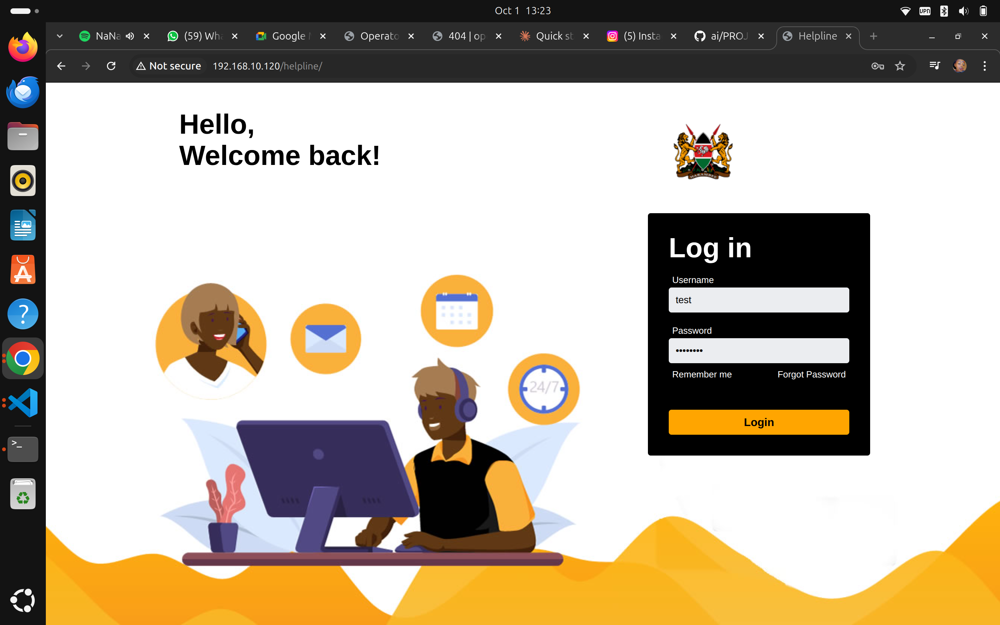
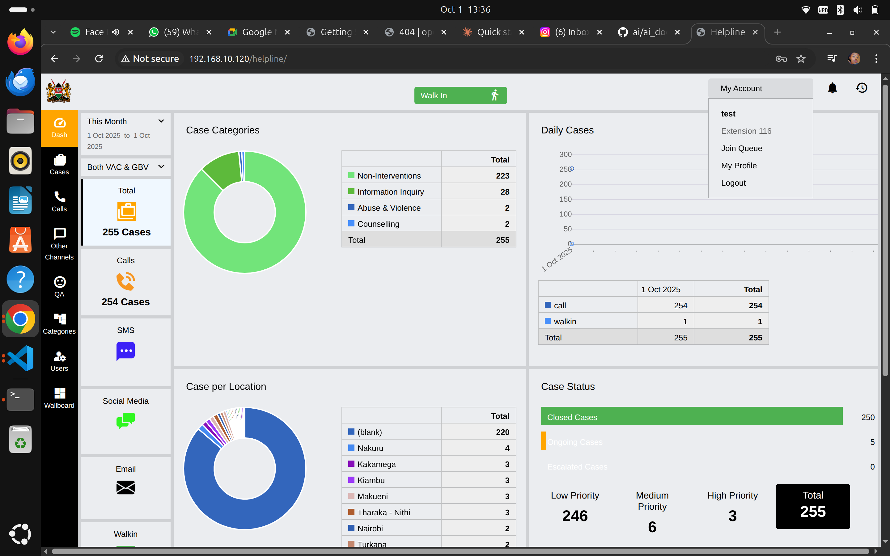
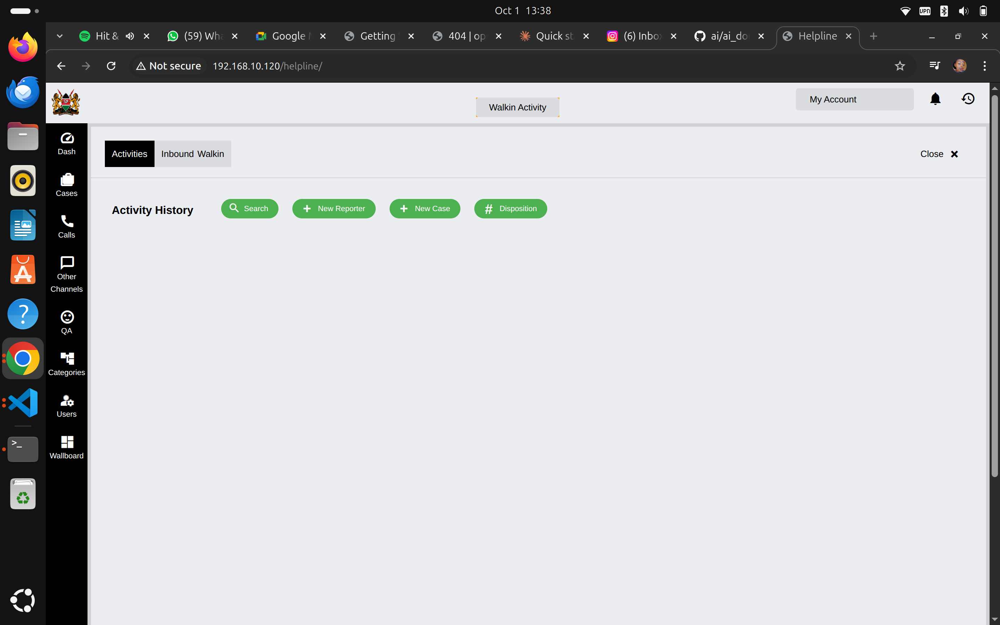
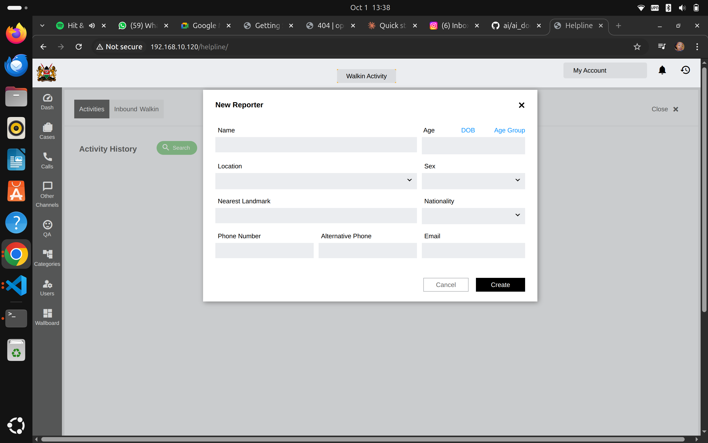
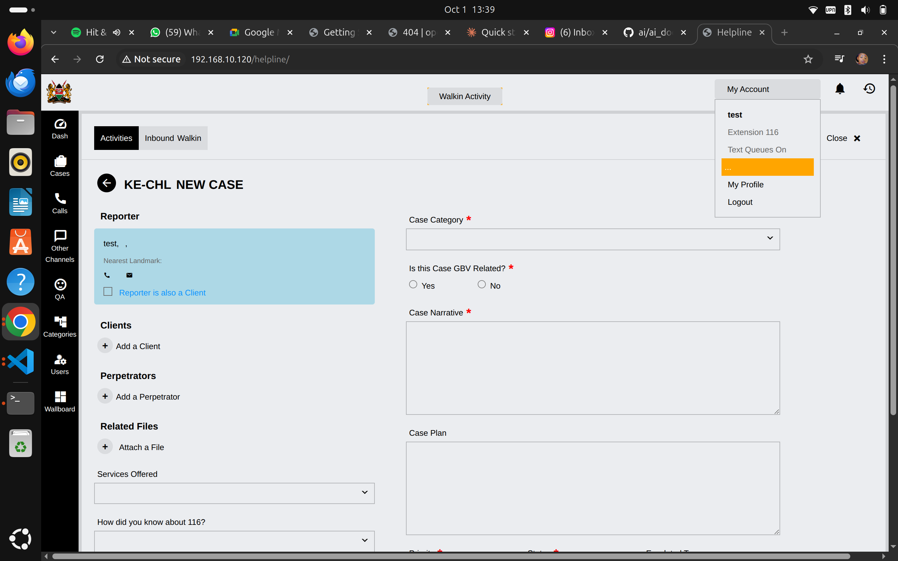

# Quick Start for Helpline Operators

Welcome to openCHS! This quick-start guide will help you log in to the system, understand the dashboard, and create your first case. For detailed information about using all features of the system, refer to the [complete Operator User Guide](../user-guides/operators.md).

## What is openCHS?

openCHS (Open Child Helpline System) is a comprehensive case management platform designed for child protection helplines. It helps you manage calls, walk-in cases, and track them from initial contact through resolution.

## Logging In

### First Time Access

1. **Open your web browser** (Chrome, Firefox, or Edge recommended)
2. **Navigate to**: `https://your-helpline-domain.com/helpline/`
3. **Enter your credentials**:
   - Username: (provided by your administrator)
   - Password: (temporary password provided)
4. **Click "Login"**

*The openCHS login screen*

### First Login Steps

On your first login, you'll need to:
- Change your temporary password to a secure one
- Complete your operator profile
- Review the system terms of use

**Security Reminder**: Always log out when you finish your shift, especially on shared computers.

## Understanding the Dashboard

Once logged in, you'll see the main dashboard with several key sections:

*The main dashboard showing case statistics and categories*

### Navigation Sidebar (Left)

The left sidebar provides quick access to main functions:

- **Dash** - Return to dashboard overview
- **Cases** - Manage all cases
- **Calls** - Phone call management
- **Other Channels** - SMS, Email, Social Media, etc.
- **QA** - Quality assurance
- **Categories** - Case categorization
- **Users** - User management (if authorized)
- **Wallboard** - Real-time statistics display

### Dashboard Overview (Main Area)

The dashboard shows you critical information at a glance:

#### Case Categories
A pie chart showing the breakdown of case types:
- Non-Interventions (majority of cases)
- Information Inquiry
- Abuse & Violence
- Counselling
- Other categories

#### Daily Cases
Shows the number of cases handled each day with a breakdown by:
- **Call** - Phone calls received
- **Walk-in** - In-person visits

#### Case per Location
Geographic distribution of cases showing which areas have the most cases.

#### Case Status
Real-time view of:
- **Closed Cases** (shown in green)
- **Pending Cases** (shown in orange)
- **Priority Distribution**:
  - Low Priority
  - Medium Priority
  - High Priority
  - **Total** (shown in black)

### Top Action Buttons

Two important buttons at the top right:
- **Walk In** (green button with up arrow) - Register walk-in cases
- **My Account** - Access your profile and settings

*Click "My Account" to access profile, queue settings, and logout*

## Creating Your First Case

### Starting a Walk-In Case

When a client arrives in person at your helpline:

1. **Click the "Walk In" button** (green button at top of screen)

2. **Navigate to Activities tab** if not already there

*Empty walk-in activity screen showing Search, New Reporter, New Case, and Disposition buttons*

3. **Click "New Reporter"** to register the person reporting the case

*Form to register a new reporter with demographic and contact information*

4. **Fill in Reporter Information**:
   - Name (required)
   - Age or Date of Birth (DOB) or Age Group
   - Location (dropdown selection)
   - Sex (dropdown selection)
   - Nearest Landmark
   - Nationality (dropdown selection)
   - Phone Number
   - Alternative Phone
   - Email

5. **Click "Create"** to save the reporter

6. **The system creates a new case** with a case number (e.g., KE-CHL NEW CASE)

*Complete case form with reporter info, case details, and action sections*

### Completing Case Details

After creating the reporter, you'll see the case form with several sections:

#### Reporter Section
- Shows the reporter information you just entered
- Checkbox: "Reporter is also a Client" (check if applicable)
- Contact icons for phone and email

#### Case Category (Required)
Select the appropriate category from the dropdown menu based on the type of case.

#### GBV Related (Required)
Indicate if this case is Gender-Based Violence related:
- Yes
- No

#### Case Narrative (Required)
Write a detailed description of the case. Include:
- What happened
- When it happened
- Who is involved
- Current situation
- Immediate concerns

#### Case Plan
Document the planned actions and interventions.

#### Clients Section
- **Add a Client** if different from the reporter
- Add details of the child or person receiving services

#### Perpetrators Section
- **Add a Perpetrator** if applicable
- Document information about the person causing harm

#### Related Files
- **Attach a File** to upload supporting documents, photos, or evidence

#### Services Offered
Select from the dropdown menu what services you're providing or referring.

#### How did you know about 116?
Track how clients learn about your helpline service.

### Saving the Case

1. **Review all required fields** (marked with red asterisk *)
2. **Complete any additional relevant sections**
3. **Click "Save" or "Submit"** (button at bottom of form)
4. **Case is now in the system** with a unique case number

## Managing Your Account

Click "My Account" in the top right to access:

### Your Profile Options

- **Extension 116** - Your operator extension number
- **Text Queues On** - Toggle for text-based queue notifications
- **My Profile** - View and edit your profile information
- **Logout** - End your session

### Checking Your Extension

Your extension number (e.g., "Extension 116") shows your operator ID in the system. This is used for:
- Call routing
- Case assignment
- Performance tracking
- Quality assurance reviews

## Quick Reference: Common Tasks

### Viewing All Cases
1. Click **"Cases"** in the left sidebar
2. Browse the case list
3. Click any case to view details

### Searching for a Case
1. Use the **"Search"** button in the Activity History section
2. Enter case number, name, or phone number
3. Select from search results

### Checking Case Disposition
Click the **"Disposition"** button to view or update case outcomes and closure status.

## Understanding Case Priority

Cases are automatically categorized by priority:

- **Low Priority** (246 shown in example) - General inquiries, routine follow-ups
- **Medium Priority** (6 shown in example) - Cases requiring attention but not urgent
- **High Priority** (3 shown in example) - Urgent cases requiring immediate action

**Always address High Priority cases first.**

## Best Practices

### During Case Entry

1. **Be thorough** - Complete all required fields
2. **Be accurate** - Double-check names, ages, and contact information
3. **Be timely** - Enter cases as soon as possible after contact
4. **Be objective** - Record facts, not opinions
5. **Be confidential** - Never discuss cases outside the system

### Case Documentation

- Use clear, professional language
- Include specific details and dates
- Note any immediate risks or safety concerns
- Document all actions taken
- Recor