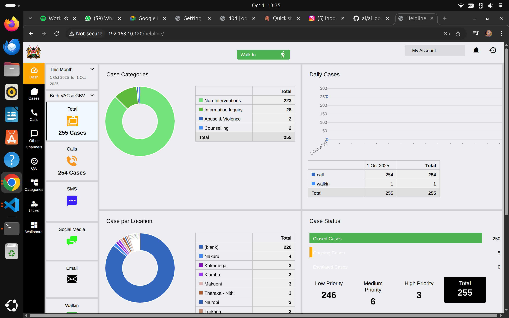
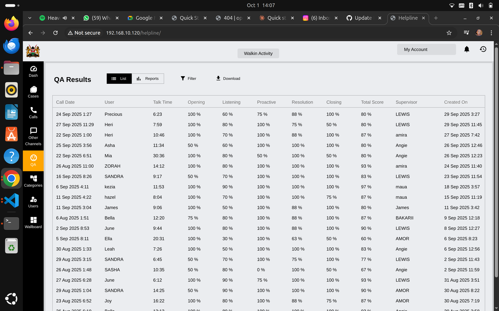

# Quick Start for Helpline System Administrators

Welcome to openCHS! This guide is for **helpline administrators** who manage users, monitor performance, and configure system settings. If you're looking for technical server deployment instructions, see the [Technical Deployment Guide](../deployment-administration/installation.md).

## What is a System Administrator?

As a helpline system administrator, you have elevated privileges to:
- **Manage users** - Create, edit, and deactivate counsellor accounts
- **Monitor performance** - View quality assurance (QA) reports and statistics
- **Configure categories** - Set up case categories, age groups, and referral options
- **Oversee operations** - Monitor real-time counsellor status via wallboard
- **Generate reports** - Create analytics for supervisors and management
- **Maintain system settings** - Configure helpline-specific parameters

## Logging In

### Accessing the Admin Panel

1. **Open your web browser** (Chrome, Firefox, or Edge recommended)
2. **Navigate to**: `https://your-helpline-domain.com/helpline/`
3. **Enter your admin credentials**:
   - Username: Your admin username
   - Password: Your secure password
4. **Click "Login"**

*The openCHS login screen*

### What Makes Admin Access Different?

Once logged in as an administrator, you'll see additional menu items that regular counsellors don't have access to:

**Admin-Only Features:**
- **QA** (Quality Assurance) - Monitor call quality and counsellor performance
- **Categories** - Manage system categories and classifications
- **Users** - Create and manage counsellor accounts
- **Wallboard** - Real-time operational monitoring
- Full access to all cases across all counsellors

## Understanding the Admin Dashboard

Your dashboard provides a comprehensive overview of helpline operations:

*Admin dashboard showing operational metrics and case statistics*

### Key Dashboard Components

#### Left Sidebar Navigation
- **Dash** - Return to dashboard overview
- **Cases** - View and manage all cases (across all counsellors)
- **Calls** - Phone call management
- **Other Channels** - SMS, Email, Social Media, etc.
- **QA** - Quality assurance monitoring
- **Categories** - Configure system categories
- **Users** - User management
- **Wallboard** - Real-time operations display

#### Dashboard Widgets
- **Case Categories** - Distribution of case types
- **Daily Cases** - Cases handled by day
- **Case per Location** - Geographic distribution
- **Case Status** - Open, closed, and pending cases with priority levels

#### Top Controls
- **Walk In** - Create walk-in cases
- **My Account** - Your admin profile
- **Status Indicator** - Shows your availability status
- **Date Range Selector** - Filter data by date range
- **View Selector** - Choose data view (Both VAC & GBV, etc.)

## Managing Users

### Viewing All Users

1. **Click "Users"** in the left sidebar
2. You'll see the complete list of system users

*Complete list of counsellors with their details and status*

### User List Information

The user table displays:
- **Username** - Login identifier
- **First Name & Last Name** - Full name
- **Phone** - Contact number
- **Email** - Email address
- **Extension** - Phone system extension number
- **Role** - User role (Counsellor, Admin, Supervisor)
- **Is Active** - Account status (Yes/No)
- **Created On** - Account creation date

### Creating a New User

1. **Click the "+ New" button** at the top right
2. **Fill in the new user form**:
   - Username (unique, no spaces)
   - First Name
   - Last Name
   - Phone Number
   - Email Address
   - Extension Number
   - Role (select from dropdown)
   - Password (temporary - user will change on first login)
3. **Set permissions** based on role
4. **Click "Create"** to save

### Editing User Accounts

1. **Click on any user** in the list
2. **Modify user details** as needed:
   - Update contact information
   - Change extension number
   - Adjust role/permissions
   - Reset password if needed
   - Activate/deactivate account
3. **Save changes**

### Deactivating Users

When a counsellor leaves:
1. Open their user profile
2. Set **"Is Active"** to **"No"**
3. Save changes
4. The user can no longer log in
5. Their historical data remains in the system

### User Roles Explained

**Counsellor**
- Handle calls and cases
- Create and manage their own cases
- Limited access to other counsellors' cases
- Cannot access admin functions

**Supervisor**
- All counsellor permissions
- Can review and edit team cases
- Access QA functions
- Generate team reports

**Administrator** (You)
- Full system access
- Manage all users
- Configure system settings
- Access all reports and analytics
- Monitor real-time operations

## Monitoring Quality Assurance (QA)

### Accessing QA Results

1. **Click "QA"** in the left sidebar
2. View quality assurance monitoring data

*QA results showing counsellor performance metrics*

### Understanding QA Metrics

The QA dashboard shows detailed performance metrics:

#### Column Headers
- **Call Date** - When the call occurred
- **User** - Counsellor who handled the call
- **Talk Time** - Duration of the call
- **Opening** - Opening/greeting score (percentage)
- **Listening** - Active listening score (percentage)
- **Proactive** - Proactiveness score (percentage)
- **Resolution** - Case resolution score (percentage)
- **Closing** - Call closing score (percentage)
- **Total Score** - Overall quality score (percentage)
- **Supervisor** - Who conducted the QA review
- **Created On** - When QA review was completed

### Viewing Detailed QA Reports

Click on any QA result row to see the detailed breakdown:

*Detailed QA assessment with specific criteria and scores*

#### QA Assessment Sections

**Opening / Greeting (4 criteria)**
Example questions:
- Did the counselor introduce themselves?
- Did the counselor introduce the organization?

**Listening (6 criteria)**
Active listening evaluation

**Pro-activeness (3 criteria)**
Proactive problem-solving assessment

**Resolution / Counselling (7 criteria)**
Case resolution effectiveness

**Closing (4 criteria)**
Proper call closure procedures

**Feedback**
Overall supervisor comments

### Running QA Reports

1. **Set date range** using the filter
2. **Select specific counsellors** if needed
3. **Click "Reports"** to generate analytics
4. **Download** results for management review

## Managing Categories

### Accessing Category Management

1. **Click "Categories"** in the left sidebar
2. View all system categories

*System categories organized in expandable tree structure*

### Available Category Types

The system includes several category groups:

#### Age Group
Pre-configured age ranges:
- 0-5
- 11-14
- 15-17
- 6-10
- Adult
- Unknown

**Adding New Age Groups:**
1. Expand "Age Group"
2. Click "+ New"
3. Enter age range details
4. Save

#### Case-Related Categories
- **Case Assessment** - Risk assessment levels
- **Case Categories** - Main case types (abuse, mental health, etc.)
- **Case Know About 116** - How clients learned about helpline
- **Case Referrals** - External referral organizations
- **Case Services** - Services offered
- **Case Status in Justice System** - Legal case status
- **Disability** - Disability types for tracking
- **Disposition** - Case outcomes
- **Employment Status** - Employment categories

### Adding New Categories

1. **Navigate to the category group** you want to modify
2. **Click the "+" icon** next to the category name
3. **Enter new category details**:
   - Category name
   - Description (optional)
   - Status (active/inactive)
4. **Click "Save"**

### Editing Existing Categories

1. **Click on any category**
2. **Modify category details**
3. **Save changes**
4. Changes apply immediately to the system

### Best Practices for Categories

- **Don't delete categories with historical data** - Deactivate instead
- **Use clear, descriptive names** - Counsellors need to understand them quickly
- **Standardize naming conventions** - Keep consistent across categories
- **Regular review** - Quarterly review of category usage and relevance
- **Train staff on changes** - Notify counsellors of new categories

## Monitoring the Wallboard

### Accessing Real-Time Operations

1. **Click "Wallboard"** in the left sidebar
2. View real-time counsellor status

*Real-time monitoring of counsellor status and call queue*

### Understanding Wallboard Information

#### Counsellors Online Section
Shows currently logged-in counsellors with:
- **Ext.** - Extension number
- **Name** - Counsellor name
- **Caller** - Current caller number (if on call)
- **Answered** - Number of calls answered
- **Missed** - Number of missed calls
- **Talk Time** - Current call duration
- **Queue Status** - Current status (Available, On Call, Wrap-up, etc.)
- **Duration** - How long in current status

#### Status Indicators
- **Green (OnCall)** - Currently on a call
- **Orange (Wrapup)** - Post-call documentation
- **Gray (Available)** - Ready for next call
- **Red** - On break or unavailable

#### Calls in Queue Section
Shows waiting calls:
- Extension/number waiting
- Caller number
- Status (Connected, IVR, etc.)
- Wait duration

### Using Wallboard for Monitoring

**Real-Time Oversight:**
- Monitor call volume and wait times
- Identify counsellors who need support
- Track response times and availability
- Ensure adequate coverage during peak times

**Performance Management:**
- Compare individual counsellor metrics
- Identify training needs
- Recognize high performers
- Address performance issues promptly

**Capacity Planning:**
- Track busy periods
- Adjust staffing schedules
- Optimize resource allocation

## Viewing and Managing All Cases

### Admin Case Access

As an administrator, you can:
- **View all cases** across all counsellors
- **Edit any case** regardless of who created it
- **Reassign cases** between counsellors
- **Close cases** if needed
- **Generate reports** on case data

### Searching Cases

1. **Click "Cases"** in the sidebar
2. **Use search filters**:
   - Date range
   - Case category
   - Priority level
   - Counsellor
   - Status (open/closed)
   - Location
3. **View results**

### Case Oversight Best Practices

- **Regular audits** - Review case quality weekly
- **Timely follow-up** - Ensure cases are progressing
- **Supervision** - Support counsellors with complex cases
- **Data quality** - Check for complete documentation
- **Compliance** - Verify protocols are being followed

## Generating Reports

### Available Report Types

1. **Daily Activity Reports** - Cases handled per day
2. **Counsellor Performance** - Individual counsellor metrics
3. **Case Category Reports** - Distribution by type
4. **QA Summary Reports** - Quality assurance overview
5. **Location Reports** - Geographic distribution
6. **Outcome Reports** - Case resolution statistics

### Creating Reports

1. **Navigate to the relevant section** (QA, Cases, etc.)
2. **Click "Reports" button**
3. **Select report type**
4. **Set parameters**:
   - Date range
   - Specific counsellors
   - Case categories
   - Other filters
5. **Generate report**
6. **Download** (usually PDF or Excel format)

### Report Frequency Recommendations

- **Daily** - Operational metrics (calls, cases, queue times)
- **Weekly** - QA summaries, counsellor performance
- **Monthly** - Comprehensive analytics for management
- **Quarterly** - Trend analysis and strategic planning

## System Configuration

### General Settings

Access system-wide settings:
1. Navigate to system settings (if available in your interface)
2. Configure:
   - Helpline hours of operation
   - Auto-assignment rules
   - Notification preferences
   - Data retention policies

### Communication Channels

Enable/disable contact methods:
- **Calls** - Phone line (always active)
- **SMS** - Text message support
- **Email** - Email inquiries
- **Social Media** - Facebook, WhatsApp, etc.
- **Walk-in** - In-person visits

## Security and Best Practices

### Account Security

- **Use strong passwords** - Minimum 12 characters, mix of types
- **Change passwords regularly** - Every 90 days
- **Don't share credentials** - Each person has unique login
- **Log out when done** - Especially on shared computers
- **Monitor user activity** - Regular audits of user actions

### Data Protection

- **Confidentiality** - All case data is strictly confidential
- **Access control** - Only give necessary permissions
- **Audit trails** - System logs all actions
- **Backup verification** - Ensure backups are running
- **Incident reporting** - Report any security concerns immediately

### User Management Best Practices

- **Onboarding checklist** - Standardized training for new users
- **Offboarding process** - Deactivate accounts promptly
- **Regular reviews** - Quarterly access audits
- **Role appropriateness** - Verify roles match responsibilities
- **Activity monitoring** - Review unusual login patterns

## Troubleshooting Common Issues

### Users Can't Log In

**Check:**
1. Is account active? (Is Active = Yes)
2. Password typed correctly?
3. Account locked after failed attempts?
4. Network connectivity issues?

**Solution:**
- Reset password if needed
- Verify account is active
- Check for system-wide issues

### Missing Cases or Data

**Check:**
1. Date range filter settings
2. Case category filters
3. User-specific views vs. all cases
4. Case status (open vs. closed)

**Solution:**
- Clear all filters
- Switch to "All Cases" view
- Verify data with database admin if issue persists

### QA Scores Not Appearing

**Check:**
1. QA review completed and saved?
2. Correct date range selected?
3. Supervisor assigned to review?

**Solution:**
- Verify QA workflow completed
- Check supervisor has completed assessment
- Contact technical support if data is missing

### Wallboard Not Updating

**Check:**
1. Browser refresh needed?
2. Network connection stable?
3. Counsellors logged in correctly?

**Solution:**
- Refresh browser (F5 or Ctrl+R)
- Check network connection
- Have counsellors log out and back in

## Training New Counsellors

### Recommended Training Process

**Week 1: System Orientation**
- System navigation
- Creating accounts
- Basic case entry
- Shadowing experienced counsellors

**Week 2: Hands-On Practice**
- Handling test cases
- Using all features
- QA process understanding
- Supervised real cases

**Week 3: Independent Practice**
- Independent case handling
- First QA review
- Feedback and improvement

### Training Resources

- [Operator User Guide](../user-guides/operators.md) - Complete counsellor manual
- [Quick Start for Operators](./quick-start-helpline-operators.md) - Getting started guide
- Video tutorials (if available)
- Internal training materials

## Getting Help

### Support Channels

**Technical Issues:**
- Contact IT support team
- Email: it-support@your-helpline.org
- Phone: [IT Support Number]

**User Management Questions:**
- Supervisor or senior administrator
- User manual reference

**System Configuration:**
- Technical administrator
- [Technical Deployment Guide](../deployment-administration/installation.md)

### Escalation Process

1. **Level 1** - Check this documentation
2. **Level 2** - Contact immediate supervisor
3. **Level 3** - Technical support team
4. **Level 4** - System administrator / Vendor support

## Next Steps

Now that you understand the basics:

1. **Complete admin training** - Full certification program
2. **Review all categories** - Ensure they match your helpline needs
3. **Set up counsellor accounts** - Create user accounts for your team
4. **Configure QA process** - Establish quality monitoring procedures
5. **Test workflows** - Run through common scenarios
6. **Train your team** - Conduct comprehensive counsellor training
7. **Monitor operations** - Daily wallboard and report reviews

## Additional Resources

- **[Complete Administrator Guide](../user-guides/administrators.md)** - In-depth administration manual
- **[Deployment Documentation](../deployment-administration/)** - Technical setup guides
- **[API Documentation](../developer-documentation/api/)** - Integration guides
- **[Security & Privacy Guidelines](../governance-legal/security-privacy.md)** - Compliance information

---

**Remember**: As an administrator, you play a crucial role in maintaining service quality and supporting your counsellor team. Regular monitoring, consistent quality assurance, and proper user management ensure your helpline operates effectively to serve vulnerable children and families.

**Support**: For administrative questions, contact your helpline management team or technical support.