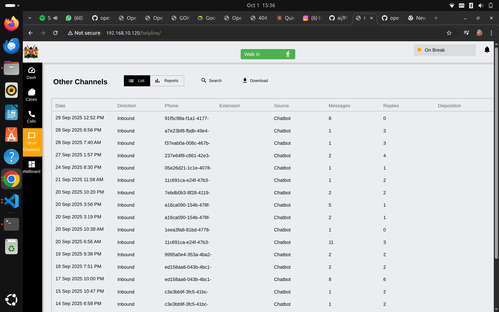
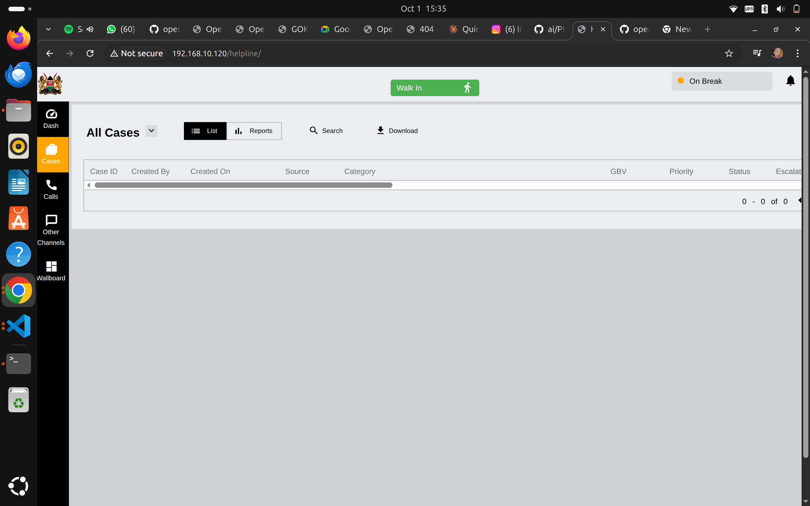

# Daily Workflow Guide for Helpline Operators

This guide walks you through a typical day as a helpline operator, from logging in to handling cases and logging out.

## Your Daily Checklist

- [ ] Log in and check your extension status
- [ ] Review any pending cases or follow-ups
- [ ] Set your status to Available
- [ ] Handle incoming calls and walk-ins
- [ ] Document all interactions
- [ ] Complete end-of-shift tasks
- [ ] Log out properly

## Starting Your Shift

### 1. Log In

1. Navigate to your helpline URL
2. Enter your **username** and **password**
3. Click **Login**

**Your Extension**: After login, note your extension number (shown in "My Account" menu). This is your operator ID for the phone system.

### 2. Check Your Dashboard

Your dashboard shows:
- **Total cases** for the current period
- **Call statistics** - how many calls you've handled
- **Case categories** - distribution by type
- **Case priorities** - what needs immediate attention

**What to Review**:
- Any **High Priority** cases (shown in red)
- **Pending cases** that need follow-up
- Your personal case count

### 3. Set Your Status

Click **My Account** → Check your status:
- 🟢 **Available** - Ready for calls
- 🟡 **On Break** - Temporarily unavailable  
- 🔴 **Busy** - In meeting or training

**Always set yourself to Available when ready to take calls.**

## Handling Your First Call

### When a Call Comes In

The system will:
1. **Alert you** with a notification
2. Show **caller information** (if available)
3. Display any **previous case history**

### During the Call

**Your Screen Shows**:

- **Call timer** - how long you've been on the call
- **Caller details** - phone number, previous contact
- **Quick actions** - create case, search, disposition

**Best Practices**:
- ✅ Greet caller warmly
- ✅ Listen actively - let them speak
- ✅ Take brief notes as they talk
- ✅ Stay calm and professional
- ✅ Follow your training protocols

### Recording Call Disposition

After every call, you must record the outcome:

**Required Information**:
- **Caller Sex** - Select from dropdown
- **Caller Location** - Select location
- **Disposition Type** - What was the outcome?

**Common Dispositions**:
- **Complete** - Call successfully handled
- **Incomplete** - Caller hung up or issues arose
- **Dropped** - Call disconnected
- **Blank** - Silent call
- **Abusive** - Inappropriate call
- **Mistake** - Wrong number
- **ConferencePrank** - Prank call

**How to Record**:
1. Select caller's **Sex**
2. Select their **Location**
3. Choose appropriate **Disposition** (scroll through options)
4. Click **Submit**

## Creating Cases

### Walk-In Cases

When someone visits in person:

1. Click **"Walk In"** button (green, top right)
2. Click **"New Reporter"** 
3. Fill in their information (see [Case Management Guide](./case-management-guide.md))

### Phone Call Cases

If the call requires a case:

1. During or after the call, click **"New Case"**
2. System auto-fills call details
3. Complete case information
4. Save the case

**When to Create a Case**:
- ✅ Child protection concern
- ✅ Abuse or violence reported
- ✅ Follow-up needed
- ✅ Referral required
- ❌ General information inquiry (just disposition)
- ❌ Wrong number (just disposition)

## Managing Your Cases

### Viewing All Your Cases

**Navigation**: Click **"Cases"** in the sidebar

**Case List Shows**:
- **Case ID** - Unique identifier
- **Created By** - Who created it (you)
- **Created On** - Date and time
- **Source** - Call, walk-in, SMS, etc.
- **Category** - Type of case
- **GBV** - Is it gender-based violence?
- **Priority** - Low, Medium, High
- **Status** - Open, Closed, Escalated

### Quick Actions

**List View** (default):
- Click **List** button to see table format
- Use **Search** to find specific cases
- Click **Download** to export cases

**Reports View**:
- Click **Reports** button
- Generate statistics on your cases
- View performance metrics

### Searching for Cases

**Search Options**:
- Case ID number
- Reporter name
- Phone number
- Date range

**To Search**:
1. Click **Search** button
2. Enter search criteria
3. View filtered results

## Other Communication Channels

### Chatbot Interactions

**Navigation**: Click **"Other Channels"** in sidebar

**What You See**:
- **Date** - When interaction occurred
- **Direction** - Inbound (from user)
- **Phone/Extension** - Identifier
- **Source** - Chatbot, SMS, Email, Social Media
- **Messages** - Number of messages exchanged
- **Replies** - Your responses
- **Disposition** - Outcome

**Your Role**: Review chatbot conversations that may need human follow-up. If a chatbot case needs attention, create a proper case.

## Mid-Shift Tasks

### Taking Breaks

When you need a break:

1. Click **"My Account"**
2. Set status to **"On Break"**
3. System stops routing calls to you
4. Return and set back to **"Available"**

**Break Reminders**:
- 🕐 Take regular breaks (every 2-3 hours)
- 💧 Stay hydrated
- 🧘 Take a moment to decompress after difficult calls
- 👥 Debrief with colleagues if needed

### Checking Team Status

**Wallboard Shows**:
- Who's **online** and available
- Who's **on a call** (yellow "Wrapup" or green "OnCall")
- Current **queue status** - how many calls waiting
- Team **performance** - answered vs missed

**Why This Matters**:
- If queue is building up, stay available
- See who can help if you need backup
- Understand team workload

## End of Shift

### Closing Out Your Day

**Before Logging Out**:

1. ✅ **Complete all open dispositions** - Finish any pending call outcomes
2. ✅ **Update case notes** - Ensure all cases have proper documentation
3. ✅ **Schedule follow-ups** - Set reminders for tomorrow
4. ✅ **Review high priority cases** - Check if anything needs immediate handoff
5. ✅ **Set status to unavailable** - So no new calls route to you

### Handover to Next Shift

**If handing over urgent cases**:

1. Open the case
2. Add a note: "Handover to [Next Shift Operator]"
3. Explain current status and next steps
4. Mark as **High Priority** if urgent

### Log Out

1. Click **"My Account"**
2. Click **"Logout"**
3. Confirm you're logged out

**Security**: Always log out on shared computers!

## Quick Reference - Daily Workflow

| Time | Task | Priority |
|------|------|----------|
| **Start of Shift** | Log in, check dashboard, set to Available | High |
| **Throughout Day** | Handle calls, create cases, document everything | High |
| **Every 2-3 Hours** | Take break, review cases, check priorities | Medium |
| **End of Shift** | Complete dispositions, update cases, handover, logout | High |

## Common Scenarios

### Scenario 1: Caller Doesn't Speak Your Language

**What to Do**:
1. Stay calm - AI transcription/translation can help
2. Try basic greetings in common languages
3. Use the system's translation features
4. Ask if someone else in their household speaks [your language]
5. If needed, transfer to a colleague who speaks the language

### Scenario 2: Emotional or Distressed Caller

**What to Do**:
1. Listen without interrupting
2. Speak calmly and reassuringly
3. Acknowledge their feelings
4. Follow crisis protocols from your training
5. Take detailed notes
6. Escalate to supervisor if needed

### Scenario 3: You're Behind on Documentation

**What to Do**:
1. During quiet periods, catch up on case notes
2. Set aside last 30 minutes of shift for documentation
3. Use disposition modal immediately after calls
4. Don't let cases pile up - document daily

### Scenario 4: System or Technical Issue

**What to Do**:
1. Try refreshing your browser (F5)
2. Check your internet connection
3. Contact IT support via help desk
4. Document calls manually if system is down
5. Enter data when system returns

## Tips for Success

**Organization**:
- 📝 Keep a notepad for quick notes during calls
- 📅 Check dashboard first thing each shift
- 🔔 Set reminders for follow-ups
- 📊 Review your metrics weekly

**Communication**:
- 🎧 Use proper headset - clear audio matters
- 🗣️ Speak clearly and at moderate pace
- 👂 Practice active listening
- ❤️ Show empathy - callers are often in crisis

**Self-Care**:
- 🌟 Celebrate successful case resolutions
- 🤝 Support your team
- 💭 Debrief difficult calls with supervisor
- 🏃 Take care of your mental health

## Getting Help

**During Your Shift**:
- **Supervisor**: For case guidance or escalations
- **IT Help Desk**: For technical issues
- **Colleagues**: For quick questions
- **Emergency Button**: For critical situations requiring immediate supervisor attention

**After Hours**:
- **Documentation**: Refer to [Case Management Guide](./case-management-guide.md)
- **System Issues**: Submit help desk ticket

## Next Steps

Now that you understand daily workflow, explore:
- **[Case Management Guide](./case-management-guide.md)** - Detailed case handling
- **[Using AI Features](./using-ai-features.md)** - How AI assists you

---

**Remember**: You're making a difference. Every call you handle properly could change or save a child's life. Your work matters.