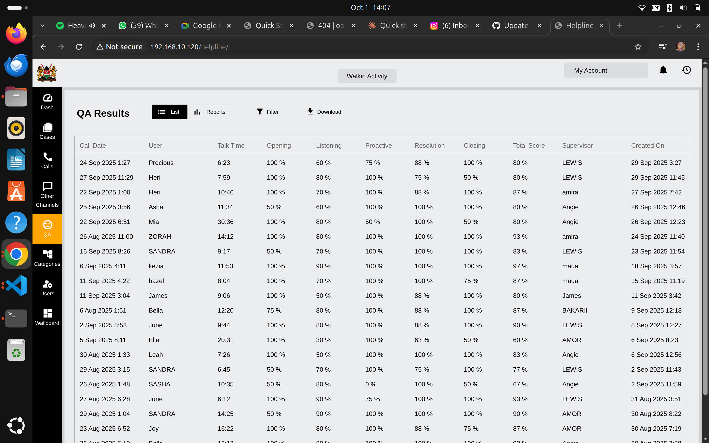
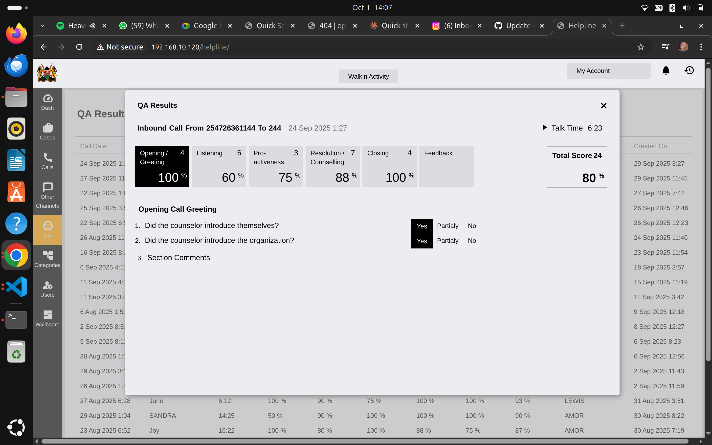

# Quality Assurance Monitoring for Supervisors

Complete guide to monitoring call quality, conducting reviews, and maintaining service standards.

## Understanding QA Monitoring

### What Is QA?

**Quality Assurance (QA)** is the systematic process of evaluating counsellor performance to ensure:
- Calls are handled professionally
- Protocols are followed
- Service standards are maintained
- Children receive appropriate help
- Documentation is accurate

### Why QA Matters

✅ **Protects Children** - Ensures proper case handling  
✅ **Develops Staff** - Identifies training needs  
✅ **Maintains Standards** - Consistent service quality  
✅ **Meets Requirements** - UNICEF and regulatory compliance  
✅ **Improves Service** - Data-driven improvements  

## Accessing QA Dashboard

**Navigation**: Click **"QA"** in the left sidebar

### Dashboard Overview

The QA dashboard shows:

**Table Columns**:
- **Call Date** - When the call occurred
- **User** - Counsellor who handled the call
- **Talk Time** - Call duration
- **Opening** - Greeting/introduction score (%)
- **Listening** - Active listening score (%)
- **Proactive** - Proactiveness score (%)
- **Resolution** - Case resolution score (%)
- **Closing** - Call closure score (%)
- **Total Score** - Overall quality score (%)
- **Supervisor** - Who conducted the review
- **Created On** - When QA review was completed

### Dashboard Features

**Top Controls**:
- **List** - Table view (default)
- **Reports** - Generate QA reports
- **Search** - Find specific reviews
- **Download** - Export QA data

## Conducting QA Reviews

### Selecting Calls to Review

**Best Practices**:
- Review **3-5 calls per counsellor per month** minimum
- Mix of **random selection** and **targeted reviews**
- Include **different times of day** and **days of week**
- Review **new staff** more frequently (weekly)
- Review **all high-risk cases**

**Selection Criteria**:
- Random sampling (most common)
- Long call duration calls
- Escalated cases
- Customer complaints
- Dropped or incomplete calls
- Training follow-ups

### Opening a QA Review

**To Review a Call**:
1. Click on any row in the QA results table
2. Detailed assessment form opens
3. Shows call information and scoring criteria

### QA Assessment Sections

#### 1. Opening / Greeting (4 Criteria)

**Evaluates**:
- Did counsellor introduce themselves?
- Did counsellor introduce the organization?
- Was greeting warm and professional?
- Did counsellor set expectations for the call?

**Response Options for Each**:
- **Yes** - Fully met standard
- **Partially** - Somewhat met standard
- **No** - Did not meet standard

**Scoring**:
- Yes = 100%
- Partially = 50%
- No = 0%

**Section Score**: Average of all 4 criteria

#### 2. Listening (6 Criteria)

**Evaluates**:
- Active listening demonstrated
- Appropriate responses to caller
- Did not interrupt unnecessarily
- Showed empathy and understanding
- Asked clarifying questions
- Paraphrased to confirm understanding

**Why It Matters**: Active listening is critical for accurate case assessment and building trust.

#### 3. Proactiveness (3 Criteria)

**Evaluates**:
- Took initiative to help
- Offered additional resources
- Anticipated caller needs
- Suggested appropriate actions

**Good Proactive Behavior**:
- "Let me also connect you with counseling services"
- "Have you considered filing a police report?"
- "I can set up a follow-up call in 2 days"

#### 4. Resolution / Counselling (7 Criteria)

**Evaluates**:
- Addressed caller's main concern
- Provided accurate information
- Made appropriate referrals
- Documented case properly
- Set clear next steps
- Assessed risk appropriately
- Followed protocols

**Most Important Section**: This directly impacts child safety.

#### 5. Closing (4 Criteria)

**Evaluates**:
- Summarized key points
- Confirmed caller understood next steps
- Provided callback information
- Closed professionally and warmly

**Good Closing**:
- "So we've set up counseling for Maria and I'll call you tomorrow at 2pm"
- "Do you have any other questions?"
- "Remember our number is 116, call anytime"

#### 6. Feedback Section

**Free Text Area For**:
- Overall comments
- Specific strengths
- Areas for improvement
- Training recommendations
- Commendations

### Scoring Guidelines

**Percentage Ranges**:
- **90-100%** - Excellent performance
- **80-89%** - Good performance, minor improvements needed
- **70-79%** - Satisfactory, some areas need attention
- **60-69%** - Below standard, requires coaching
- **Below 60%** - Poor performance, immediate intervention needed

### Completing the Review

**Steps**:
1. Listen to call recording (if available)
2. Review call transcript and case documentation
3. Score each criterion honestly and fairly
4. Calculate section scores
5. Write constructive feedback
6. Save the review
7. Schedule feedback session with counsellor

## Analyzing QA Results

### Individual Performance

**Review Each Counsellor's**:
- **Average scores** across all reviews
- **Trends over time** (improving or declining?)
- **Specific weak areas** (consistently low sections)
- **Strengths** to leverage

**Red Flags**:
- Scores consistently below 70%
- Declining performance trend
- Repeated issues in same area
- Low resolution/counselling scores (safety concern)

### Team Performance

**Aggregate Metrics**:
- Team average QA score
- Common weak areas across staff
- Training needs analysis
- Best performers (for mentoring others)

**Questions to Ask**:
- Are new hires scoring lower? (training issue)
- Are scores lower at certain times? (fatigue, coverage issues)
- Are certain call types poorly handled? (specialized training needed)

### Using QA Data

**For Training**:
- Identify skill gaps
- Design targeted training sessions
- Create coaching plans
- Share best practices

**For Performance Management**:
- Set improvement goals
- Track progress
- Recognize excellence
- Address performance issues

**For Service Improvement**:
- Update protocols based on findings
- Improve scripts and resources
- Adjust staffing based on quality vs. volume
- Enhance supervision

## Providing Feedback

### Scheduling Feedback Sessions

**When to Meet**:
- Within 1 week of completing review
- Regular one-on-ones (monthly minimum)
- Immediately for serious issues
- Group sessions for team-wide patterns

**Meeting Format**:
- 30-45 minutes
- Private, quiet setting
- Have call recording and QA form ready
- Prepare specific examples

### Feedback Best Practices

**Start Positive**:
- Acknowledge strengths
- Highlight what went well
- Specific examples of good practice

**Address Issues Constructively**:
- Describe specific behavior, not personality
- Use "I noticed..." not "You always..."
- Focus on impact on children/service
- Suggest concrete improvements

**Create Action Plan**:
- Agree on 2-3 specific goals
- Set measurable targets
- Schedule follow-up
- Offer support and resources

**Example Feedback**:

**Good**:
> "In the Maria case, you did an excellent job showing empathy when the mother was crying. I noticed you paused and let her express her feelings before asking questions. That's great active listening.
>
> One area to work on: In three calls this month, you didn't ask about immediate safety. Let's practice safety assessment questions. Goal: 100% of calls include safety check by next month. I'll observe your next 5 calls to coach you."

**Bad**:
> "Your scores were low. You need to do better. Be more proactive."

### Handling Difficult Conversations

**If Counsellor Disagrees with Score**:
- Listen to their perspective
- Review specific criteria together
- Explain your reasoning with examples
- Find common ground
- Focus on improvement, not blame

**If Counsellor Is Defensive**:
- Stay calm and professional
- Reiterate goal is to help, not punish
- Acknowledge pressure of the role
- Emphasize teamwork
- Set clear expectations

**If Performance Is Very Poor**:
- Be direct but kind
- Document the conversation
- Create improvement plan with clear deadlines
- Increase supervision
- Follow HR policies for performance management

## QA Reports

### Generating Reports

**To Create Report**:
1. Click **"Reports"** button on QA dashboard
2. Select date range
3. Choose counsellor(s) or "All"
4. Select report type
5. Generate

**Report Types**:
- Individual counsellor performance
- Team summary
- Trend analysis (scores over time)
- Section breakdowns (which areas need work)
- Comparison reports

### Key Metrics to Track

**Overall Quality**:
- Average team QA score
- Month-over-month trends
- Percentage of calls meeting standard (>80%)

**By Section**:
- Opening scores
- Listening scores
- Resolution scores
- Closing scores

**By Counsellor**:
- Individual averages
- Improvement rates
- Number of reviews completed

**By Time Period**:
- Monthly performance
- Quarterly trends
- Annual comparisons

### Using Reports

**Monthly Team Meetings**:
- Share aggregate results
- Celebrate improvements
- Discuss common challenges
- Set team goals

**Management Reports**:
- Quarterly summaries for leadership
- Compliance documentation
- Funding reports (UNICEF requirements)
- Impact metrics

**Training Planning**:
- Identify skill gaps
- Design training based on data
- Measure training effectiveness

## QA Program Management

### Setting Standards

**Define What "Good" Looks Like**:
- Target scores for each section
- Minimum acceptable performance
- Excellence benchmarks
- Specific behavioral standards

**Document Standards**:
- Written QA guidelines
- Scoring rubrics
- Example calls (good and bad)
- Protocol checklists

### Calibration Sessions

**Why Calibrate**:
- Ensure consistent scoring across supervisors
- Reduce scorer bias
- Maintain fairness

**How to Calibrate**:
1. All supervisors review same call
2. Each scores independently
3. Compare results
4. Discuss differences
5. Agree on scoring approach

**Frequency**: Quarterly minimum

### QA Schedule

**Recommended Frequency**:
- **New Hires**: Weekly for first month, then bi-weekly for 3 months
- **Experienced Staff**: 3-5 calls per month
- **High Performers**: 2-3 calls per month
- **Performance Issues**: Weekly until improved

**Balancing Act**: Quality reviews vs. supervisor time availability

### Quality of QA

**Monitor Your Own QA Process**:
- Are reviews completed on time?
- Are scores consistent?
- Is feedback provided promptly?
- Are counsellors improving?
- Is documentation thorough?

## Common Challenges

### Challenge: Not Enough Time

**Solutions**:
- Schedule dedicated QA time
- Use call sampling, not all calls
- Delegate to senior counsellors
- Use AI insights to prioritize calls
- Block time on calendar

### Challenge: Counsellor Resistance

**Solutions**:
- Frame as development, not punishment
- Involve counsellors in standard-setting
- Recognize improvements publicly
- Show how QA helps them
- Be consistent and fair

### Challenge: Difficult-to-Score Calls

**Solutions**:
- Get second opinion from another supervisor
- Discuss in calibration sessions
- Focus on clear criteria
- Document reasoning
- Use "N/A" for non-applicable criteria

### Challenge: Maintaining Consistency

**Solutions**:
- Regular calibration sessions
- Clear scoring rubrics
- Document edge cases
- Review your own bias
- Seek feedback from counsellors

## Integration with Other Systems

### Linking to Performance Reviews

**QA Informs**:
- Annual performance evaluations
- Promotion decisions
- Training assignments
- Mentorship opportunities

**How to Use**:
- Include QA trends in reviews
- Show improvement over time
- Identify star performers
- Document performance issues

### Linking to Training

**QA Identifies Training Needs**:
- Low scores in specific sections
- Common errors across team
- New protocol adoption rates
- Skill gap analysis

**Training Evaluation**:
- Compare pre/post training scores
- Measure effectiveness
- Adjust training content
- Track improvement

## Best Practices Summary

**Do**:
- ✅ Review regularly and consistently
- ✅ Provide timely, constructive feedback
- ✅ Calibrate with other supervisors
- ✅ Use data to drive improvements
- ✅ Recognize excellent performance
- ✅ Focus on child safety first

**Don't**:
- ❌ Use QA only for problem counsellors
- ❌ Let reviews pile up
- ❌ Give vague feedback
- ❌ Score without listening to call
- ❌ Be inconsistent across staff
- ❌ Forget to follow up

## Quick Reference

| Task | Frequency | Priority |
|------|-----------|----------|
| Conduct QA reviews | 3-5 per counsellor/month | High |
| Provide feedback | Within 1 week of review | High |
| Generate team reports | Monthly | Medium |
| Calibration sessions | Quarterly | High |
| Review QA process | Annually | Medium |

## Getting Help

**Questions About QA**:
- Consult QA guidelines document
- Discuss with senior management
- Reach out to UNICEF mentor
- Join supervisor community calls

**Technical Issues**:
- Contact IT support
- Submit help desk ticket
- Check system documentation

## Next Steps

- **[Team Workflow Management](./team-workflow-management.md)** - Monitor real-time operations
- **[Reporting Dashboards](./reporting-dashboards.md)** - Analyze overall performance

---

**Remember**: QA is about improvement, not punishment. Your goal is to help counsellors succeed so children get the best possible help. Approach every review as a coaching opportunity.