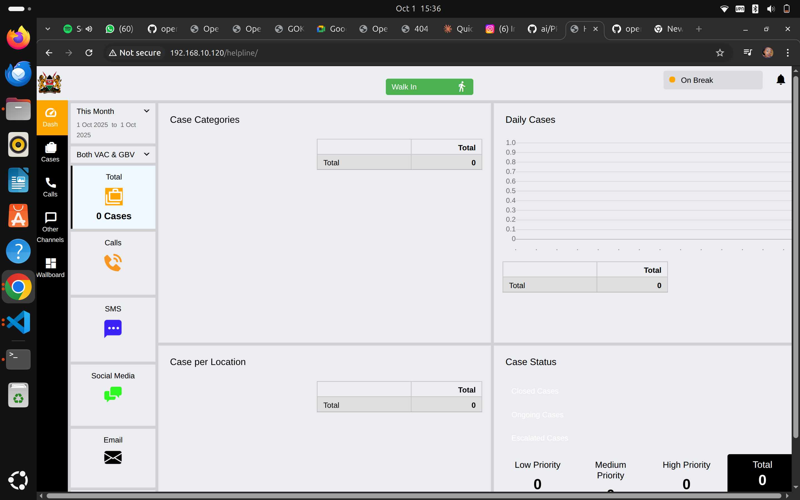

# Reporting Dashboards for Supervisors and Managers

Complete guide to understanding analytics, generating reports, and using data for decision-making.

## Understanding the Dashboard

### Accessing the Main Dashboard



**Navigation**: Click **"Dash"** in the left sidebar

**What You See**: Comprehensive overview of helpline operations including case statistics, call volumes, geographic distribution, and status tracking.

### Dashboard Components

The dashboard has four main sections:

1. **Case Categories** (top left)
2. **Daily Cases** (top right)
3. **Case per Location** (bottom left)
4. **Case Status** (bottom right)

Plus sidebar filters and channel breakdowns.

## Sidebar Controls

### Date Range Selector

**"This Month" Dropdown**:
- Current month (default)
- Last month
- This quarter
- Last quarter
- This year
- Custom date range

**Purpose**: Filter all dashboard data by time period

**Use Cases**:
- Monthly performance reviews
- Quarterly reports
- Year-over-year comparisons
- Campaign period analysis

### View Type Selector

**"Both VAC & GBV" Dropdown**:
- Both VAC & GBV (show all cases)
- VAC only (Violence Against Children)
- GBV only (Gender-Based Violence)
- Non-VAC/GBV only

**Purpose**: Focus on specific case types based on your reporting needs

### Channel Breakdown

**Left Sidebar Shows**:

**Total Cases**: 351
- Overall case count for selected period

**Calls**: 350 Cases
- Cases originating from phone calls
- Largest volume channel

**SMS**: (if active)
- Cases from text messages

**Social Media**: (if active)
- Cases from Facebook, WhatsApp, etc.

**Email**: (if active)
- Cases from email inquiries

**Walk-in**: 1 Case
- In-person visits

## Case Categories Section

### Visual Display

**Pie Chart** shows distribution of case types:
- Green: Non-Interventions (313 cases - 89%)
- Light Green: Information Inquiry (34 cases - 10%)
- Blue: Abuse & Violence (2 cases)
- Purple: Counselling (2 cases)

### Data Table

| Category | Count | Percentage |
|----------|-------|------------|
| Non-Interventions | 313 | ~89% |
| Information Inquiry | 34 | ~10% |
| Abuse & Violence | 2 | <1% |
| Counselling | 2 | <1% |
| **Total** | **351** | **100%** |

### Understanding the Categories

**Non-Interventions** (Highest Volume):
- General information requests
- Directory assistance
- Brief consultations
- Does not require case creation typically
- High volume is normal

**Information Inquiry**:
- Specific questions about services
- Eligibility inquiries
- Referral requests
- Educational questions

**Abuse & Violence** (Critical Priority):
- Physical abuse
- Sexual abuse
- Emotional abuse
- Domestic violence
- **Always high priority regardless of count**

**Counselling**:
- Mental health support
- Crisis counseling
- Emotional support
- Therapeutic intervention

### Using This Data

**For Staffing**:
- High non-intervention volumes suggest need for FAQ resources
- Can some be handled by chatbot or automated systems?
- Allows counsellors to focus on serious cases

**For Training**:
- Are serious cases (abuse, violence) being properly categorized?
- Do staff need more training on identification?
- Review sample cases from each category

**For Reporting**:
- Track month-over-month category trends
- Identify emerging patterns
- Report VAC/GBV rates to stakeholders

## Daily Cases Section

### Time Series Chart

**Displays**: Number of cases handled each day over the selected period

**Y-Axis**: Case count (0 to max, e.g., 350)
**X-Axis**: Dates (1 Oct 2025 to 1 Oct 2025 in example)

### Data Table

Shows daily breakdown by channel:

| Date | Call | Walk-in | Total |
|------|------|---------|-------|
| 1 Oct 2025 | 350 | 1 | **351** |

### What to Look For

**Patterns**:
- Which days have highest volume?
- Are weekends different from weekdays?
- Are there seasonal patterns?
- Do campaigns drive spikes?

**Trends**:
- Increasing or decreasing over time?
- Consistent volume or erratic?
- Impact of staffing changes?

**Anomalies**:
- Sudden spikes (investigate cause)
- Unexpected drops (system issues? Staffing?)
- Zero-case days (holiday? Outage?)

### Using This Data

**For Capacity Planning**:
- Schedule more staff on high-volume days
- Plan training on low-volume days
- Anticipate seasonal fluctuations

**For Goal Setting**:
- Target number of cases to handle
- Growth projections
- Service expansion planning

## Case per Location Section

### Geographic Distribution

**Pie Chart** shows where cases originate:
- Blue (largest): (blank) - 308 cases
- Various colors: Named locations
  - Nairobi: 4 cases
  - Nakuru: 4 cases
  - Kakamega: 3 cases
  - Kiambu: 3 cases
  - Makueni: 3 cases
  - Tharaka-Nithi: 3 cases
  - (and more)

### Data Table

| Location | Count | Percentage |
|----------|-------|------------|
| (blank) | 308 | ~88% |
| Nairobi | 4 | ~1% |
| Nakuru | 4 | ~1% |
| Other locations | 3 each | <1% each |
| **Total** | **351** | **100%** |

### Understanding "Blank" Locations

**Why So Many Blanks?**:
- Location not captured during call
- Caller refused to provide
- Quick information calls (didn't ask)
- System field left empty

**Action Items**:
- Train staff to always ask for location
- Make location field required
- Add "Refused" option vs leaving blank
- Improve data collection protocols

### Using Location Data

**For Service Planning**:
- Identify underserved areas
- Plan outreach in high-need regions
- Partner with local organizations in hotspots

**For Resource Allocation**:
- Referral networks by location
- Translation needs by region
- Cultural competency training

**For Stakeholder Reporting**:
- Show geographic reach
- Demonstrate community impact
- Support funding requests for specific regions

## Case Status Section

### Status Indicators

**Closed Cases** (Green Bar): 250
- Cases successfully resolved
- Highest volume (good sign!)

**Pending Cases** (Orange Bar): 5
- Cases in progress
- Awaiting information or follow-up

**Escalated Cases** (Gray Bar): 0
- Cases requiring specialized intervention
- Transferred to higher-level support

### Priority Distribution

Shows case urgency levels:

**Low Priority**: 340
- Non-urgent matters
- Standard follow-up schedule
- Most cases fall here (expected)

**Medium Priority**: 6
- Requires attention within 48-72 hours
- Moderate concern
- Monitor closely

**High Priority**: 3
- Immediate intervention needed
- Emergency situations
- **Requires supervisor oversight**

**Total**: 351

### Health Indicators

**Healthy Status Distribution**:
- High % closed (250/351 = 71%)
- Low pending count (5)
- Zero escalations
- Few high-priority (3)

**Concerning Patterns**:
- Growing pending backlog
- Many escalations (capacity issue?)
- Too many high-priority (identification problem?)
- Low closure rate

### Using Status Data

**Daily Monitoring**:
- Check pending cases every morning
- Follow up on high-priority immediately
- Ensure escalated cases being handled

**Performance Tracking**:
- Closure rate (target: >70%)
- Average time to close
- Escalation rate (target: <5%)
- Priority accuracy

**Resource Allocation**:
- Assign experienced staff to high-priority
- Balance caseload across team
- Identify need for additional resources

## Generating Reports

### Available Report Types

**From Dashboard**:
1. Click **"Reports"** button (various locations)
2. Select report type
3. Choose parameters
4. Generate

**Report Options**:
- Summary reports (overview)
- Detailed case lists
- Category breakdowns
- Performance metrics
- Custom reports

### Report Filters

**Common Filters**:
- Date range
- Case category
- Priority level
- Status (open/closed)
- Location
- Channel source
- Counsellor/team

**Tips**:
- Start broad, then narrow
- Save frequently-used filter combinations
- Export raw data for custom analysis

### Exporting Data

**Click "Download" Button**:
- CSV format (for Excel)
- PDF format (for printing/sharing)
- JSON format (for technical analysis)

**Best Practices**:
- Regular backups (monthly minimum)
- Secure storage of exported data
- Follow data protection policies
- Anonymize before sharing externally

## Key Performance Metrics

### Volume Metrics

**Total Cases**: 351 (this month)
- Trend: Up/down from last month?
- Target: Meeting organizational goals?

**Cases by Channel**:
- Calls: 350 (99.7%)
- Walk-ins: 1 (0.3%)
- Other channels: Monitor adoption

**Daily Average**: 351 cases ÷ 30 days = ~12 per day
- Helps with staffing calculations
- Compare to capacity

### Quality Metrics

**Case Closure Rate**: 250/351 = 71%
- Industry benchmark: >70%
- Higher is better (but not rushed)

**Pending Backlog**: 5 cases
- Should be <5% of total
- Monitor age of pending cases

**High-Priority Response Time**:
- Track time from case creation to first action
- Target: Same day for high-priority

### Efficiency Metrics

**Average Case Duration**:
- From creation to closure
- By category (abuse cases take longer)
- Identify bottlenecks

**Counsellor Caseload**:
- Cases per counsellor
- Balance across team
- Prevent overload or underutilization

### Impact Metrics

**VAC/GBV Cases**: 2-4 cases this month
- Core mission metric
- Track interventions made
- Measure outcomes

**Referrals Made**:
- Number of successful referrals
- Partner organizations used
- Follow-up completion rate

## Analysis and Insights

### Trend Analysis

**Month-over-Month**:
```
September: 320 cases
October: 351 cases
Change: +31 cases (+9.7%)
```

**Questions to Ask**:
- Why the increase?
- Is it sustainable?
- Do we need more staff?
- Is quality being maintained?

### Identifying Patterns

**Time Patterns**:
- Busiest days of week
- Peak hours
- Seasonal variations
- Holiday impacts

**Category Patterns**:
- Are certain types increasing?
- New emerging issues?
- Training gaps revealed?

**Geographic Patterns**:
- New areas reaching out?
- Declining regions (why)?
- Urban vs rural differences?

### Data-Driven Decisions

**Examples**:

**Finding**: 90% of cases are information inquiries  
**Action**: Develop FAQ page, chatbot for common questions  
**Result**: Frees counsellors for serious cases

**Finding**: Nairobi has 4x more cases than other regions  
**Action**: Open satellite office, hire Nairobi-based staff  
**Result**: Better local service, reduced response times

**Finding**: High-priority cases often miscategorized initially  
**Action**: Improve training on risk assessment  
**Result**: Better triage, faster interventions

## Reporting to Stakeholders

### Monthly Report Template

**Executive Summary**:
- Total cases handled
- Key achievements
- Challenges faced
- Next month plans

**Detailed Metrics**:
- Volume by category
- Geographic reach
- Priority distribution
- Case outcomes

**Highlights**:
- Success stories (anonymized)
- Impact metrics
- Team performance

**Needs and Requests**:
- Resource requirements
- Training needs
- System improvements

### Quarterly Report

**Includes**:
- 3-month trend analysis
- Goal achievement review
- Financial summary (if applicable)
- Strategic recommendations
- Case studies
- Team development updates

### Annual Report

**Comprehensive Review**:
- Year-over-year comparison
- Total impact (lives touched)
- Major milestones
- Challenges overcome
- Future strategy
- Sustainability plan

### Visualizing Data

**For Presentations**:
- Use dashboard screenshots
- Create simple charts
- Highlight key numbers
- Tell stories with data
- Show trends visually

**Tools**:
- Export data to Excel for custom charts
- Use PowerPoint/Google Slides for presentations
- Consider infographics for external sharing

## Best Practices

### Regular Review Schedule

**Daily** (5 minutes):
- Quick dashboard check
- High-priority cases
- Queue status

**Weekly** (30 minutes):
- Detailed metrics review
- Team performance
- Trend identification

**Monthly** (2 hours):
- Comprehensive analysis
- Report generation
- Strategic planning

**Quarterly** (Half day):
- Deep dive analysis
- Goal assessment
- Planning for next quarter

### Data Quality

**Ensure Accuracy**:
- Regular data audits
- Spot-check cases
- Verify calculations
- Investigate anomalies

**Maintain Consistency**:
- Standard categorization
- Uniform data entry
- Clear definitions
- Training on standards

**Privacy and Security**:
- Anonymize sensitive data
- Secure storage
- Access controls
- Compliance with regulations

## Troubleshooting

### Dashboard Not Loading

**Solutions**:
- Refresh browser (F5)
- Clear cache and cookies
- Try different browser
- Contact IT support

### Numbers Don't Match

**Check**:
- Date range selected
- Filters applied
- View type (VAC/GBV toggle)
- Data refresh timing

### Missing Data

**Possible Causes**:
- Cases not finalized
- Filters excluding data
- Time zone differences
- System sync delays

## Quick Reference

### Key Metrics Summary

| Metric | Current | Target | Status |
|--------|---------|--------|--------|
| Total Cases | 351 | 300+ | ✅ Met |
| Closure Rate | 71% | >70% | ✅ Met |
| High Priority | 3 | <5% | ✅ Met |
| Pending | 5 | <5% | ✅ Met |

### Dashboard Navigation

| Need | Click | Find |
|------|-------|------|
| Overview | Dash | All metrics |
| Call Volume | Calls | Channel breakdown |
| Quality | QA | Performance scores |
| Staff Status | Wallboard | Real-time activity |
| All Cases | Cases | Case list |

## Getting Help

**Data Questions**:
- Review this guide
- Ask senior supervisor
- Contact IT for technical issues

**Training**:
- Request dashboard training session
- Review video tutorials (if available)
- Practice with historical data

## Next Steps

- **[Quality Assurance Monitoring](./quality-assurance-monitoring.md)** - Evaluate service quality
- **[Team Workflow Management](./team-workflow-management.md)** - Manage daily operations

---

**Remember**: Data tells stories. Your job is to listen to what the numbers are saying, identify patterns, and take action to improve service. Good data leads to good decisions, and good decisions save lives.