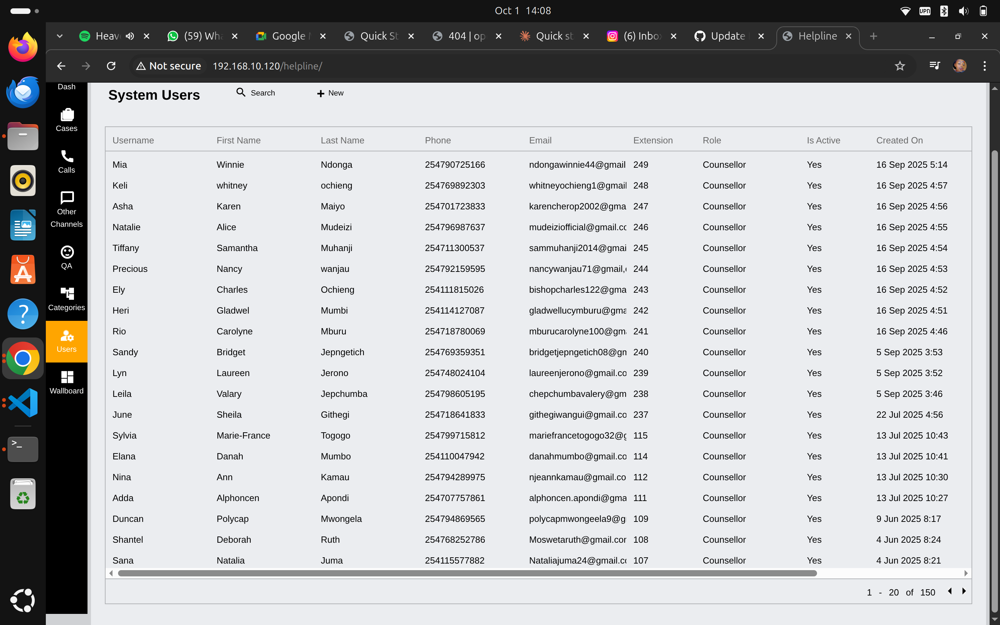

# Team Workflow Management for Supervisors

Guide to monitoring real-time operations, managing staff, and ensuring optimal helpline coverage.

## Real-Time Operations Monitoring

### Accessing the Wallboard


**Navigation**: Click **"Wallboard"** in the left sidebar

**What Is the Wallboard?**  
A real-time display showing current counsellor activity, call queue status, and team performance metrics.

### Counsellors Online Section

**Displays**:
- Number of counsellors currently online (e.g., "6" counsellors)
- Individual counsellor status
- Call handling metrics
- Real-time activity

**Table Columns**:
- **Ext.** - Extension number
- **Name** - Counsellor name
- **Caller** - Current caller number (if on call)
- **Answered** - Total calls answered today
- **Missed** - Calls missed today
- **Talk Time** - Current call duration
- **Queue Status** - Current activity state
- **Duration** - Time in current status

### Understanding Queue Status

**Status Indicators**:

🟢 **OnCall** (Green)
- Currently speaking with caller
- Duration shows how long on current call
- Monitor for unusually long calls

🟡 **Wrapup** (Orange)
- Completing post-call documentation
- Standard time: 2-5 minutes
- Watch for excessive wrapup time

⚪ **Available** (Gray)
- Ready to receive calls
- Waiting for next caller
- Idle time tracked

**Status Colors Help You**:
- Quickly identify who's busy
- Spot coverage gaps
- Monitor workload distribution
- Identify potential issues

### Calls in Queue Section

**Shows**:
- Number of callers waiting
- Extension/number waiting for
- Caller phone number
- Wait status (Connected, IVR, etc.)
- Wait duration

**Example**:
```
Calls in Queue: 0  ← No one waiting (good!)
Calls in Queue: 3  ← 3 callers waiting (need to monitor)
Calls in Queue: 10 ← High volume (action needed)
```

## Monitoring Team Performance

### Key Metrics to Watch

**Real-Time Indicators**:

| Metric | Green | Yellow | Red |
|--------|-------|--------|-----|
| **Queue Size** | 0-2 callers | 3-5 callers | 6+ callers |
| **Wrapup Time** | <3 min | 3-5 min | >5 min |
| **Available Counsellors** | 3+ available | 1-2 available | 0 available |
| **Answered vs Missed** | >95% answered | 90-95% answered | <90% answered |

### Identifying Issues

**Red Flags**:
- Multiple counsellors on long calls simultaneously
- Consistently high missed call rates for one counsellor
- Extended wrapup times (>5 minutes repeatedly)
- No available counsellors during busy periods
- Growing call queue

**Immediate Actions**:
- Contact counsellor if issue is urgent
- Reassign tasks if someone needs backup
- Bring additional staff online if available
- Document patterns for staffing adjustments

### Throughout the Day

**Morning (Shift Start)**:
- Verify all scheduled staff are online
- Check extension assignments
- Review any handover notes from previous shift
- Brief team on priorities for the day

**Mid-Day**:
- Monitor queue levels during lunch breaks
- Ensure staggered breaks for coverage
- Check in with counsellors handling difficult cases
- Address any emerging issues

**End of Day**:
- Review day's metrics
- Note any incidents or concerns
- Prepare handover for next shift
- Ensure all counsellors complete documentation

## Managing Staff

### User Management



**Navigation**: Click **"Users"** in the sidebar (Admin access required)

### User List Overview

**Information Displayed**:
- **Username** - Login ID
- **First Name & Last Name** - Full name
- **Phone** - Contact number
- **Email** - Email address
- **Extension** - Phone system extension
- **Role** - Permission level
- **Is Active** - Account status (Yes/No)
- **Created On** - When account was created

### User Roles


**Available Roles**:
- **Counsellor** - Frontline operators
- **Supervisor** - Team leads (you)
- **Case Manager** - Case oversight
- **Case Worker** - Field staff
- **Partner** - External organization access
- **Media Account** - Communications team
- **Administrator** - System admin (full access)

**Role Determines**:
- What they can see
- What they can edit
- Who they can manage
- Reports they can access

### Creating New User Accounts

**When You Need To**:
- New hire onboarding
- Temporary staff for busy periods
- Replacement for departed staff
- Role changes/promotions

**Steps**:
1. Click **"+ New"** button (top right)
2. Fill in user information:
   - Username (unique, no spaces)
   - First and Last Name
   - Phone number
   - Email address
   - Extension number
   - Role (select appropriate level)
3. Set temporary password
4. Mark as **Active**
5. Save

**New User Checklist**:
- [ ] Account created
- [ ] Login credentials sent securely
- [ ] Extension configured in phone system
- [ ] Added to team schedule
- [ ] Training completed
- [ ] Shadow shift completed
- [ ] First solo shift observed

### Editing User Accounts

**Common Updates**:
- Change extension number
- Update contact information
- Modify role/permissions
- Activate/deactivate account
- Reset password

**To Edit**:
1. Click on user in the list
2. Modify necessary fields
3. Save changes
4. Notify user of any changes

### Deactivating Users

**When Staff Leave**:
1. Open their user profile
2. Set **"Is Active"** to **"No"**
3. Save changes
4. User can no longer log in
5. Their data remains in system for records

**Important**: Don't delete users - deactivate them. This preserves:
- Case history
- QA records
- Performance data
- Audit trails

## Staff Scheduling

### Coverage Requirements

**Minimum Staffing Levels**:
- Peak hours (10am-6pm): 4-6 counsellors
- Off-peak hours: 2-3 counsellors
- Night shift: 1-2 counsellors (if 24/7)
- Always have supervisor available

**Considerations**:
- Call volume patterns
- Day of week (weekends may differ)
- Special events or campaigns
- Staff experience levels (mix experienced with new)

### Creating Schedules

**Best Practices**:
- Post schedule 2 weeks in advance
- Rotate shifts fairly
- Consider counsellor preferences
- Plan for breaks and lunch
- Build in overlap for handovers
- Have backup staff identified

**Schedule Format Example**:
```
Monday, Oct 2:
8am-4pm: Maria (Ext 187), John (Ext 144)
12pm-8pm: Sarah (Ext 133), Lyn (Ext 239)
Supervisor: You (Ext 250)
```

### Managing Time Off

**Approval Process**:
1. Counsellor requests time off
2. Check schedule coverage
3. Approve if adequate coverage
4. Update schedule
5. Notify team of changes

**Balance**:
- Staff wellbeing (approve reasonable requests)
- Service needs (maintain coverage)
- Fairness (equal opportunity for time off)

## Handling Escalations

### When Counsellors Need Help

**Common Escalation Scenarios**:
- High-risk case (immediate danger)
- Uncertain how to proceed
- Difficult or abusive caller
- Technical system issues
- Personal crisis during shift

### How Counsellors Reach You

**Methods**:
- Internal messaging/chat
- Phone extension
- **Emergency button** (for urgent situations)
- In-person (if on-site)

**Response Time Expectations**:
- Emergency: Immediate (within 1 minute)
- High priority: Within 5 minutes
- Standard questions: Within 15 minutes

### Responding to Escalations

**Step 1: Assess Urgency**
- Is child in immediate danger? → Call emergency services
- Does counsellor need immediate help? → Drop everything
- Can it wait 5 minutes? → Finish current task first

**Step 2: Take Action**
- Listen to counsellor's concern
- Review case if needed
- Provide clear guidance
- Take over call if necessary
- Document the escalation

**Step 3: Follow Up**
- Debrief with counsellor after
- Check if they need support
- Update case notes
- Report to management if needed

## Supporting Staff Wellbeing

### Recognizing Stress and Burnout

**Warning Signs**:
- Increased absenteeism
- Declining QA scores
- Short temper or irritability
- Disengagement from team
- Rushing through calls
- Mistakes in documentation

**Causes of Stress**:
- High call volume
- Difficult cases (abuse, death)
- Feeling helpless
- Lack of support
- Poor work-life balance

### Providing Support

**Daily Support**:
- Check in with each counsellor
- Encourage breaks
- Create safe space to debrief
- Acknowledge difficult calls
- Celebrate successes

**Structured Support**:
- Regular one-on-ones (bi-weekly minimum)
- Team meetings (weekly)
- Debriefing sessions after traumatic cases
- Access to counseling services
- Team building activities

**When to Refer for Professional Help**:
- Persistent symptoms of depression or anxiety
- Significant changes in behavior
- Talk of harming self or others
- Inability to function at work
- Substance abuse signs

## Team Meetings and Communication

### Weekly Team Meetings

**Agenda Template**:
1. **Metrics Review** (10 min)
   - Call volumes
   - QA scores
   - Team achievements

2. **Case Discussions** (15 min)
   - Complex cases
   - Learning opportunities
   - Protocol updates

3. **Team Updates** (10 min)
   - Schedule changes
   - New policies
   - Training opportunities

4. **Open Discussion** (15 min)
   - Concerns or questions
   - Suggestions for improvement
   - Peer recognition

**Best Practices**:
- Start and end on time
- Create safe space for honest discussion
- Encourage participation from all
- Follow up on action items
- Rotate note-taking responsibility

### Daily Huddles

**Quick 10-Minute Stand-Up**:
- Any high-priority cases to watch
- Staffing or coverage issues
- Quick wins to celebrate
- Questions or concerns

**When**: Start of each shift

### Communication Channels

**For Urgent Issues**:
- Phone/extension
- Emergency alerts
- In-person

**For Non-Urgent**:
- Team chat/messaging
- Email for documentation
- Staff bulletin board

## Managing Different Channels

### Phone Calls (Primary Channel)

**Monitoring**:
- Real-time wallboard tracking
- Call duration alerts
- Missed call reports
- Peak time analysis

**Optimization**:
- Adjust staffing to call patterns
- Route calls efficiently
- Minimize hold times
- Ensure adequate coverage

### Other Channels


**Navigation**: Click "Other Channels" in sidebar

**Available Channels**:
- SMS/Text messages
- Email inquiries
- Social Media (Facebook, WhatsApp)
- Chatbot interactions

**Your Role**:
- Monitor response times
- Ensure channel coverage
- Track channel-specific metrics
- Escalate technical issues

**Assignment Strategy**:
- Dedicated staff for each channel (if volume justifies)
- Or rotation system where counsellors cover multiple channels
- Always have backup coverage

## Performance Management

### Setting Expectations

**Clear Standards For**:
- Response times (answer within X rings)
- Case documentation (complete within 24 hours)
- QA scores (minimum 80%)
- Attendance and punctuality
- Professional conduct

**Communicate Standards**:
- During onboarding
- In writing (handbook)
- Regular reminders
- Performance reviews

### Tracking Individual Performance

**Key Metrics Per Counsellor**:
- Calls handled (quantity)
- Average handling time
- QA scores (quality)
- Missed call rate
- Case completion rate
- Attendance record

**Review Frequency**:
- Informal check-ins: Weekly
- Formal one-on-ones: Bi-weekly
- Performance reviews: Quarterly
- Annual comprehensive review

### Addressing Performance Issues

**Early Intervention**:
1. Notice the pattern
2. Discuss with counsellor privately
3. Understand root cause
4. Create improvement plan
5. Set clear timeline
6. Provide support and resources
7. Follow up regularly

**Performance Improvement Plan (PIP)**:
- Specific issues identified
- Measurable goals set
- Timeline for improvement (typically 30-60 days)
- Regular check-ins scheduled
- Consequences if no improvement
- Documentation of all steps

**Progressive Discipline** (if needed):
1. Verbal warning (documented)
2. Written warning
3. Final warning
4. Termination (following HR policies)

### Recognizing Excellence

**Ways to Recognize**:
- Public praise in team meetings
- Private thank you notes
- Employee of the month
- Small rewards/gift cards
- Professional development opportunities
- Recommendation letters

**What to Recognize**:
- High QA scores
- Going above and beyond
- Helping team members
- Creative problem-solving
- Positive client feedback
- Consistent reliability

## Shift Handovers

### Effective Handovers

**Information to Share**:
- Current queue status
- High-priority cases in progress
- System issues or outages
- Staffing changes for next shift
- Any urgent follow-ups needed

**Handover Format**:
```
Date: Oct 1, 2025
Outgoing Shift: 8am-4pm
Incoming Shift: 4pm-12am

Status:
- 6 counsellors online
- 2 calls in queue
- All systems operational

High Priority Cases:
- Case #12345: 10yo girl, possible abuse, police report filed,
  follow-up call scheduled for 6pm today
- Case #12346: Suicidal teen, referred to crisis center,
  awaiting confirmation

Notes:
- Network was slow 2-3pm, resolved
- Maria (Ext 187) handling difficult case, may need support
- John (Ext 144) leaving early at 3pm for appointment

Next Shift Lead: Sarah
```

### Documentation

**Where to Document**:
- Shift log (shared document)
- Handover sheet (physical or digital)
- Team chat channel
- Email to next supervisor

**Keep It**:
- Brief but complete
- Organized and clear
- Accessible to next shift
- Updated throughout shift

## Crisis Management

### Types of Crises

**Operational Crises**:
- System outage
- Phone system down
- Understaffing (call-outs)
- Overwhelming call volume

**Individual Crises**:
- Counsellor experiencing personal emergency
- High-risk case requiring immediate action
- Workplace safety issue
- Threat to staff

### Crisis Response

**Immediate Actions**:
1. Assess situation severity
2. Ensure safety first (staff and callers)
3. Implement contingency plan
4. Communicate clearly with team
5. Escalate to management if needed
6. Document everything

**Communication During Crisis**:
- Brief, clear updates
- Multiple channels (don't rely on system that's down)
- Reassure staff
- Provide clear instructions
- Follow up frequently

**After Crisis**:
- Debrief with team
- Document lessons learned
- Update contingency plans
- Provide support to affected staff
- Report to management

## Contingency Planning

### Common Scenarios and Plans

**System Outage**:
- Manual call logging procedures
- Paper backup forms ready
- IT contact information accessible
- Communication plan for team
- Enter data when system returns

**Understaffing**:
- On-call backup staff list
- Cross-trained supervisors can take calls
- Prioritize critical cases
- Adjust service hours if needed
- Communicate with callers about delays

**High Volume**:
- Bring in additional staff
- Extend shifts (if possible)
- Implement overflow procedures
- Prioritize by urgency
- Consider callback system

**Power Outage**:
- Backup location identified
- Mobile phones as backup
- Generator (if available)
- Remote work options
- Rescheduling protocol

## Reporting to Management

### Regular Reports

**Weekly Summary**:
- Call volume statistics
- Staffing levels
- Key incidents
- Training completed
- Issues requiring attention

**Monthly Report**:
- Team performance metrics
- QA summary
- Cases handled by category
- Staff attendance
- Training needs
- Budget implications

**Quarterly Review**:
- Trend analysis
- Goal achievement
- Team development
- Process improvements
- Strategic recommendations

### Ad-Hoc Reporting

**Report Immediately**:
- Serious safety incidents
- Data breaches or security issues
- Staff misconduct
- Major system failures
- Media inquiries
- Legal concerns

## Quick Reference

### Daily Supervisor Tasks

**Start of Day**:
- [ ] Check wallboard - all staff online?
- [ ] Review handover notes
- [ ] Check for urgent cases
- [ ] Brief team on priorities

**Throughout Day**:
- [ ] Monitor wallboard regularly
- [ ] Respond to escalations
- [ ] Support counsellors
- [ ] Track metrics

**End of Day**:
- [ ] Complete shift log
- [ ] Prepare handover
- [ ] Document incidents
- [ ] Review tomorrow's schedule

### Key Performance Indicators

| Metric | Target | Alert If |
|--------|--------|----------|
| Queue Size | 0-2 | >5 callers |
| Answer Rate | >95% | <90% |
| Avg Wrapup Time | <3 min | >5 min |
| QA Score | >85% | <80% |
| Staff Utilization | 70-85% | <60% or >90% |

## Tools and Resources

**System Access**:
- Wallboard for real-time monitoring
- User management for staff administration
- QA system for quality reviews
- Reporting dashboards for analytics

**Documents**:
- Staff handbook
- Emergency procedures
- Contact lists
- Training materials
- Performance templates

**Support**:
- IT help desk
- HR department
- Management team
- UNICEF mentors

## Getting Help

**Operational Issues**:
- IT support for technical problems
- Management for policy questions
- HR for personnel issues

**Professional Development**:
- Supervisor training programs
- Peer supervisor network
- Industry conferences
- Online resources

## Next Steps

- **[Quality Assurance Monitoring](./quality-assurance-monitoring.md)** - Conduct effective QA reviews
- **[Reporting Dashboards](./reporting-dashboards.md)** - Analyze team performance data

---

**Remember**: Your role is to enable your team to do their best work. Support them, guide them, protect them, and celebrate them. A strong supervisor creates a strong team, and a strong team saves lives.