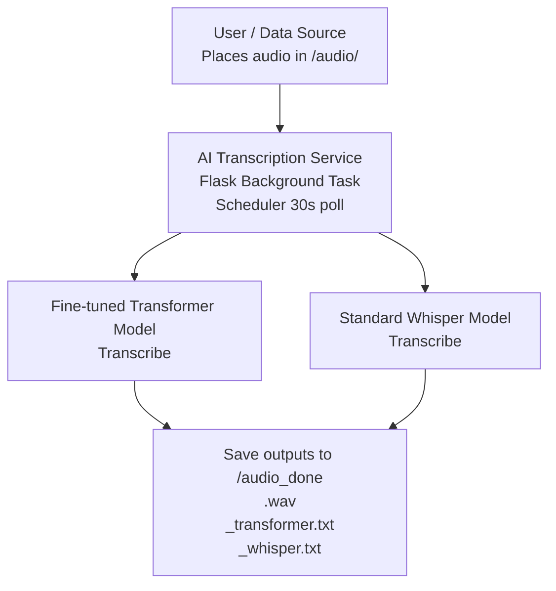

# AI Transcription Service Design Document

## 1. Overview

The **AI Transcription Service** is a background process within a Flask application that automatically detects, transcribes, and organizes audio files. It uses two transcription models:

- **Fine-tuned Transformer-based Whisper model**
- **Standard OpenAI Whisper model**

---

## 2. Objectives

- Automate transcription of audio files dropped into a designated folder
- Produce comparative outputs from two distinct models
- Organize and archive original audio and transcription results
- Provide an API endpoint for manual transcription triggers

---

## 3. System Architecture



---

## 4. How It Works

1. **Service Execution**
   - Registered as a background task in the Flask app
   - Uses a scheduler to run every **30 seconds**
   - Scans:

```bash
/home/bitz/aidev/datasets/audio/
```

2. **File Processing**
   For each supported audio file (`.wav`, `.mp3`, `.ogg`, `.flac`):
   1. Load file
   2. Transcribe with the **fine-tuned model**
   3. Transcribe with the **standard Whisper model**
   4. Save outputs:
      - `<filename>_transformer.txt`
      - `<filename>_whisper.txt`
   5. Move original and output files to:

```bash
/home/bitz/aidev/datasets/audio_done/
```

---

## 5. Project Folder Structure

```
ai_service/
├── app.py                    # Main Flask application
├── transcriber/
│   ├── init.py              # Transcriber module init
│   ├── whisper_custom.py    # Fine-tuned Transformer model logic
│   ├── whisper_standard.py  # Standard OpenAI Whisper logic
│   └── utils.py            # Shared utilities (scanning, moving files)
├── scheduler/
│   ├── init.py
│   └── watcher.py          # Monitors folder and triggers transcription
├── config/
│   ├── init.py
│   └── settings.py         # Configurable paths, intervals, model flags
├── logs/
│   └── transcriber.log     # Log file (or symlink to system journal)
├── requirements.txt        # Python dependencies
└── README.md              # This document & usage notes
```

---

## 6. Configuration

Edit `ai_service/config/settings.py`:

```python
# Directory paths
AUDIO_INPUT_DIR  = "/home/bitz/aidev/datasets/audio/"
AUDIO_OUTPUT_DIR = "/home/bitz/aidev/datasets/audio_done/"

# Scheduler
POLLING_INTERVAL = 30            # seconds

# Model settings
USE_GPU          = True
CUSTOM_MODEL_PATH = "/path/to/fine­tuned/model"
```

## 7. Usage Instructions

### Add Audio
Place your `.wav`, `.mp3`, `.ogg`, or `.flac` files in:

```bash
/home/bitz/aidev/datasets/audio/
```

### Automatic Processing
The service polls every 30 seconds and processes new files.

### Retrieve Results
Find originals & transcripts in:

```bash
/home/bitz/aidev/datasets/audio_done/
```

## 8. API Endpoint

Trigger transcription manually:

```bash
curl "http://localhost:50001/transcribe/data/casedata" \
  -H "Content-Type: application/json" \
  --data '{"task": "transcribe", "docs": 100}'
```

- task: Action ("transcribe")
- docs: Number of files to process in one call

## 9. Monitoring

To follow live logs:

```bash
sudo journalctl -u aidev -f
```

## 10. Troubleshooting

### Service Status

```bash
sudo systemctl status aidev
```

### Ensure Directories Exist

```bash
mkdir -p ~/aidev/datasets/audio
mkdir -p ~/aidev/datasets/audio_done
```

### Permissions

```bash
sudo chown -R bitz:bitz ~/aidev/datasets
```

### Restart Service

```bash
sudo systemctl restart aidev
```
