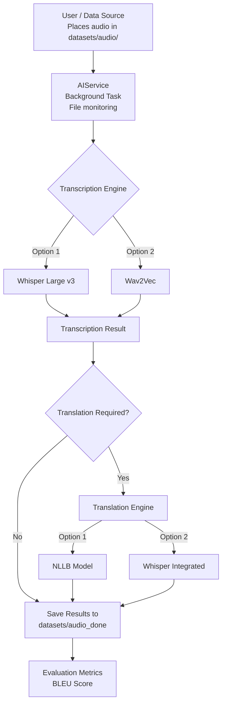

# AIService

## Overview

AIService is a modular speech-to-text and translation solution that processes audio files automatically. The service monitors a designated input folder, processes audio files, and outputs both transcription and translation results.

## Key Features

- **Automated Processing**: Background service that polls for new audio files at configurable intervals
- **Dual Transcription Engines**: 
  - [Whisper Large v3](https://github.com/openai/whisper) (OpenAI)
  - [Wav2Vec](https://huggingface.co/facebook/wav2vec2-large-960h) (Facebook/Meta)
- **Translation Integration**:
  - [NLLB (No Language Left Behind)](https://github.com/facebookresearch/fairseq/tree/nllb) for high-quality translation of transcripts
  - Optional Whisper integrated transcription+translation
- **Organized Output**: Structured storage of originals and processed files
- **Evaluation Metrics**: Tools for assessing transcription and translation quality

## System Architecture



## How It Works

1. **Service Execution**
   - Runs as a background task in the Flask application
   - Regularly scans the input directory for new audio files

2. **Transcription Processing**
   - Detects supported audio formats (`.wav`, `.mp3`, `.ogg`, `.flac`)
   - Based on configuration, processes with either:
     - Whisper Large v3 model
     - Wav2Vec model

3. **Translation Processing**
   - After transcription, text is routed to translation:
     - Primary method: NLLB model receives transcription output
     - Alternative method: Whisper handles both transcription and translation in one step

4. **Output Management**
   - Saves transcription and translation results as text files
   - Moves original audio and output files to the completed directory
   - Maintains organized structure for evaluation and archiving

## Project Folder Structure

```
.
├── config.py                  # Main configuration file
├── instance
│   └── config.py              # Instance-specific configuration
├── run.py                     # Main application entry point
├── datasets
│   ├── audio                  # Input audio directory
│   └── audio_done             # Processed audio directory
├── transcribe
│   ├── __init__.py
│   ├── runscribe.py           # Main transcription engine
│   ├── solorunscribe.py       # Standalone transcription
│   └── util_code.py           # Transcription utilities
├── translate
│   ├── __init__.py
│   └── translation.py         # Translation engine
├── models
│   ├── __init__.py
│   ├── metrics                # Evaluation metrics
│   │   ├── BLEU.py            # BLEU score implementation
│   ├── casedata.py            # Data models
├── logs
│   ├── __init__.py
│   └── runtime.log            # Application logs
├── requirements.txt           # Python dependencies
└── README.md                  # This document
```

## Core Components

### Transcription Module
Located in `transcribe/runscribe.py`, this module:
- Detects audio files in the input directory
- Processes audio using either Whisper Large v3 or Wav2Vec models
- Saves transcription results to the output directory

### Translation Module
Located in `translate/translation.py`, this module:
- Takes transcribed text as input
- Translates using NLLB model or Whisper's built-in translation capabilities
- Saves translation results alongside transcriptions


## Usage Instructions

### Adding Audio Files
Place your audio files (`.wav`, `.mp3`, `.ogg`, `.flac`) in the input directory:

```bash
datasets/audio/
```

### Automatic Processing
The service monitors the input directory and automatically processes new files.

### Retrieving Results
Find original files and processed outputs in the output directory:

```bash
datasets/audio_done/
```

Output files include:
- Original audio file
- Transcription text file
- Translation text file (if translation is enabled)

## Monitoring

To follow live logs:

```bash
tail -f logs/runtime.log
```

## Installation & Setup

1. Clone the repository
2. Install dependencies:
   ```bash
   pip install -r requirements.txt
   ```
3. Configure settings in `config.py` or `instance/config.py`
4. Start the service:
   ```bash
   python run.py
   ```

## Troubleshooting

### Common Issues

- **Missing Audio Directory**: Create the input/output directories if they don't exist
  ```bash
  mkdir -p datasets/audio
  mkdir -p datasets/audio_done
  ```

- **Model Download Errors**: Ensure internet connection and sufficient disk space
  ```bash
  # Check disk space
  df -h
  ```

- **GPU Not Detected**: Verify CUDA installation if using GPU acceleration
  ```bash
  # Check CUDA availability
  python -c "import torch; print(torch.cuda.is_available())"
  ```

- **Service Fails to Start**: Check the logs for error messages
  ```bash
  cat logs/runtime.log
  ```

### Evaluation and Metrics

The AIService includes evaluation tools to assess transcription and translation quality:

- **BLEU Score**: Located in `models/metrics/BLEU.py`
- **Reference Files**: Use `models/metrics/reference.txt` and `models/metrics/candidate.txt` for evaluation

## Future Enhancements

- Support for additional audio formats
- Enhanced batch processing capabilities
- Integration with additional translation models
- Web interface for monitoring and management
- Real-time processing improvements