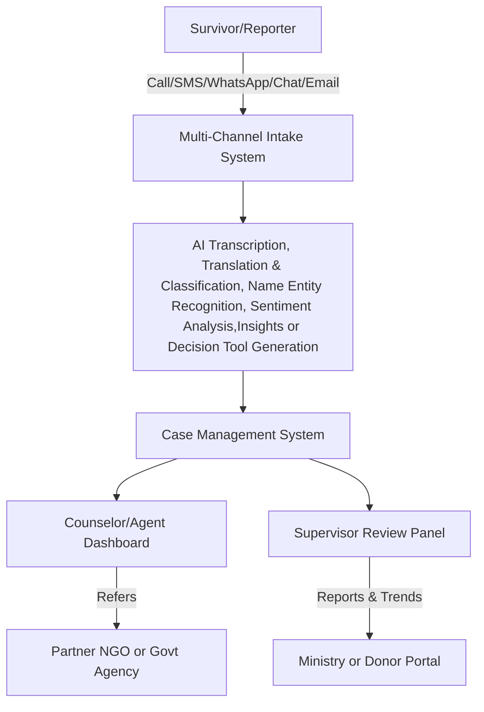

# 📊 Data Map for VAC & GBV Call Center

This document outlines the data flows, processing activities, and privacy considerations for a call center focused on Violence Against Children (VAC) and Gender-Based Violence (GBV) cases.

---

## 1. 🛠️ System Data Flow

## 2. 🗂️ Data Inventory Table

| **Data Element**        | **Collected From**         | **Purpose**                       | **Shared With**                | **Retention Policy**             |
|-------------------------|----------------------------|------------------------------------|--------------------------------|----------------------------------|
| Name/Phone Number       | Caller/chat/email input    | Contact, follow-up                | Internal only                  | 3–6 months post-resolution       |
| Case Description        | Voice/chat/email content   | Triage, classification            | Supervisors, NGOs (with consent) | Retained for 2 years             |
| Age, Gender             | Caller or child info       | Assess vulnerability              | Internal                       | Encrypted, redact when shared    |
| Audio Recording         | Phone system               | Evidence, quality assurance       | Not shared                     | Auto-deleted after 30 days       |
| Chat/WhatsApp Messages  | Chat/WhatsApp systems      | Case documentation                | Internal                       | 1 year or anonymized for NLP     |
| Emails                  | Email system               | Case documentation, referrals     | Internal, trusted partners     | Archive after 6 months           |
| Location (District)     | Caller/device info         | Connect to local services         | NGOs, Govt                     | Shared with consent              |
| Case Category (VAC/GBV) | AI/NLP classification      | Workflow automation               | Reporting dashboard            | Anonymized before analytics      |
| Referrals & Notes       | Agents/supervisors         | Track case movement               | Relevant service providers     | Retained as per MoU              |
| Consent Records         | Caller input/log files     | Legal compliance                  | Internal only                  | 5 years minimum                  |

---

## 3. 🔐 Privacy & Security Considerations

- **Legal Basis for Processing**: Consent, legal obligation, vital interest.
- **Access Control**: Role-based access (Agents, Supervisors, NGOs).
- **Storage Security**: Encrypted databases, cloud storage with geo-fencing.
- **Data Sharing Agreements**: MoUs required with all external partners.
- **AI/ML Use**: Anonymize sensitive inputs; log model interactions and decisions.
- **Incident Response**: Rapid breach notification, incident handling SOPs.
- **Chat/Email/WhatsApp**: End-to-end encryption; session tokens; opt-in terms.

---

## 4. 📝 Notes

- System designed to support survivors of VAC and GBV through secure, multi-channel communication.
- Periodic reviews of this map are conducted during Privacy Impact Assessments (PIA).
- Compliant with CHS, GDPR, Kenya Data Protection Act, HIPAA (if applicable), and donor standards.

---

**Document Owner**: [BITZ IT CONSULTING]  
**Version**: 1.0  
**Last Updated**: 2025-05-30
