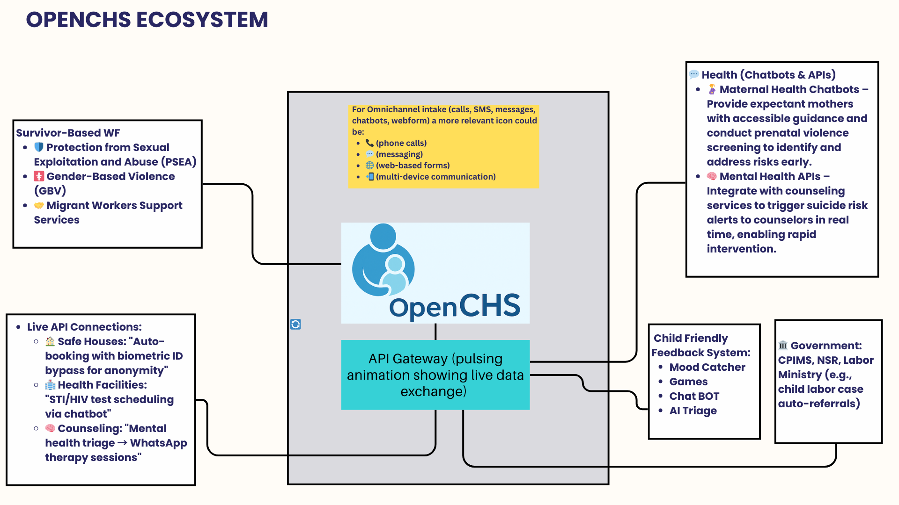

# Ecosystem Overview

The **openCHS Ecosystem** brings together the **Helpline Service**, the **AI Service**, and connected partner systems into a unified platform for child protection case management.

## Core Components

### 1. Helpline Service
- **Omni-channel communication** (voice, messages, web)
- **Voice-to-text transcription** for accurate case capture
- **Real-time dashboards** to monitor:
  - Location of incidents
  - Perpetrator type
  - Abuse category
  - Resolution time
  - Referral completion
- **Connected referrals** to partner agencies
- **Case lifecycle management** from intake to closure

### 2. AI Service
- **Speech-to-Text + Translation** (Whisper + NLLB)
- **Entity extraction** (names, gender, institutions, locations)
- **Automated classification** (categories, interventions, risks, referrals)
- **Decision support** using risk scores & intervention suggestions
- **Data preparation** for data-driven decision making

### 3. Partner Integrations
- **Government child protection systems** (e.g., CPIMS)
- **Referral partner platforms**
- **Reporting dashboards** for policymakers and stakeholders

## Data Flow
1. **Call or message received** via Helpline Service
2. **AI Service processes** the input (transcribe, translate, classify, extract entities)
3. **Case record created/updated** in openCHS
4. **Connected referrals** sent to partner systems
5. **Monitoring & reporting** through real-time dashboards

## Diagram

*(Replace `/images/ecosystem-diagram.png` with the actual path once the diagram is uploaded)*

---

## Benefits of the Ecosystem
- **No lost calls due to language barriers**
- **50% less time spent on admin** — more time for survivor care
- **No dropped referrals** or duplicate paperwork
- **Actionable insights** for caseworkers and policymakers

---

## OPENCHS ECOSYSTEM COMPONENTS

### Survivor-Based WF
- 🛡️ Protection from Sexual Exploitation and Abuse (PSEA)
- 🚺 Gender-Based Violence (GBV)
- 🤝 Migrant Workers Support Services

### Live API Connections
- 🏠 **Safe Houses:** "Auto-booking with biometric ID bypass for anonymity"
- 🏥 **Health Facilities:** "STI/HIV test scheduling via chatbot"
- 🧠 **Counseling:** "Mental health triage → WhatsApp therapy sessions"
- API Gateway (pulsing animation showing live data exchange)

### Health (Chatbots & APIs)
- 🤰 **Maternal Health Chatbots:** Provide expectant mothers with accessible guidance and conduct prenatal violence screening to identify and address risks early.
- 🧠 **Mental Health APIs:** Integrate with counseling services to trigger suicide risk alerts to counselors in real time, enabling rapid intervention.

### Government
- CPIMS, NSR, Labor Ministry (e.g., child labor case auto-referrals)

### Child Friendly Feedback System
- Mood Catcher
- Games
- Chat BOT
- AI Triage

### Omnichannel Intake
For Omnichannel intake (calls, SMS, messages, chatbots, webform) a more relevant icon could be:
- 📞 (phone calls)
- 💬 (messaging)
- 🌐 (web-based forms)
- 📲 (multi-device communication)