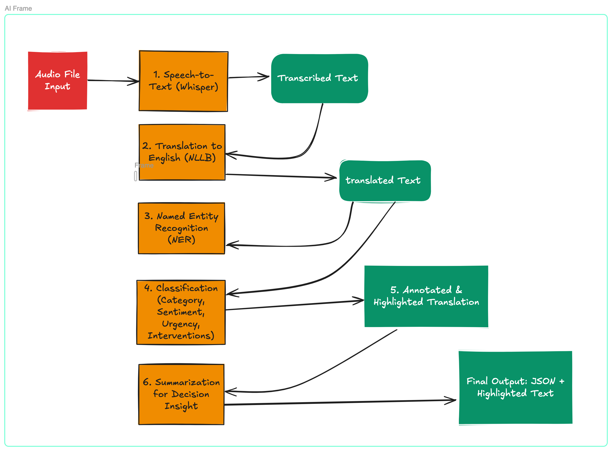

# 🧠 Django-based AI Service Pipeline Documentation

## Overview

This Django-based AI service processes an **input audio file** and generates an **insightful, structured summary** by combining transcription (Whisper), translation (NLLB), named entity recognition (NER), classification, and summarization. The system supports multilingual voice input and outputs decision-ready summaries with annotations.

---

## 🔁 Pipeline Workflow


## 📁 Django Project Structure (Recommended)

```bash
ai_service/
├── ai_service/                 # Django project config
│   └── settings.py
├── core/                       # Core app for pipeline logic
│   ├── models.py               # Store uploaded files and metadata
│   ├── views.py                # Handle requests & orchestrate pipeline
│   ├── serializers.py          # DRF serializers
│   ├── pipeline/               # Core processing logic
│   │   ├── transcription.py
│   │   ├── translation.py
│   │   ├── ner.py
│   │   ├── classifier.py
│   │   └── summarizer.py
│   └── utils/                  # Helper functions
│       └── highlighter.py
├── media/                      # Uploaded audio files
├── manage.py
└── requirements.txt
```

## 🔧 Pipeline Component Descriptions

### 1. Transcription (Whisper)
- Library: openai-whisper or faster-whisper
- Input: Uploaded audio file
- Output: Plain text transcript with timestamps

### 2. Translation (NLLB)
- Library: HuggingFace nllb-200 model
- Input: Transcript in source language
- Output: English-translated text

### 3. Named Entity Recognition (NER)
- Library: spaCy / Transformers
- Output: Tagged entities (Person, Location, CaseType, etc.)

### 4. Classification
Models:
- Case Category (multi-label)
- Sentiment (positive / neutral / negative)
- Urgency (low / medium / high)

### 5. Annotation
- Markup: Uses <mark> or custom spans for entity & category highlights

### 6. Summarization
- Model: T5 / PEGASUS / GPT
- Output: 2–3 sentence summary with decisions

## 🧪 Example Input & Output

### 📥 Input
- File: voice_note_001.wav
- Language: Luganda

### 📤 Output (JSON)
```json
{
  "transcript": "Omwana wange anyanyasibwa ku ssomero...",
  "translation": "My child is being abused at school...",
  "entities": [
    {"text": "child", "label": "PERSON"},
    {"text": "school", "label": "LOCATION"}
  ],
  "classification": {
    "category": "Child Abuse",
    "sentiment": "negative",
    "urgency": "high"
  },
  "annotated_text": "<mark class='person'>child</mark> is being abused at <mark class='location'>school</mark>.",
  "summary": "High-urgency child abuse report from school. Escalation required."
}
```

## 🧰 Django REST Framework API (Optional)

| Endpoint | Method | Description |
|----------|--------|-------------|
| /api/process/ | POST | Accept audio file and return results |
| /api/status/ | GET | Check pipeline status (async option) |

Example POST /api/process/
```bash
curl -F "audio=@voice_note.wav" http://localhost:8000/api/process/
```

DRF Serializer Snippet
```python
class AudioInputSerializer(serializers.Serializer):
    audio = serializers.FileField()
```

## 🛡️ Data Protection
- Storage: Uploaded audio and processed data stored under /media/
- Privacy: GDPR & child protection compliant
- Redaction: Optional entity masking or redaction before storage/export

## ✅ Next Steps
- [ ] Scaffold Django app & models
- [ ] Integrate Whisper in transcription.py
- [ ] Integrate NLLB in translation.py
- [ ] Add NER, classification, and summarization logic
- [ ] Expose endpoints via DRF
- [ ] Implement test suite and async processing (e.g., Celery)

## 📦 Dependencies
```txt
Django>=4.2
djangorestframework
transformers
torch
whisper
faster-whisper
fairseq
spaCy
scikit-learn
```