# 📞 AI Audio Pipeline System Design (Django + Asterisk)

## 🌟 Objective

Design a robust, scalable system to process audio calls from an Asterisk-based telephony system using Django, with two modes of operation:

* 🔴 **Live Streaming**: Process calls in real-time (e.g., transcription, classification)
* 📌 **Post-Call Processing**: Process recordings after the call ends

---

## 🏗️ System Architecture

### 🔧 Components

| Component            | Description                                                  |
| -------------------- | ------------------------------------------------------------ |
| **Asterisk**         | Handles calls and streams/saves audio                        |
| **Django App**       | Receives webhook, queues tasks, manages pipeline             |
| **Celery Workers**   | Execute AI pipeline asynchronously                           |
| **Redis**            | Celery message broker                                        |
| **Database**         | Stores audio files, transcripts, summaries, insights         |
| **Client/Dashboard** | Displays processed results to users (e.g., agents, analysts) |

---

### 🫙 Architecture Diagram (Mermaid)

```mermaid
flowchart TD
    subgraph Asterisk [🯧 Asterisk Telephony System]
        A1[📞 Caller Connects]
        A2[🛄 Send Audio Stream]
        A3[📌 Save Call Recording]
    end

    subgraph RealTime [🔴 Real-Time Processing]
        B1[🌐 Django WebSocket]
        C1[📝 Live Transcription]
        C2[🧠 Real-time NLU]
        D1[📄 Live Dashboard]
    end

    subgraph PostCall [📌 Post-Call Processing]
        E1[📂 Audio Storage]
        E2[🌐 Django API]
        F1[🎯 Celery Tasks]
        F2[📝 AI Pipeline]
        F3[(📎 Database)]
        F4[📄 Analytics Dashboard]
    end

    A1 --> A2
    A1 --> A3
    
    A2 --> B1
    B1 --> C1
    C1 --> C2
    C2 --> D1

    A3 --> E1
    E1 --> E2
    E2 --> F1
    F1 --> F2
    F2 --> F3
    F3 --> F4
```


---

## 🔴 Live Streaming (Real-Time Call Processing)

### 🔁 Flow

1. Asterisk streams audio via ARI/RTSP/WebSocket
2. Django receives the stream (via Django Channels or FastAPI)
3. Small chunks are transcribed using Whisper
4. Real-time outputs:

   * Transcript
   * Detected issues (e.g., abuse, distress)
   * Named Entities (e.g., names, locations)
5. Dashboard receives real-time updates via WebSocket

### 🔧 Tools

| Function      | Tool                                      |
| ------------- | ----------------------------------------- |
| Streaming     | Asterisk ARI or AGI                       |
| Live Server   | Django Channels or FastAPI                |
| Real-time NLP | Whisper.cpp, small transformer models     |
| Client        | Web dashboard using Vue/React + WebSocket |

---

## 📌 Post-Call Processing (Batch Mode)

### 🔁 Flow

1. Call ends
2. Asterisk saves `.wav`/`.mp3` file
3. Asterisk sends webhook to Django:

   ```http
   POST /api/recording-done/
   {
     "call_id": "1737217551",
     "recording_url": "http://asterisk.local/records/1737217551.wav"
   }
   ```
4. Django fetches the file, saves it to `audio_files/`
5. Celery queue handles:

   * Transcription
   * Translation
   * Summarization
   * NER
   * Classification
   * Insight generation
   * Annotated transcript
6. Django saves all results to DB
7. Dashboard fetches results using `audio_id`

### 🫙 Endpoint Example (`views.py`)

```python
class RecordingCompleteWebhook(APIView):
    def post(self, request):
        recording_url = request.data.get("recording_url")
        call_id = request.data.get("call_id")

        if not recording_url or not call_id:
            return Response({"error": "Missing recording_url or call_id"}, status=400)

        response = requests.get(recording_url)
        if response.status_code != 200:
            return Response({"error": "Failed to fetch recording"}, status=502)

        filename = f"{call_id}_{uuid.uuid4().hex}.wav"
        file_path = os.path.join("audio_files/incoming", filename)
        os.makedirs(os.path.dirname(file_path), exist_ok=True)

        with open(file_path, "wb") as f:
            f.write(response.content)

        audio = AudioFile.objects.create(audio=file_path)
        task = process_audio_pipeline.delay(audio.id)

        return Response({"status": "queued", "audio_id": audio.id, "task_id": task.id})
```

---

## 📆 Celery Task Overview

```python
@shared_task(bind=True)
def process_audio_pipeline(self, audio_id):
    audio_instance = AudioFile.objects.get(id=audio_id)

    transcript = transcription.transcribe(audio_instance.audio.path)
    translated = translation.translate(transcript)
    summary = summarizer.summarize(transcript)
    entities = ner.extract_entities(summary, flat=True)
    classification = classifier.classify_case(summary)
    insights = generate_case_insights(summary)
    annotated = highlighter.highlight_text(transcript, entities)

    audio_instance.transcript = transcript
    audio_instance.insights = insights
    audio_instance.annotated_text = annotated
    audio_instance.save()

    return {"status": "completed"}
```

---

## 📂 API Endpoints Summary

| Method | Endpoint                 | Description                                   |
| ------ | ------------------------ | --------------------------------------------- |
| `POST` | `/api/recording-done/`   | Webhook to receive post-call recording        |
| `POST` | `/api/upload/`           | (Optional) Manual file upload                 |
| `GET`  | `/api/status/<task_id>/` | Check processing status                       |
| `GET`  | `/api/audio/<id>/`       | Retrieve results (transcript, insights, etc.) |

---

## 🧠 Design Principles

* Asynchronous pipeline for non-blocking audio processing
* Asterisk-integrated audio capture (stream + save)
* Structured, layered processing pipeline
* Scalable with Celery workers and Redis
* Real-time or batch flexibility depending on use case
* Dashboard-friendly JSON results

---

## 🗋️ Future Extensions

* Support SMS summary for missed calls
* Integrate speech sentiment analysis
* Add voice biometrics for speaker detection
* Auto-tagging of abuse or emergencies
* Graph-based exploration of recurring issues

---

## 👷 Maintainer Notes

* Use Celery with Redis: `celery -A ai_service worker -l info`
* Ensure `audio_files/incoming/` is writable by Django
* Secure webhook endpoints using tokens or IP whitelist
* Use `watchdog` or a polling command if webhook is unavailable
