# 📞 AI Audio Pipeline System Design (Django + Asterisk)

## 🌟 Objective

Design a robust, scalable system to process audio calls from an Asterisk-based telephony system using Django, with two modes of operation:
- 🔴 **Live Streaming**: Process calls in real-time (e.g., transcription, classification)
- 📌 **Post-Call Processing**: Process recordings after the call ends

---

## 🏗️ System Architecture

### 🔧 Components

| Component         | Description |
|------------------|-------------|
| **Asterisk**      | Handles calls and streams/saves audio |
| **Django App**    | Receives webhook, queues tasks, manages pipeline |
| **Celery Workers**| Execute AI pipeline asynchronously |
| **Redis**         | Celery message broker |
| **Database**      | Stores audio files, transcripts, summaries, insights |
| **Client/Dashboard** | Displays processed results to users (e.g., agents, analysts) |
| **Thread Manager** | Routes multiple call streams to distinct pipelines in real-time |

---

### 🫙 Architecture Diagram (Mermaid)

```mermaid
flowchart TD
    subgraph Asterisk [🯧 Asterisk Telephony System]
        A1[📞 Caller Connects]
        A2[🛄 Send Audio Stream]
        A3[📌 Save Call Recording]
    end

    subgraph RealTime [Real-time Processing]
        B1[Thread Manager]
        B2[Stream Router]
        C1[Live Transcription]
        C2[Real-time NLU]
        C3[Agent Dashboard]
    end

    subgraph PostCall [Post-call Processing]
        D1[Audio Buffer]
        D2[Django API]
        E1[Celery Task]
        E2[Processing Pipeline]
        E3[Database]
        E4[Analyst Dashboard]
    end

    A1 --> A2
    A1 --> A3

    %% Live Stream Path
    A2 --> B1
    B1 --> B2
    B2 --> C1
    C1 --> C2
    C2 --> C3

    %% Post-call Path
    A3 --> D1
    D1 --> D2
    D2 --> E1
    E1 --> E2
    E2 --> E3
    E3 --> E4
```

---

## 🔴 Managing Multiple Real-Time Calls

To handle simultaneous live calls:

### 🛏️ Concurrency Strategies

1. **Threaded Streaming Router**
   - Django Channels receives streams
   - `call_id` maps to a dedicated async processing thread
   - Stream processor stores intermediate state per thread

2. **Task Queue Isolation**
   - Each call stream is placed on a thread-safe queue
   - Pipeline reads from that queue, processes independently

3. **Session Management**
   - Assign `session_id = call_id + timestamp`
   - Store intermediate outputs in memory or Redis cache

4. **Real-Time Results Dispatcher**
   - Outputs are pushed to UI/dashboard via WebSocket channel `room:<call_id>`

### 🔧 Tools for Implementation

| Function              | Suggested Tools |
|-----------------------|-----------------|
| Streaming Server      | Django Channels or FastAPI + websockets |
| Concurrent Handling   | Python `asyncio`, `concurrent.futures`, or Celery Events |
| Buffer Management     | `queue.Queue`, Redis pub/sub per call_id |
| Real-Time Push        | Django Channels group, Vue/React WebSocket client |
| Load Balancing        | Nginx/Traefik in front of Django, use Gunicorn workers |

---

## 🔴 Live Streaming (Real-Time Call Processing)

### 🔁 Flow

1. Asterisk streams audio via ARI/RTSP/WebSocket
2. Django receives the stream (via Django Channels or FastAPI)
3. Each call gets a dedicated handler (by call_id)
4. Small chunks are transcribed using Whisper
5. Real-time outputs:
   - Transcript
   - Detected issues (e.g., abuse, distress)
   - Named Entities (e.g., names, locations)
6. Dashboard receives real-time updates via WebSocket

---

## 📌 Post-Call Processing (Batch Mode)

### 🔁 Flow

1. Call ends
2. Asterisk saves `.wav`/`.mp3` file
3. Asterisk sends webhook to Django:
   ```http
   POST /api/recording-done/
   {
     "call_id": "1737217551",
     "recording_url": "http://asterisk.local/records/1737217551.wav"
   }
   ```
4. Django fetches the file, saves it to `audio_files/`
5. Celery queue handles:
   - Transcription
   - Translation
   - Summarization
   - NER
   - Classification
   - Insight generation
   - Annotated transcript
6. Django saves all results to DB
7. Dashboard fetches results using `audio_id`

---

## 📆 Celery Task Overview

```python
@shared_task(bind=True)
def process_audio_pipeline(self, audio_id):
    audio_instance = AudioFile.objects.get(id=audio_id)

    transcript = transcription.transcribe(audio_instance.audio.path)
    translated = translation.translate(transcript)
    summary = summarizer.summarize(transcript)
    entities = ner.extract_entities(summary, flat=True)
    classification = classifier.classify_case(summary)
    insights = generate_case_insights(summary)
    annotated = highlighter.highlight_text(transcript, entities)

    audio_instance.transcript = transcript
    audio_instance.insights = insights
    audio_instance.annotated_text = annotated
    audio_instance.save()

    return {"status": "completed"}
```

---

## 📂 API Endpoints Summary

| Method | Endpoint | Description |
|--------|----------|-------------|
| `POST` | `/api/recording-done/` | Webhook to receive post-call recording |
| `POST` | `/api/upload/` | (Optional) Manual file upload |
| `GET` | `/api/status/<task_id>/` | Check processing status |
| `GET` | `/api/audio/<id>/` | Retrieve results (transcript, insights, etc.) |

---

## 🧠 Design Principles

- Asynchronous pipeline for non-blocking audio processing
- Asterisk-integrated audio capture (stream + save)
- Structured, layered processing pipeline
- Scalable with Celery workers and Redis
- Real-time or batch flexibility depending on use case
- Dashboard-friendly JSON results

---

## 🗋️ Future Extensions

- Support SMS summary for missed calls
- Integrate speech sentiment analysis
- Add voice biometrics for speaker detection
- Auto-tagging of abuse or emergencies
- Graph-based exploration of recurring issues

---

## 👷 Maintainer Notes

- Use Celery with Redis: `celery -A ai_service worker -l info`
- Ensure `audio_files/incoming/` is writable by Django
- Secure webhook endpoints using tokens or IP whitelist
- Use `watchdog` or a polling command if webhook is unavailable