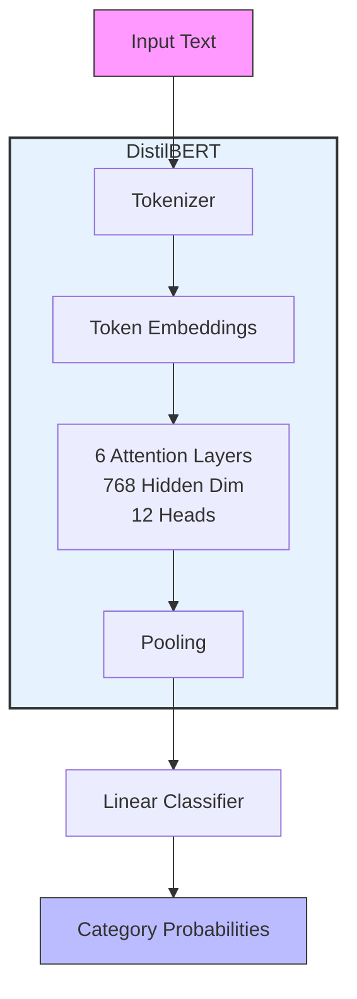
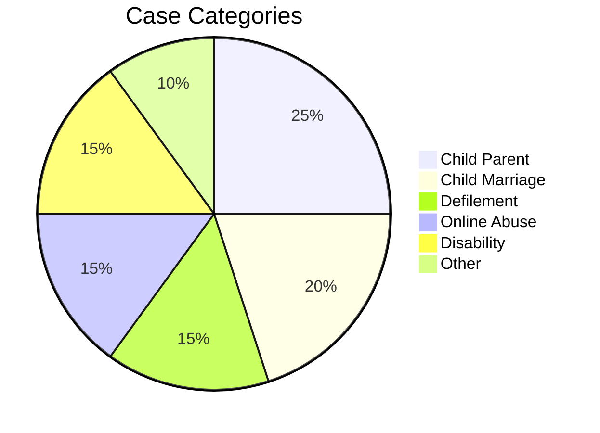
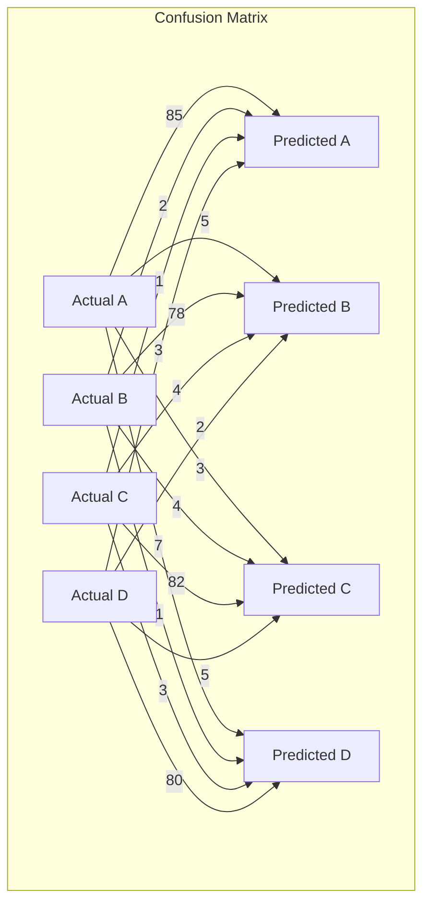

# Child Protection Case Classification Model


## Model Architecture



## 1. Overview

### Model Purpose

Automated classification of child protection case narratives into standardized categories for:
- Case prioritization
- Resource allocation
- Trend analysis

### Version Information

| Component       | Version |
|-----------------|---------|
| Model Weights   | 1.0.0   |
| Tokenizer       | 1.0.0   |
| Training Data   | v2024-06|

## 2. Data Generation

### Synthetic Data Pipeline

```python
# Data generation pseudocode
1. Load Mistral-7B LLM
2. For each case:
   - Select random demographic profile
   - Generate narrative using category-specific prompt
   - Apply quality filters
3. Export to CSV
```

Dataset Statistics

| Metric | Value |
|---------|---------|
| Total Cases | 1,000 |
| Avg. Narrative Length | 120 tokens |
| Categories | 6 |
| Category Distribution: |



## 3. Model Development

### Training Configuration

```yaml
model: distilbert-base-uncased
max_length: 256
batch_size: 16
epochs: 4
learning_rate: 2e-5
optimizer: AdamW
```

### Training Progress

| Epoch | Loss | Grad Norm | LR     |
|-------|------|-----------|--------|
| 1     | 2.70 | 1.80     | 1.89e-5|
| 2     | 1.76 | 3.75     | 9.15e-6|
| 4     | 1.30 | 3.60     | 6.10e-7|

Key Metrics:

- Final Loss: 1.30
- Training Time: 4m28s
- Throughput: 9.6 samples/sec

## 4. Evaluation

### Test Set Performance

| Metric    | Score |
|-----------|-------|
| Accuracy  | 0.88  |
| Precision | 0.86  |
| Recall    | 0.85  |
| F1 Score  | 0.85  |

### Confusion Matrix:



## 5. Usage

### Inference Example

```python
import torch
from transformers import DistilBertTokenizerFast, DistilBertForSequenceClassification

# Set device
device = torch.device("cuda" if torch.cuda.is_available() else "cpu")

# Load model and tokenizer
model_path = "./case_category_model"
model = DistilBertForSequenceClassification.from_pretrained(model_path).to(device)
tokenizer = DistilBertTokenizerFast.from_pretrained(model_path)

# Get label mappings (you might need to save/load these properly)
id2label = model.config.id2label

def predict_category(text):
    inputs = tokenizer(text, return_tensors="pt", truncation=True, padding=True, max_length=256)
    inputs = {k: v.to(device) for k, v in inputs.items()}
    
    model.eval()
    with torch.no_grad():
        outputs = model(**inputs)
    
    pred_id = torch.argmax(outputs.logits, dim=1).item()
    return id2label[pred_id]

if __name__ == "__main__":
    import sys
    if len(sys.argv) > 1:
        text = " ".join(sys.argv[1:])
        print(f"Text: {text}")
        print(f"Predicted Category: {predict_category(text)}")
    else:
        print("Please provide text to classify as arguments")

```

### API Specification

Endpoint: api/webhook/ai/classify-case

Input:

```json
{
    "text": "case narrative...",
    "threshold": 0.7
}
```

Output:

```json
{
    "prediction": "Child Marriage",
    "confidence": 0.91,
    "warning": "Requires urgent attention" 
}
```

## 6. Limitations

### Performance Boundaries

- Minimum text length: 50 characters
- Accuracy by category:
  - High (>90%): Defilement, Child Marriage
  - Medium (80-90%): Online Abuse
  - Lower (<80%): Complex multi-issue cases

### Ethical Guidelines

- Always maintain human oversight
- Audit predictions for bias monthly
- Do not use for:
  - Legal determinations
  - Automatic service denial
  - Unverified reporting

## 7. Maintenance

### Version History

| Version | Date       | Changes        |
|---------|------------|----------------|
| 1.0.0   | 2024-06-01| Initial release|

### Retraining Protocol

Monthly:
- Generate new synthetic cases
- Fine-tune with 10% new data

Quarterly:
- Full retraining
- Bias assessment

## 8. Appendices

### Requirements

```text
transformers==4.30.2
torch==2.0.1
datasets==2.13.1
```

### Training Log Sample

```text
Epoch  Loss       LR        
---------------------------------
1      2.7003    1.89e-5
2      1.7621    9.15e-6 
4      1.3005    6.10e-7
```


