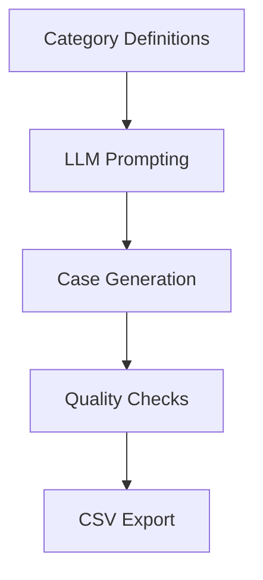

# 📄 Synthetic Data Generation Protocol
**Version**: 1.1  
**Compliance**: Kenya Children Act 2022

---

## 🧭 Overview

Purpose: Generate synthetic child protection case narratives for AI model training that are:
- Privacy-preserving (no real data)
- Legally compliant (Children Act 2022)
- Inclusive of rare but critical cases

---

## 🧩 Workflow Diagram



---

## 📂 Data Specifications

### 🔹 Input File

| File Name              | Format | Fields                    |
|------------------------|--------|----------------------------|
| `case_categories_ke.csv` | CSV    | Case_Category, Definition |

### 🔹 Output Schema

```python
{
    "case_id": "CASE-0123",
    "category_name": "Sec20_SexualAbuse",
    "narrative": "14yo female coerced...",
    "case_plan": "Medical referral...",
    "dates": {
        "incident": "2024-03-01",
        "report": "2024-03-02 14:30:00"
    }
}
```

---

## ⚙️ Generation Process

### Step 1: Setup

```python
# Configure LLM (Mistral-7B)
llm = Llama(
    model_path="mistral-7b-instruct-v0.1.Q4_K_M.gguf",
    n_ctx=2048,
    n_gpu_layers=16
)
```

### Step 2: Narrative Generation

**Prompt Template**:
```
You are a child protection officer writing a case report.
Create a 3-sentence realistic case narrative for:

Client: {name}, {age}-year-old {sex}  
Case Category: {category}  
Definition: {definition}
```

**LLM Parameters**:
- `max_tokens = 120`
- `stop = ["\n", "###"]`

### Step 3: Case Assembly

```python
def generate_case():
    return {
        "case_id": f"CASE-{i:04d}",
        "client": {
            "name": random.choice(["Amina", "John", ...]),
            "age": random.randint(4, 17),
            "sex": random.choice(["Male", "Female"])
        },
        "legal": {
            "category": category["Case_Category"],
            "definition": category["Definition"]
        }
    }
```

---

## ✅ Quality Control

### Content Validation

```python
assert "forced" not in narrative          # Avoid triggering terms
assert len(narrative.split()) >= 15       # Ensure enough detail
```

### Statistical Balance

```python
from collections import Counter

category_counts = Counter(record["category_name"] for record in records)
assert max(category_counts.values()) / min(category_counts.values()) < 2.5
```

---

## ⚙️ Runtime & Performance

### Runtime Parameters

| Parameter   | Value | Description                        |
|-------------|-------|------------------------------------|
| num_cases   | 1000  | Number of cases per generation run |
| n_threads   | 6     | Number of threads for parallelism  |
| retries     | 3     | Retries for failed generations     |

### Performance Benchmarks

| Metric            | Value  |
|-------------------|--------|
| Cases per minute  | 42     |
| GPU VRAM Usage    | 14 GB  |
| Output File Size  | 8.7 MB |

---

## 🔒 Ethical & Legal Safeguards

### Privacy Protections

- No real names or locations used
- Dates are synthetically generated
- Balanced demographics:
  ```python
  sex_distribution = {"Male": 48%, "Female": 52%}
  age_distribution = {"4-12": 40%, "13-17": 60%}
  ```

### Legal Alignment

- Categories map to Children Act sections
- Case plans follow standard child protection procedures

---

## 🧾 Example Output

```csv
case_id,category_name,narrative,case_plan,incident_date,report_date
CASE-0123,Sec20_SexualAbuse,"14yo female coerced...","Medical referral...","2024-03-01","2024-03-02 14:30:00"
```

---

## 🛠️ Maintenance

### Version History

| Version | Changes                            |
|---------|------------------------------------|
| 1.0     | Initial release                    |
| 1.1     | Added demographic balancing checks |

### Scheduled Updates

- Quarterly: Review case category definitions
- Biannual: Update LLM model configurations
