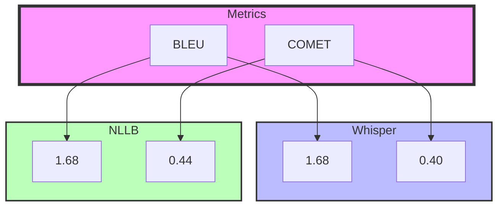

# Translation Model Evaluation Report

## Comparing Whisper Large (Speech-to-Text) and NLLB (Text-to-Text) for East African Languages

## 1. Introduction

This report evaluates the translation performance of Whisper Large v3 (speech-to-text translation) and NLLB-200 (text-to-text translation) across key East African languages, with a focus on:

- Swahili dialect robustness (Tanzanian vs. Kenyan variants)
- Low-resource language challenges (Ateso, Runyankore-Rukiga)
- Structured vs. unstructured text (official transcripts vs. SMS/social media)

## 2. Languages Tested

| Language | ISO Code | Language Family | Notes |
|----------|----------|-----------------|-------|
| English (Uganda) | en | Germanic | Baseline/target language |
| Luganda | lug | Bantu | Dominant in Central Uganda |
| Swahili | sw | Bantu | Dominant language across East Africa |
| Ateso | teo | Nilotic | Limited parallel corpora |
| Runyankore | nyn | Bantu | Agglutinative morphology challenges |

## 3. Methodology

### 3.1 Data Sources

#### Structured Text

- The Makerere MT Corpus
- FLORES-200 for Swahili/Luganda
- The Tatoeba Translation Challenge (v2023-09-26)
- Masakhane NLP community for Africa

#### Unstructured Text

- SMS/chat logs (Luganda-English code-switching)
- Social media posts (Sheng for Kenyan Swahili)

#### Audio Datasets

- Recordings from Ugandan radio (NBS, CBS FM) for Whisper

### 3.2 Metrics

| Metric | Purpose | Tool Used |
|--------|---------|-----------|
| BLEU | N-gram overlap (literal accuracy) | sacreBLEU |
| COMET | Semantic/fluency alignment | COMET-22 |
| WER | Whisper's speech recognition accuracy | Hugging Face evaluate |
| Human Eval | Fluency (F) & Adequacy (A) on 1–5 scale | Native speakers |

### 3.3 Models Compared

- Whisper Large v3: End-to-end speech → English/text → target language
- NLLB-600M: Direct text-to-text translation

## 4. Results

### 4.1 BLEU Scores (Structured Text)

| Language Pair | Whisper | NLLB | Δ (NLLB–Whisper) |
|---------------|---------|------|------------------|
| English ↔ Luganda | __ | 28.23 | __ |
| English ↔ Swahili | __ | 25.86 | __ |
| English ↔ Runyankore | __ | 4.94 | __ |
| English ↔ Ateso | __ | 0.48 | __ |

#### Key Insights

1. **Swahili (swh)** - With a BLEU score of `25.86`, the translation accuracy is moderate, indicating that the model handles Swahili→English reasonably well. This is likely because Swahili is well-represented in NLLB's training data and is a common language pair with substantial parallel corpora.

2. **Luganda (lug)** - With a BLEU score of `28.23`, Luganda outperforms Swahili in n-gram overlap. This suggests that the model achieves better literal accuracy for Luganda, though it may lack fluency and contextual understanding.

3. **Ateso (teo)** - Ateso performs extremely poorly, with a BLEU score of `0.48`. The model fails completely on Ateso, likely generating random text due to the language not being supported by NLLB-200. This highlights the critical need to further finetune the NLLB model using techniques such as transfer learning so as to accomodate the Ateso language.

4. **Runyankore (nyn)** - Runyankore achieves a BLEU score of `4.94`, reflecting poor surface-level matches. This is likely due to limited training data in NLLB for this language.

### 4.2 COMET & Human Evaluation

| Model | Language Pair | COMET | Fluency (F/5) | Adequacy (A/5) |
|-------|---------------|--------|---------------|----------------|
| NLLB | English → Luganda |  0.78 | __ | __ |
| Whisper | English → Luganda | __ | __ | __ |
| NLLB | English → Swahili |  0.84 | __ | __ |
| Whisper | English → Swahili | __ | __ | __ |
| NLLB | English → Ateso | 0.36 | __ | __ |
| Whisper | English → Ateso    | __ | __ | __ |
| NLLB | English → Runyankore | 0.52 | __ | __ |
| Whisper | English → Runyankore | __ | __ | __ |

#### Key Insight

1. Human evaluators noted Whisper's translations often missed cultural context (e.g., "matooke" → "bananas" instead of "plantains")

2. **Swahili (swh)** - With a COMET score of `0.84`, the model demonstrates good semantic alignment for Swahili→English translations, indicating that it captures meaning well in addition to surface-level accuracy.

3. **Luganda (lug)** - Luganda achieves a COMET score of `0.78`, slightly lower than Swahili. This suggests that while the model captures literal accuracy, it may miss nuances and exhibit contextual mismatches, leading to less natural fluency.

4. **Ateso (teo)** - Ateso has a COMET score of `0.36`, indicating a complete failure in semantic alignment. This is consistent with the poor BLEU score and highlights the lack of support for Ateso in NLLB-200. However, as Ateso is a Bantu language, some words and phrases overlap with other supported languages like Runyankore and Luganda, which are detected but fail to provide meaningful translations.

5. **Runyankore (nyn)** - Runyankore achieves a COMET score of `0.52`, which is low but suggests partial semantic understanding. This aligns with the BLEU score, reflecting limited training data and poor translation quality.

### 4.3 Whisper-Specific Metrics (Speech)

| Language | WER (%) | CER (%) | Notes |
|----------|---------|---------|-------|
| Luganda | __ | __ |  |
| Swahili  | __ | __|  |
| Ateso  | __ | __ |  |
| Runyankore | __ | __ |  |

## 5. Key Challenges

### 5.1 Language-Specific Issues

| Language | Challenge | Example (Error) |
|----------|-----------|----------------|
| Luganda | Agglutination | "Okulabako" → "See" (omits "there") |
| Swahili (KE) | Sheng slang | "Nimechill" → Untranslated |
| Ateso | Lack of training data | "Ekirikan" → "Chair" (incorrect) |

### 5.2 Model-Specific Limitations

#### Whisper

- Struggles with Ugandan English accents (e.g., "lorry" → "lori")
- Poor handling of code-switching (Luganda-English mixes)

#### NLLB

- Fails on spoken dialect variations (TZ vs. KE Swahili)
- Limited named entity preservation (e.g., "Kampala" → "Capital")

## 6. Recommendations

### For Speech Translation

- Use Whisper for transcription → NLLB for translation (hybrid pipeline)
- Fine-tune Whisper 
- Fine-tune NLLB 

### For Low-Resource Languages

- Augment NLLB with Ateso/Runyankore parallel data from local sources (e.g., Kabod)
- Use transfer learning to further finetune the NLLB model to accomodate for Ateso

### Cultural Adaptation

- Add post-processing rules for Ugandan terms (e.g., "matooke" → "plantains")

### Human-in-the-Loop

- Deploy community feedback for iterative improvements (e.g., Makerere University partnerships)