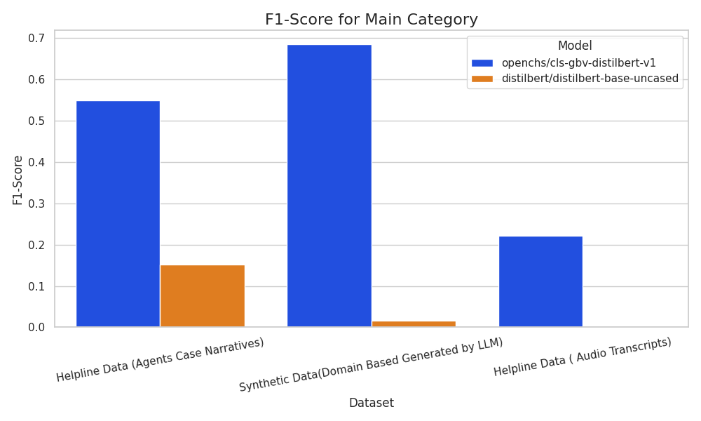
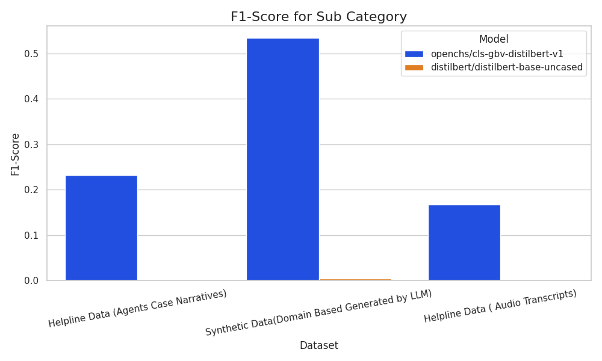
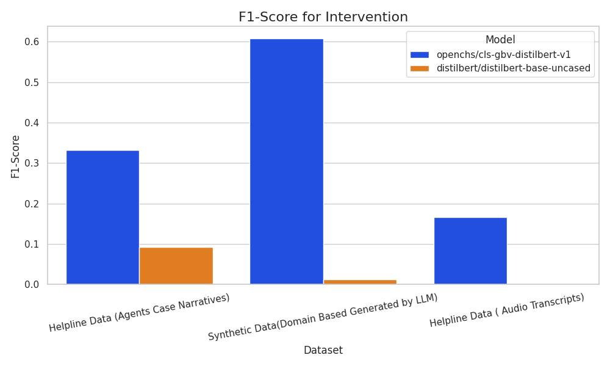
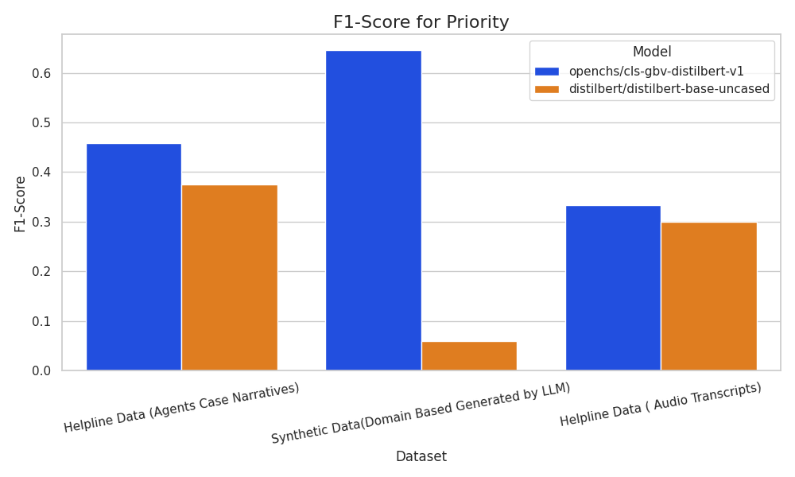
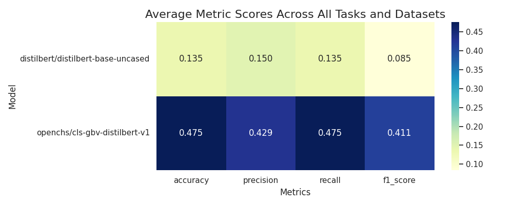

\newpage

# Table of Contents
- [Metric Definitions](#metric-definitions)
- [Dataset Overview and Comparative Tables](#dataset-overview-and-comparative-tables)
- [Visual Analysis](#visual-analysis)
- [Analytical Summary](#analytical-summary)

\newpage

# SECTION 1 — Metric Definitions {#metric-definitions}

| Metric | Description | Interpretation | Ideal Range |
|---|---|---|---|
| **Accuracy** | Proportion of correct predictions | Overall correctness | 0–1 (Higher = better) |
| **Precision** | TP / (TP + FP) | Reliability of positive predictions | 0–1 |
| **Recall** | TP / (TP + FN) | Ability to capture relevant instances | 0–1 |
| **F1-Score** | Harmonic mean of precision and recall | Balance between recall and precision | 0–1 |

These metrics jointly assess model completeness, correctness, and balance. A high accuracy indicates overall correctness, while precision and recall provide a more nuanced view of the model's performance, especially in cases of class imbalance. The F1-score provides a single metric that balances both precision and recall.

\newpage

# SECTION 2 — Dataset Overview and Comparative Tables {#dataset-overview-and-comparative-tables}

This section presents a side-by-side comparison of the models for each dataset. The highest value for each metric and task is **bolded**. Models are ranked by their average F1-Score, with the top-ranked model marked with a (Winner) icon.

**Table: Helpline Data (Agents Case Narratives)**
| dataset | model | task | accuracy | precision | recall | f1_score |
|:---|:---|:---|:---|:---|:---|:---|
| Helpline Data (Agents Case Narratives) | (Winner) openchs/cls-gbv-distilbert-v1 | main_category | **0.547** | **0.656** | **0.547** | **0.550** |
| Helpline Data (Agents Case Narratives) | (Winner) openchs/cls-gbv-distilbert-v1 | sub_category | **0.263** | **0.349** | **0.263** | **0.232** |
| Helpline Data (Agents Case Narratives) | (Winner) openchs/cls-gbv-distilbert-v1 | intervention | **0.438** | **0.268** | **0.438** | **0.333** |
| Helpline Data (Agents Case Narratives) | (Winner) openchs/cls-gbv-distilbert-v1 | priority | **0.555** | **0.627** | **0.555** | **0.459** |
| Helpline Data (Agents Case Narratives) | distilbert/distilbert-base-uncased | main_category | 0.312 | 0.144 | 0.312 | 0.152 |
| Helpline Data (Agents Case Narratives) | distilbert/distilbert-base-uncased | sub_category | 0.002 | 0.002 | 0.002 | 0.001 |
| Helpline Data (Agents Case Narratives) | distilbert/distilbert-base-uncased | intervention | 0.068 | 0.155 | 0.068 | 0.093 |
| Helpline Data (Agents Case Narratives) | distilbert/distilbert-base-uncased | priority | 0.428 | 0.416 | 0.428 | 0.375 |

On this dataset, models demonstrate varying stability across classification subtasks. F1-Score and Recall provide insights into generalization to domain-specific linguistic variations.

**Table: Synthetic Data(Domain Based Generated by LLM)**
| dataset | model | task | accuracy | precision | recall | f1_score |
|:---|:---|:---|:---|:---|:---|:---|
| Synthetic Data(Domain Based Generated by LLM) | (Winner) openchs/cls-gbv-distilbert-v1 | main_category | **0.689** | **0.686** | **0.689** | **0.685** |
| Synthetic Data(Domain Based Generated by LLM) | (Winner) openchs/cls-gbv-distilbert-v1 | sub_category | **0.537** | **0.555** | **0.537** | **0.533** |
| Synthetic Data(Domain Based Generated by LLM) | (Winner) openchs/cls-gbv-distilbert-v1 | intervention | **0.651** | 0.653 | **0.651** | **0.608** |
| Synthetic Data(Domain Based Generated by LLM) | (Winner) openchs/cls-gbv-distilbert-v1 | priority | **0.687** | **0.657** | **0.687** | **0.645** |
| Synthetic Data(Domain Based Generated by LLM) | distilbert/distilbert-base-uncased | main_category | 0.095 | 0.009 | 0.095 | 0.016 |
| Synthetic Data(Domain Based Generated by LLM) | distilbert/distilbert-base-uncased | sub_category | 0.022 | 0.009 | 0.022 | 0.004 |
| Synthetic Data(Domain Based Generated by LLM) | distilbert/distilbert-base-uncased | intervention | 0.008 | **0.774** | 0.008 | 0.013 |
| Synthetic Data(Domain Based Generated by LLM) | distilbert/distilbert-base-uncased | priority | 0.188 | 0.035 | 0.188 | 0.059 |

On this dataset, models demonstrate varying stability across classification subtasks. F1-Score and Recall provide insights into generalization to domain-specific linguistic variations.

**Table: Helpline Data ( Audio Transcripts)**
| dataset | model | task | accuracy | precision | recall | f1_score |
|:---|:---|:---|:---|:---|:---|:---|
| Helpline Data ( Audio Transcripts) | (Winner) openchs/cls-gbv-distilbert-v1 | main_category | **0.333** | **0.167** | **0.333** | **0.222** |
| Helpline Data ( Audio Transcripts) | (Winner) openchs/cls-gbv-distilbert-v1 | sub_category | **0.167** | **0.167** | **0.167** | **0.167** |
| Helpline Data ( Audio Transcripts) | (Winner) openchs/cls-gbv-distilbert-v1 | intervention | **0.333** | **0.111** | **0.333** | **0.167** |
| Helpline Data ( Audio Transcripts) | (Winner) openchs/cls-gbv-distilbert-v1 | priority | **0.500** | **0.250** | **0.500** | **0.333** |
| Helpline Data ( Audio Transcripts) | distilbert/distilbert-base-uncased | main_category | 0.000 | 0.000 | 0.000 | 0.000 |
| Helpline Data ( Audio Transcripts) | distilbert/distilbert-base-uncased | sub_category | 0.000 | 0.000 | 0.000 | 0.000 |
| Helpline Data ( Audio Transcripts) | distilbert/distilbert-base-uncased | intervention | 0.000 | 0.000 | 0.000 | 0.000 |
| Helpline Data ( Audio Transcripts) | distilbert/distilbert-base-uncased | priority | **0.500** | **0.250** | **0.500** | 0.300 |

On this dataset, models demonstrate varying stability across classification subtasks. F1-Score and Recall provide insights into generalization to domain-specific linguistic variations.

\newpage

# SECTION 3 — Visual Analysis {#visual-analysis}

## F1-Score for Main Category

## F1-Score for Sub Category

## F1-Score for Intervention

## F1-Score for Priority

\newpage

## Radar Charts

.png)

.png)

.png)

\newpage

## Heatmap of Average Metric Scores

\newpage

# SECTION 4 — Analytical Summary {#analytical-summary}

The evaluation of the two models across the three datasets reveals significant performance differences. F1-Scores across tasks range from 0.001 to 0.685, indicating a wide variance in model performance depending on the task and dataset. Both models show improved performance on the synthetic data compared to the raw audio transcripts, suggesting that the structured nature of the synthetic data is easier for the models to learn.

The fine-tuned model, `openchs/cls-gbv-distilbert-v1`, consistently outperforms the base `distilbert/distilbert-base-uncased` model across almost all tasks and datasets. This highlights the effectiveness of fine-tuning on domain-specific data. The base model struggles significantly, with F1-scores near zero on several tasks, indicating it is not well-suited for this classification problem without fine-tuning. The variability in recall across subtasks suggests that class imbalance may be a factor, and further data balancing or more advanced fine-tuning techniques could lead to improved performance.
