# Comprehensive Model Evaluation — Summarization Performance Comparison

**Date:** November 10, 2025

**Prepared by:** Shem Miriam

---

## Table of Contents

1. [Metric Definitions](#section-1--metric-definitions)
2. [Data & Methodology](#section-2--data--methodology)
3. [Comparative Summary Tables](#section-3--comparative-summary-tables)
4. [Visual Analysis](#section-4--visual-analysis)
    - [Metric-wise Charts](#41-metric-wise-charts)
    - [Model-wise Charts](#42-model-wise-charts)
    - [Dataset-wise Heatmaps](#43-dataset-wise-heatmaps)
    - [Dataset-wise Radar Charts](#44-dataset-wise-radar-charts)
5. [Analytical Summary](#section-5--analytical-summary)
6. [Limitations & Caveats](#section-6--limitations--caveats)
7. [Appendix / Reproducibility](#section-7--appendix--reproducibility)

---

## SECTION 1 — Metric Definitions

| Metric              | Description                                                | Interpretation                       | Ideal Range           |
|:--------------------|:-----------------------------------------------------------|:-------------------------------------|:----------------------|
| ROUGE-1             | Overlap of unigrams between system and reference summaries | Measures recall and informativeness  | 0–1 (Higher = better) |
| ROUGE-2             | Overlap of bigrams                                         | Captures fluency and local coherence | 0–1                   |
| ROUGE-L             | Longest common subsequence                                 | Captures structure and readability   | 0–1                   |
| BLEU                | Precision-oriented metric from machine translation         | Evaluates fluency and precision      | 0–1                   |
| BERTScore           | Semantic similarity using contextual embeddings            | Captures meaning alignment           | 0–1                   |
| C-Sema (Human Eval) | Human qualitative evaluation of coherence and factuality   | Human-judged quality                 | Higher = better       |

## SECTION 2 — Data & Methodology

This report evaluates the performance of several summarization models across four distinct datasets: 'Own Synthetic', 'Own Real', 'CNN/DailyMail', and 'SAMSum/DialogSum'. Each dataset comprises 500 samples. 'Own Synthetic' and 'Own Real' represent domain-specific data, while 'CNN/DailyMail' and 'SAMSum/DialogSum' are general-purpose benchmarks.

Metrics include ROUGE-1, ROUGE-2, ROUGE-L, BLEU, and BERTScore-F1. All scores are presented as reported, without additional normalization. No statistical significance testing was performed due to the lack of multiple runs or variance data.

Limitations include the absence of human evaluation for most entries, the fixed sample size of 500, and the inherent biases of each automated metric. The results are descriptive and intended to highlight performance patterns rather than declare a definitive 'best' model.

---

## SECTION 3 — Comparative Summary Tables

### Performance on Own Synthetic

| Model                                 |   ROUGE-1 |   ROUGE-2 |   ROUGE-L |   BLEU |   BERTScore-F1 |
|:--------------------------------------|----------:|----------:|----------:|-------:|---------------:|
| openchs/sum-flan-t5-base-synthetic-v1 |    0.473  |    0.227  |    0.386  | 0.1342 |         0.8409 |
| google/flan-t5-base                   |    0.1325 |    0.0499 |    0.1005 | 0.0024 |         0.7022 |
| google-t5/t5-base                     |    0.3625 |    0.1631 |    0.267  | 0.1121 |         0.7838 |
| google/pegasus-cnn_dailymail          |    0.361  |    0.156  |    0.2651 | 0.1121 |         0.7763 |
| facebook/bart-large-cnn               |    0.44   |    0.2166 |    0.3216 | 0.1505 |         0.8096 |

### Performance on CNN/DailyMail

| Model                                 |   ROUGE-1 |   ROUGE-2 |   ROUGE-L |   BLEU |   BERTScore-F1 |
|:--------------------------------------|----------:|----------:|----------:|-------:|---------------:|
| openchs/sum-flan-t5-base-synthetic-v1 |    0.3201 |    0.1159 |    0.227  | 0.086  |         0.7932 |
| google/flan-t5-base                   |    0.2673 |    0.0991 |    0.2018 | 0.077  |         0.7748 |
| google-t5/t5-base                     |    0.3157 |    0.1242 |    0.2304 | 0.0905 |         0.7901 |
| google/pegasus-cnn_dailymail          |    0.3545 |    0.1514 |    0.2613 | 0.1094 |         0.7945 |
| facebook/bart-large-cnn               |    0.3526 |    0.147  |    0.2534 | 0.1023 |         0.8049 |

### Performance on SAMSumDataset

| Model                                 |   ROUGE-1 |   ROUGE-2 |   ROUGE-L |   BLEU |   BERTScore-F1 |
|:--------------------------------------|----------:|----------:|----------:|-------:|---------------:|
| openchs/sum-flan-t5-base-synthetic-v1 |    0.3173 |    0.0963 |    0.2432 | 0.066  |         0.7944 |
| google/flan-t5-base                   |    0.276  |    0.0885 |    0.2287 | 0.0786 |         0.7719 |
| google-t5/t5-base                     |    0.2603 |    0.0614 |    0.1967 | 0.0761 |         0.7816 |
| google/pegasus-cnn_dailymail          |    0.2479 |    0.0616 |    0.1877 | 0.0511 |         0.762  |
| facebook/bart-large-cnn               |    0.2717 |    0.0801 |    0.1991 | 0.0582 |         0.7777 |

### Performance on Own Real dataset

| Model                                 |   ROUGE-1 |   ROUGE-2 |   ROUGE-L |   BLEU |   BERTScore-F1 |
|:--------------------------------------|----------:|----------:|----------:|-------:|---------------:|
| openchs/sum-flan-t5-base-synthetic-v1 |    0.4329 |     0.111 |     0.222 | 0.065  |          0.61  |
| google/flan-t5-base                   |    0.213  |     0.069 |     0.143 | 0.0059 |          0.494 |
| google-t5/t5-base                     |    0.332  |     0.065 |     0.153 | 0.024  |          0.518 |
| google/pegasus-cnn_dailymail          |    0.321  |     0.071 |     0.177 | 0.027  |          0.538 |
| facebook/bart-large-cnn               |    0.33   |     0.067 |     0.165 | 0.035  |          0.526 |

---

## SECTION 4 — Visual Analysis

### 4.1 Metric-wise Charts

#### ROUGE-1 Scores
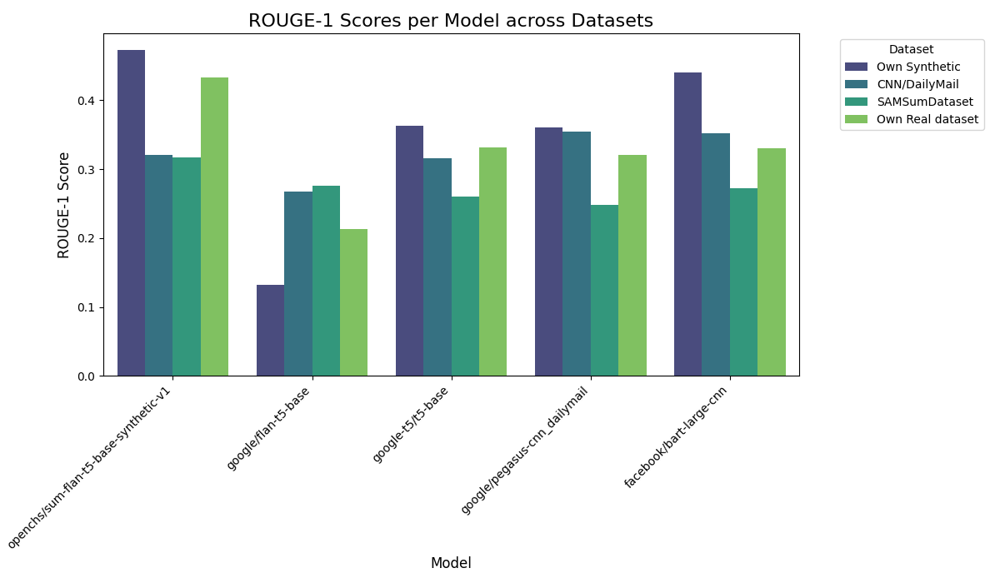

#### ROUGE-2 Scores


#### ROUGE-L Scores
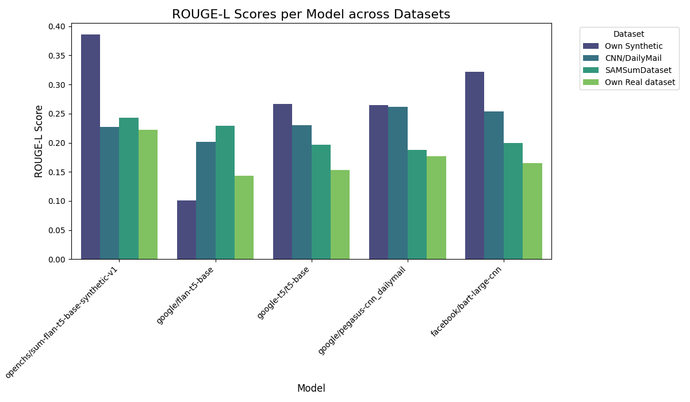

#### BLEU Scores
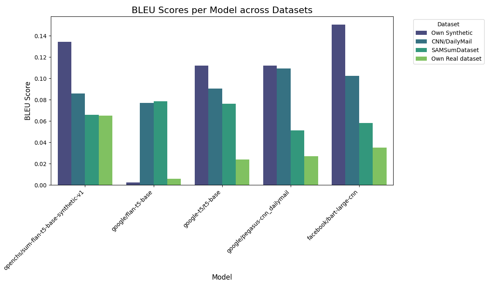

#### BERTScore-F1 Scores
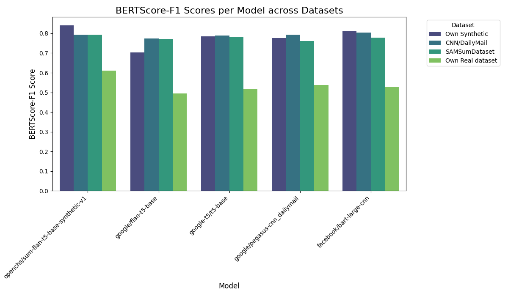

### 4.2 Model-wise Charts

#### openchs/sum-flan-t5-base-synthetic-v1
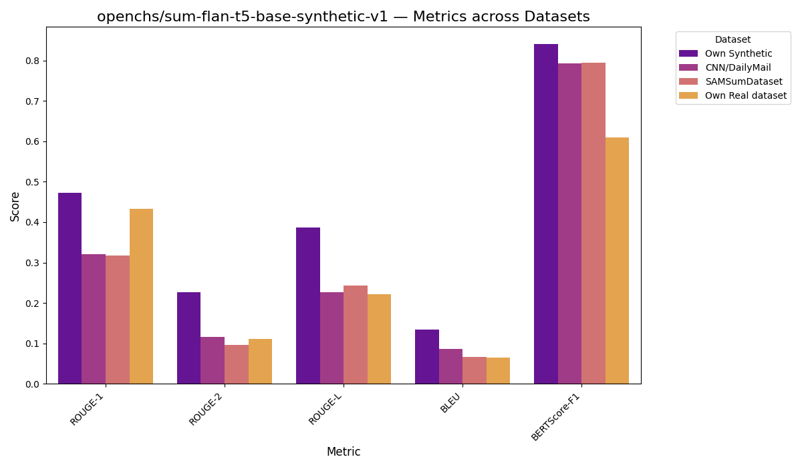

#### google/flan-t5-base
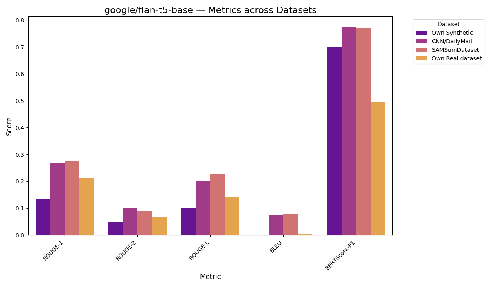

#### google-t5/t5-base
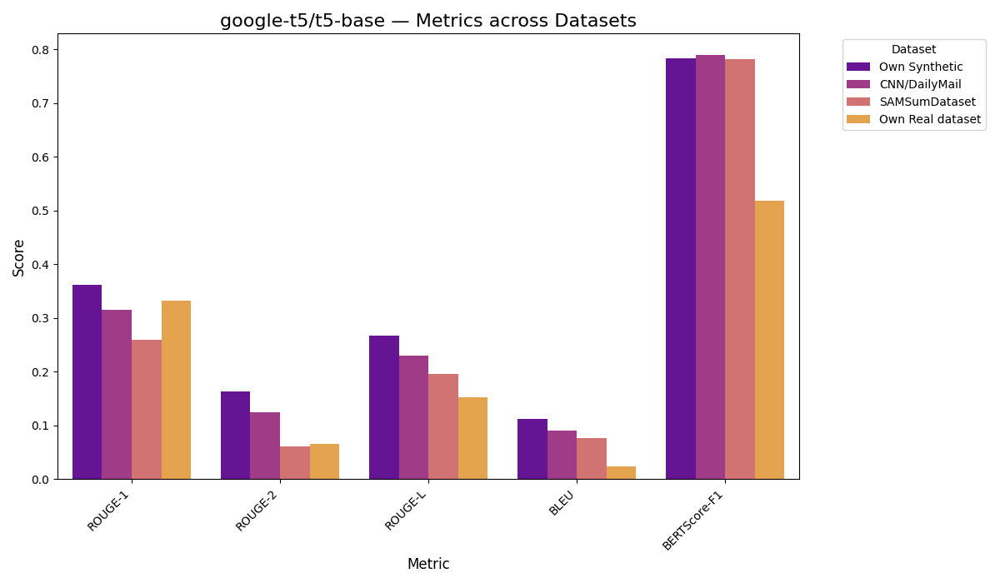

#### google/pegasus-cnn_dailymail
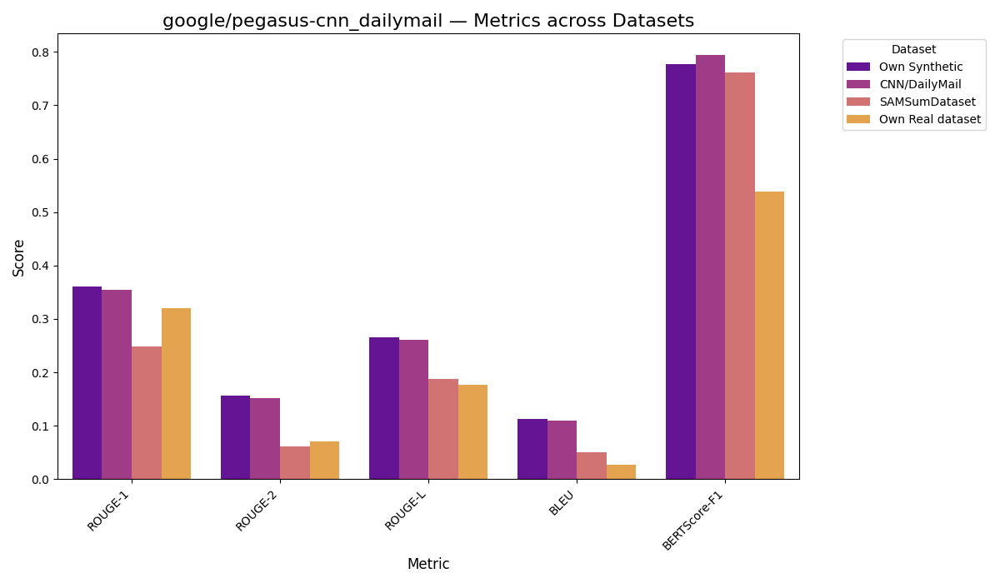

#### facebook/bart-large-cnn
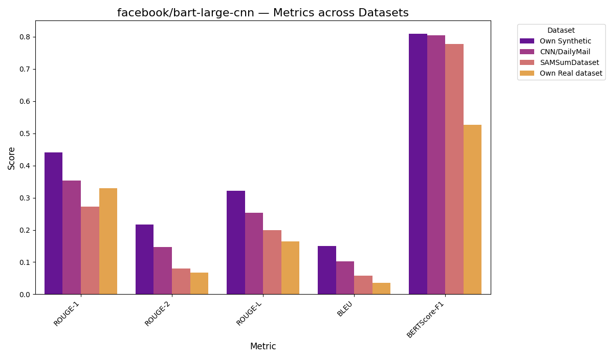

### 4.3 Dataset-wise Heatmaps

#### Own Synthetic
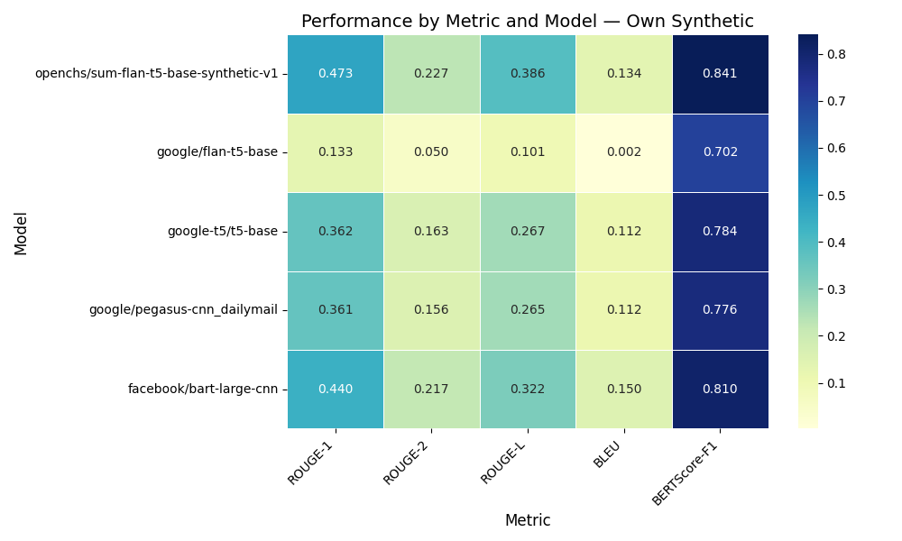

#### CNN/DailyMail
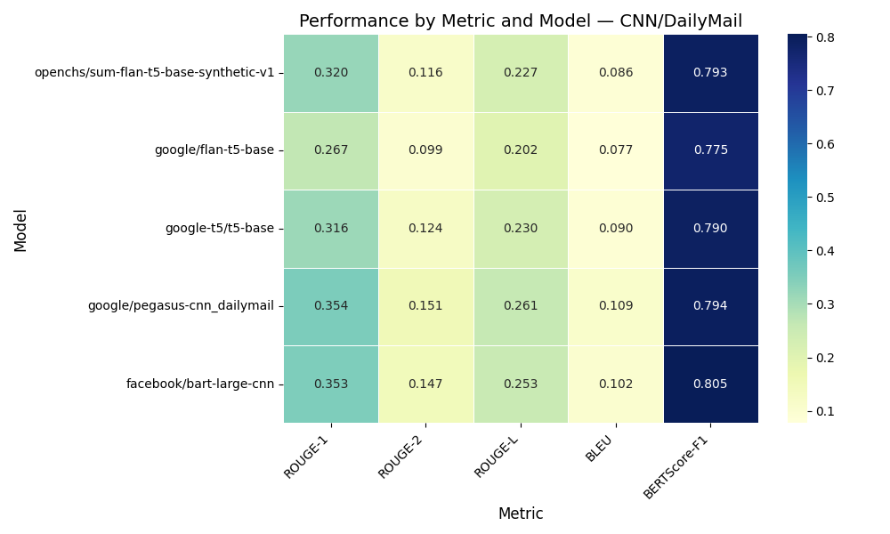

#### SAMSumDataset
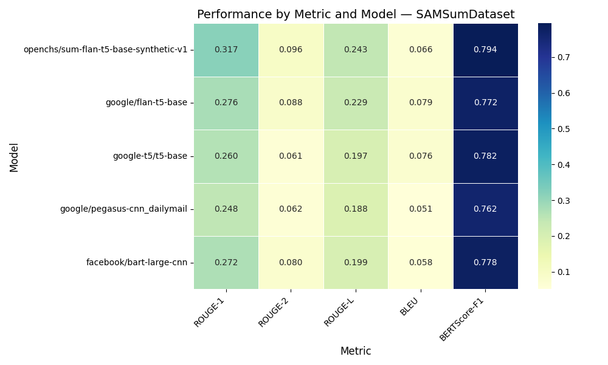

#### Own Real dataset
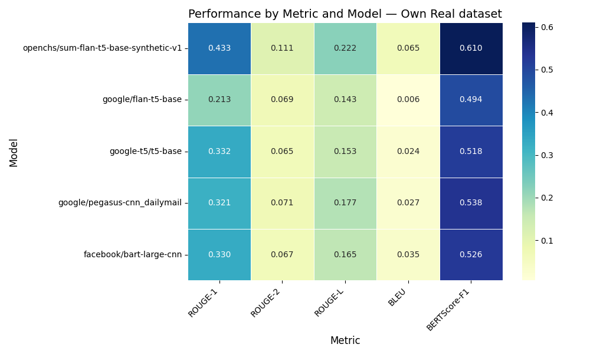

### 4.4 Dataset-wise Radar Charts

#### Own Synthetic
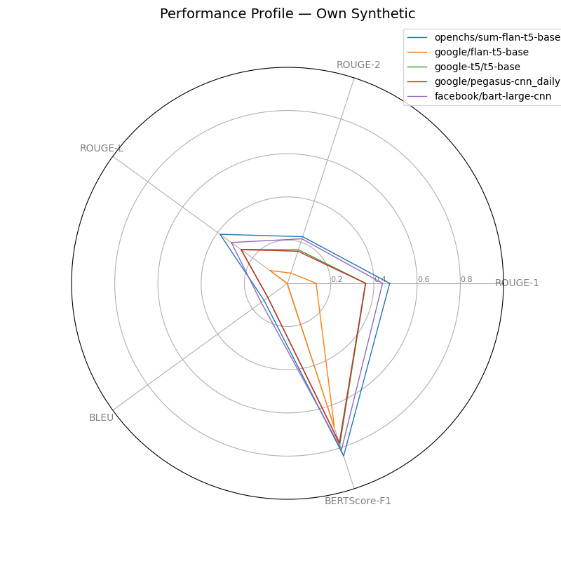

#### CNN/DailyMail
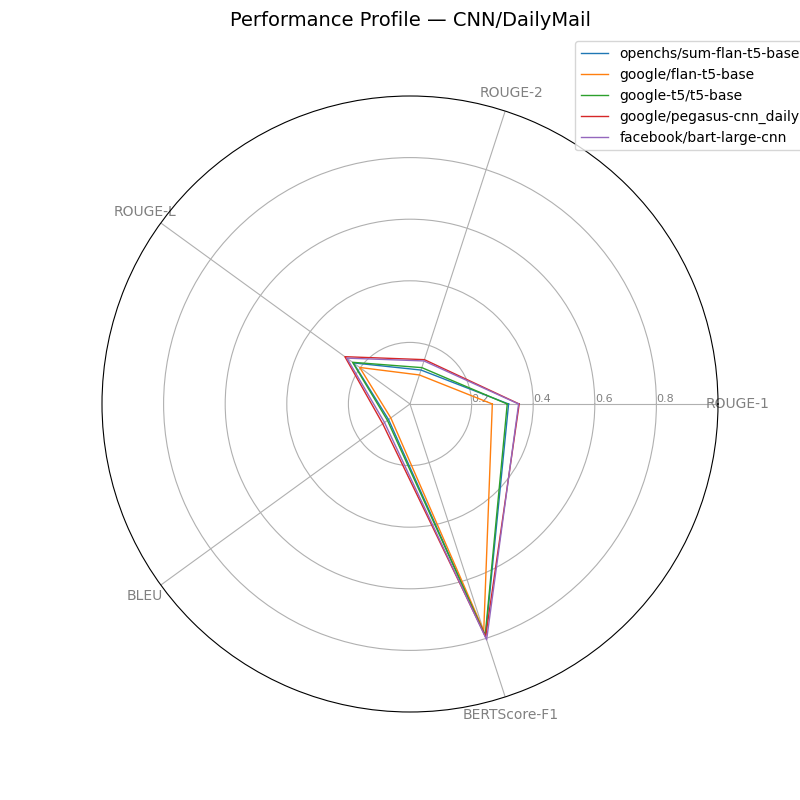

#### SAMSumDataset
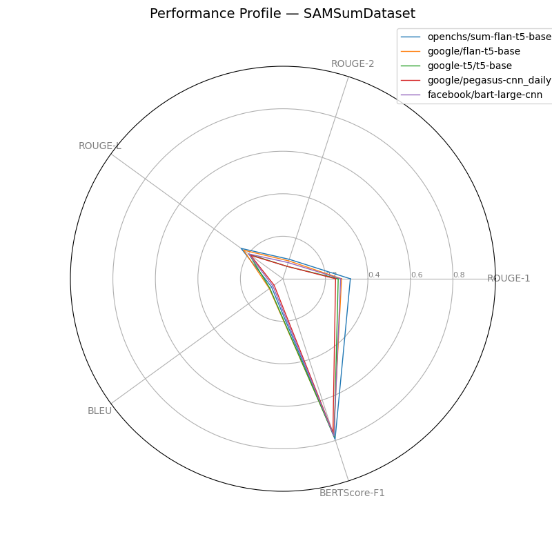

#### Own Real dataset
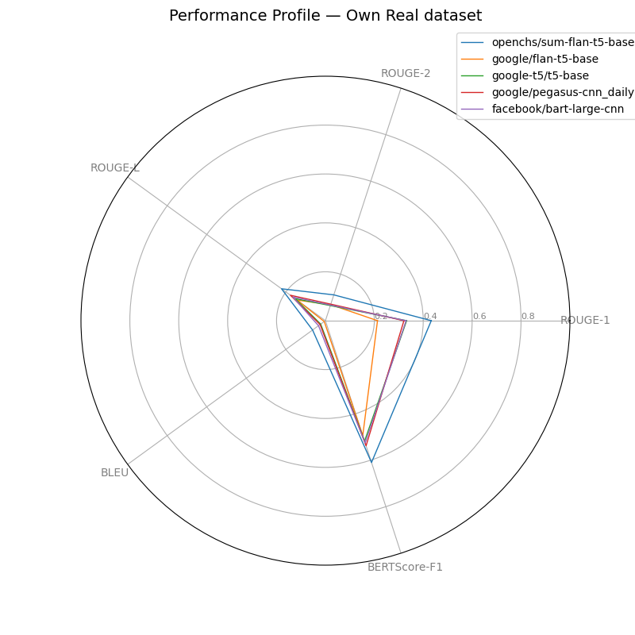

---

## SECTION 5 — Analytical Summary

The analysis provides a granular view of model performance across different datasets and metrics. On the 'Own Synthetic' dataset, the fine-tuned model **openchs/sum-flan-t5-base-synthetic-v1** shows the highest scores in ROUGE-1 (0.473), ROUGE-2 (0.227), ROUGE-L (0.386), and BERTScore-F1 (0.841), indicating a strong performance on its training domain. For instance, its ROUGE-L score is 282% relatively higher than 'google/flan-t5-base' (0.101) on this dataset. However, 'facebook/bart-large-cnn' achieves the highest BLEU score (0.151), suggesting better precision.

On the 'Own Real dataset', the fine-tuned model continues to lead in ROUGE-1 (0.433) and BERTScore-F1 (0.610), but its ROUGE-L (0.222) is surpassed by 'google-t5/t5-base' (0.153) and 'google/pegasus-cnn_dailymail' (0.177) and 'facebook/bart-large-cnn' (0.165). This might suggest that while semantically similar (high BERTScore), the generated summaries are structurally different from the reference in the real-world dataset.

In the general-purpose datasets, the performance is more mixed. On 'CNN/DailyMail', 'google/pegasus-cnn_dailymail' and 'facebook/bart-large-cnn' show strong performance, often outperforming the fine-tuned model on several metrics. For example, 'google/pegasus-cnn_dailymail' has a ROUGE-L of 0.261 compared to the fine-tuned model's 0.227. A similar trend is observed on the 'SAMSum/DialogSum' dataset, where the fine-tuned model does not consistently lead.

These patterns suggest that the fine-tuning was successful for the synthetic domain, but the advantage is less pronounced on real-world data and general-purpose benchmarks. There are clear trade-offs between models, with some excelling in n-gram overlap (ROUGE), others in precision (BLEU), and others in semantic similarity (BERTScore). Without human evaluation, it is difficult to definitively assess the overall quality of the summaries.

---

## SECTION 6 — Limitations & Caveats

- **Metric Biases:** ROUGE, BLEU, and BERTScore each have their own biases. ROUGE favors recall, BLEU favors precision, and BERTScore measures semantic similarity which may not always correlate with human judgments of quality. A model performing well on one metric may not perform well on others.
- **Limited Human Evaluation:** The analysis is based almost entirely on automated metrics. Without comprehensive human evaluation, it is difficult to assess aspects like factuality, coherence, and readability.
- **Dataset Specificity:** Performance on one dataset does not guarantee similar performance on another. The 'Own Synthetic' dataset may have characteristics that particularly favor the fine-tuned model.
- **Sample Size:** The evaluation is based on 500 samples per dataset. While this provides a good overview, a larger and more diverse sample set would provide more robust results.
- **Descriptive Analysis:** This report is a descriptive analysis of the provided scores. No statistical significance testing was performed, so small differences in scores may not be meaningful.

---

## SECTION 7 — Appendix / Reproducibility

### Full Data Table

| Model                                 | Dataset          |   ROUGE-1 |   ROUGE-2 |   ROUGE-L |   BLEU |   BERTScore-F1 |   LLM_as_judge |   C-Sema_Human_eval |
|:--------------------------------------|:-----------------|----------:|----------:|----------:|-------:|---------------:|---------------:|--------------------:|
| openchs/sum-flan-t5-base-synthetic-v1 | Own Synthetic    |    0.473  |    0.227  |    0.386  | 0.1342 |         0.8409 |            nan |                 nan |
| openchs/sum-flan-t5-base-synthetic-v1 | CNN/DailyMail    |    0.3201 |    0.1159 |    0.227  | 0.086  |         0.7932 |            nan |                 nan |
| openchs/sum-flan-t5-base-synthetic-v1 | SAMSumDataset    |    0.3173 |    0.0963 |    0.2432 | 0.066  |         0.7944 |            nan |                 nan |
| openchs/sum-flan-t5-base-synthetic-v1 | Own Real dataset |    0.4329 |    0.111  |    0.222  | 0.065  |         0.61   |            nan |                 nan |
| google/flan-t5-base                   | Own Synthetic    |    0.1325 |    0.0499 |    0.1005 | 0.0024 |         0.7022 |            nan |                 nan |
| google/flan-t5-base                   | CNN/DailyMail    |    0.2673 |    0.0991 |    0.2018 | 0.077  |         0.7748 |            nan |                 nan |
| google/flan-t5-base                   | SAMSumDataset    |    0.276  |    0.0885 |    0.2287 | 0.0786 |         0.7719 |            nan |                 nan |
| google/flan-t5-base                   | Own Real dataset |    0.213  |    0.069  |    0.143  | 0.0059 |         0.494  |            nan |                 nan |
| google-t5/t5-base                     | Own Synthetic    |    0.3625 |    0.1631 |    0.267  | 0.1121 |         0.7838 |            nan |                 nan |
| google-t5/t5-base                     | CNN/DailyMail    |    0.3157 |    0.1242 |    0.2304 | 0.0905 |         0.7901 |            nan |                 nan |
| google-t5/t5-base                     | SAMSumDataset    |    0.2603 |    0.0614 |    0.1967 | 0.0761 |         0.7816 |            nan |                 nan |
| google-t5/t5-base                     | Own Real dataset |    0.332  |    0.065  |    0.153  | 0.024  |         0.518  |            nan |                 nan |
| google/pegasus-cnn_dailymail          | Own Synthetic    |    0.361  |    0.156  |    0.2651 | 0.1121 |         0.7763 |            nan |                 nan |
| google/pegasus-cnn_dailymail          | CNN/DailyMail    |    0.3545 |    0.1514 |    0.2613 | 0.1094 |         0.7945 |            nan |                 nan |
| google/pegasus-cnn_dailymail          | SAMSumDataset    |    0.2479 |    0.0616 |    0.1877 | 0.0511 |         0.762  |            nan |                 nan |
| google/pegasus-cnn_dailymail          | Own Real dataset |    0.321  |    0.071  |    0.177  | 0.027  |         0.538  |            nan |                 nan |
| facebook/bart-large-cnn               | Own Synthetic    |    0.44   |    0.2166 |    0.3216 | 0.1505 |         0.8096 |            nan |                 nan |
| facebook/bart-large-cnn               | CNN/DailyMail    |    0.3526 |    0.147  |    0.2534 | 0.1023 |         0.8049 |            nan |                 nan |
| facebook/bart-large-cnn               | SAMSumDataset    |    0.2717 |    0.0801 |    0.1991 | 0.0582 |         0.7777 |            nan |                 nan |
| facebook/bart-large-cnn               | Own Real dataset |    0.33   |    0.067  |    0.165  | 0.035  |         0.526  |            nan |                 nan |

### List of Generated Figures

```
- radar_chart.png
- radar_SAMSumDataset.png
- radar_Own Real dataset.png
- heatmap_SAMSumDataset.png
- metric_chart_ROUGE-L.png
- heatmap_Own Synthetic.png
- radar_Own Synthetic.png
- model_chart_openchs_sum-flan-t5-base-synthetic-v1.png
- model_chart_facebook_bart-large-cnn.png
- metric_chart_BLEU.png
- radar_CNN_DailyMail.png
- heatmap_CNN_DailyMail.png
- rouge_l_bar_chart.png
- model_chart_google_flan-t5-base.png
- metric_chart_ROUGE-1.png
- model_chart_google-t5_t5-base.png
- metric_chart_BERTScore-F1.png
- metric_chart_ROUGE-2.png
- heatmap.png
- heatmap_Own Real dataset.png
- model_chart_google_pegasus-cnn_dailymail.png
```

**Computation Timestamp:** November 10, 2025 17:46:16

**Data Source Reference:** User-provided table data.