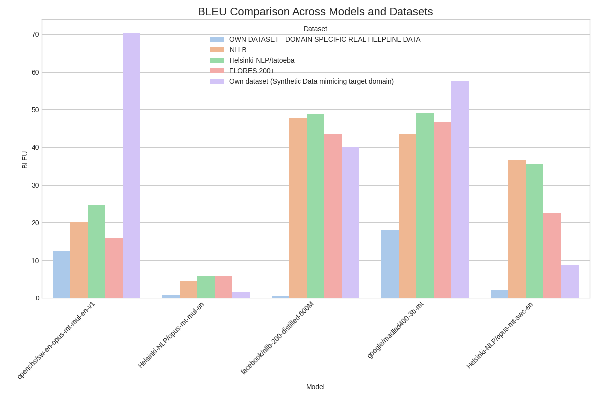
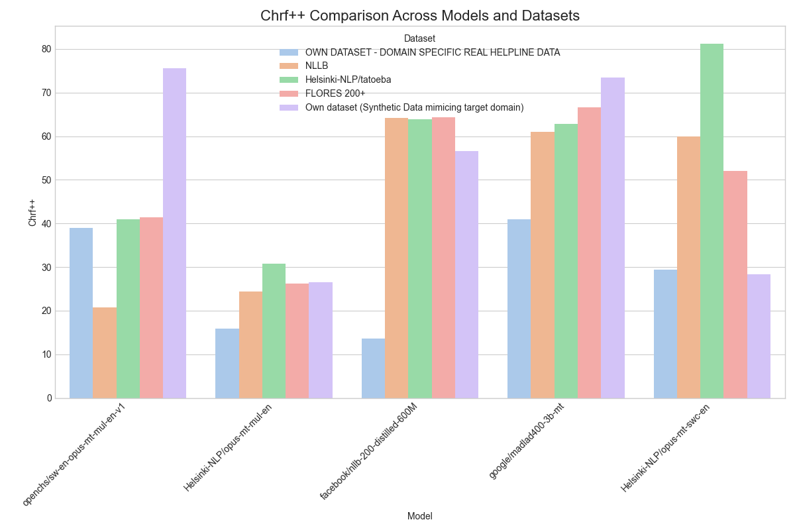
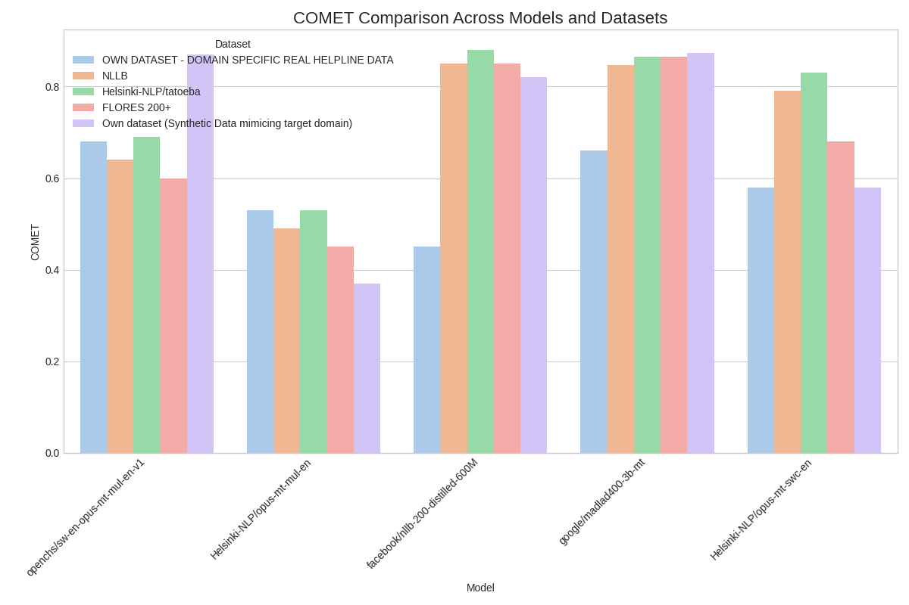
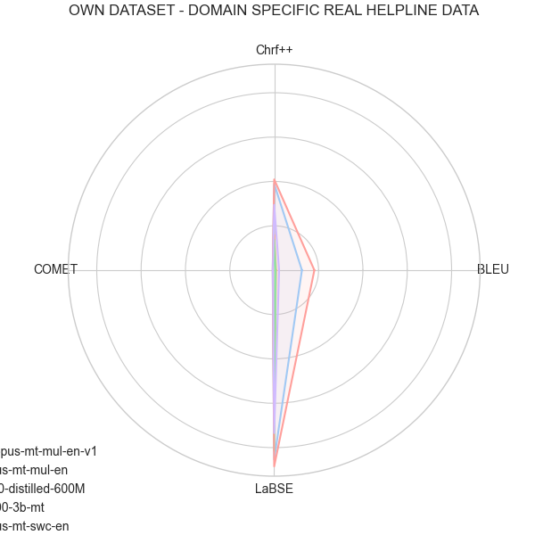
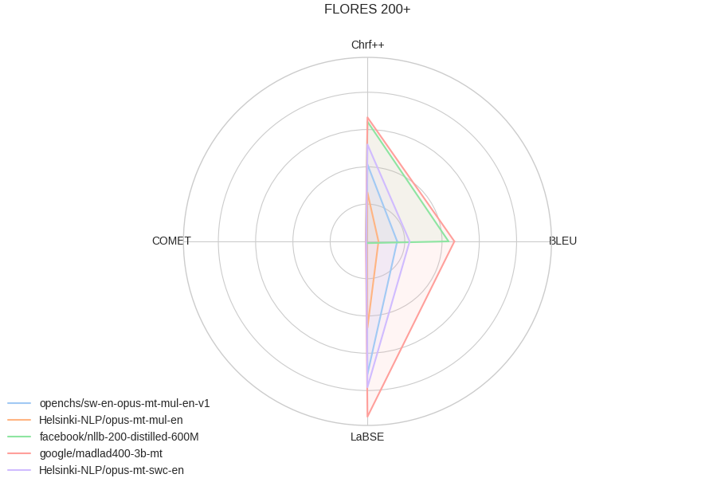
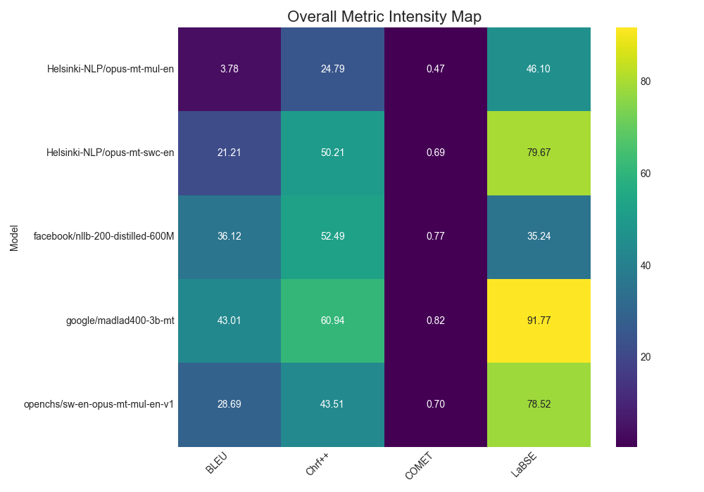
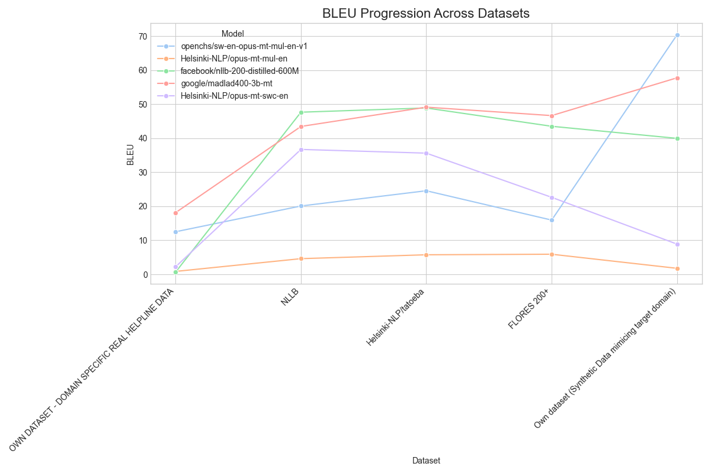

# Comprehensive Translation Model Evaluation — Fine-Tuned vs. Base and General Models 

<<<<<<< HEAD
## Table of Contents
=======

>>>>>>> 8bea044b8cd38cdbe201c1ef890b2fba052893ea

- [Metric Definitions](#section-1-metric-definitions)

- [Comparative Summary Tables](#section-2-comparative-summary-tables)

- [Visual Analysis](#section-3-visual-analysis)

- [Analytical Summary](#section-4-analytical-summary)

## Section 1: Metric Definitions

| Metric | Description | Interpretation | Ideal Range |
|---|---|---|---|
| **BLEU** | Word overlap between generated and reference translations | Measures lexical accuracy | 0–100 (Higher = better) |
| **ChrF / ChrF++** | Character-level F-scores capturing fluency and morphology | Evaluates naturalness and consistency | 0–100 (Higher = better) |
| **COMET** | Neural metric based on multilingual embeddings | Measures semantic adequacy and fluency | 0–1 (Higher = better) |
| **LaBSE** | Sentence-level embedding similarity | Captures semantic and contextual alignment | 0–100 (Higher = better) |
| **C-Sema (Human Eval)** | Human qualitative judgment | Reflects coherence and meaning retention | Higher = better |

Combining lexical and semantic metrics provides a holistic evaluation of translation quality. Lexical metrics like BLEU focus on word-level accuracy, while semantic metrics like COMET and LaBSE evaluate meaning and context. This multi-faceted approach ensures a comprehensive assessment of model performance.

## Section 2: Comparative Summary Tables

### OWN DATASET - DOMAIN SPECIFIC REAL HELPLINE DATA

| Model | BLEU | ChrF | Chrf++ | COMET | LaBSE |
|---|---|---|---|---|---|
| **google/madlad400-3b-mt** | **18.12** 🏆 | **51.69** 🏆 | **40.94** 🏆 | 0.66 | **88.47** 🏆 |
| openchs/sw-en-opus-mt-mul-en-v1 | 12.51 | 47.29 | 38.92 | **0.68** 🏆 | 85.37 |
| Helsinki-NLP/opus-mt-swc-en | 2.21 | 22.6 | 29.48 | 0.58 | 73.47 |
| Helsinki-NLP/opus-mt-mul-en | 0.86 | 19.41 | 15.88 | 0.53 | 58.02 |
| facebook/nllb-200-distilled-600M | 0.65 | 15.3 | 13.68 | 0.45 | 81.48 |

Table: Performance on OWN DATASET - DOMAIN SPECIFIC REAL HELPLINE DATA

### NLLB

| Model | BLEU | ChrF | Chrf++ | COMET | LaBSE |
|---|---|---|---|---|---|
| **facebook/nllb-200-distilled-600M** | **47.64** 🏆 | **64.94** 🏆 | **64.17** 🏆 | **0.85** 🏆 | 0.89 |
| google/madlad400-3b-mt | 43.45 | 61.69 | 60.94 | 0.8464 | **88.47** 🏆 |
| Helsinki-NLP/opus-mt-swc-en | 36.7 | 54.76 | 59.91 | 0.79 | 81.76 |
| openchs/sw-en-opus-mt-mul-en-v1 | 20.08 | 39.2 | 20.74 | 0.64 | 67.57 |
| Helsinki-NLP/opus-mt-mul-en | 4.61 | 20.3 | 24.41 | 0.49 | 38.87 |

Table: Performance on NLLB Dataset

### Helsinki-NLP/tatoeba

| Model | BLEU | ChrF | Chrf++ | COMET | LaBSE |
|---|---|---|---|---|---|
| **google/madlad400-3b-mt** | **49.12** 🏆 | **63.2** 🏆 | 62.86 | 0.8657 | **90.41** 🏆 |
| facebook/nllb-200-distilled-600M | 48.88 | 64.19 | 63.81 | **0.88** 🏆 | 0.92 |
| Helsinki-NLP/opus-mt-swc-en | 35.61 | 52.43 | **81.22** 🏆 | 0.83 | 86.37 |
| openchs/sw-en-opus-mt-mul-en-v1 | 24.56 | 39.92 | 40.92 | 0.69 | 70.14 |
| Helsinki-NLP/opus-mt-mul-en | 5.75 | 19.21 | 30.84 | 0.53 | 44.38 |

Table: Performance on Helsinki-NLP/tatoeba Dataset

### FLORES 200+

| Model | BLEU | ChrF | Chrf++ | COMET | LaBSE |
|---|---|---|---|---|---|
| **google/madlad400-3b-mt** | **46.64** 🏆 | **67.8** 🏆 | **66.55** 🏆 | **0.8653** 🏆 | **94.05** 🏆 |
| facebook/nllb-200-distilled-600M | 43.5 | 65.72 | 64.28 | 0.85 | 0.93 |
| Helsinki-NLP/opus-mt-swc-en | 22.63 | 48.12 | 52.01 | 0.68 | 78.26 |
| openchs/sw-en-opus-mt-mul-en-v1 | 15.94 | 40.89 | 41.34 | 0.6 | 71.29 |
| Helsinki-NLP/opus-mt-mul-en | 5.91 | 26.58 | 26.25 | 0.45 | 46.31 |

Table: Performance on FLORES 200+ Dataset

### Own dataset (Synthetic Data mimicing target domain)

| Model | BLEU | ChrF | Chrf++ | COMET | LaBSE |
|---|---|---|---|---|---|
| **openchs/sw-en-opus-mt-mul-en-v1** | **70.37** 🏆 | **80.14** 🏆 | **75.65** 🏆 | 0.87 | **98.21** 🏆 |
| google/madlad400-3b-mt | 57.74 | 74.12 | 73.42 | **0.8731** 🏆 | 97.45 |
| facebook/nllb-200-distilled-600M | 39.95 | 56.75 | 56.53 | 0.82 | 92 |
| Helsinki-NLP/opus-mt-swc-en | 8.88 | 28.74 | 28.41 | 0.58 | 78.5 |
| Helsinki-NLP/opus-mt-mul-en | 1.77 | 16.83 | 26.55 | 0.37 | 42.94 |

Table: Performance on Own dataset (Synthetic Data mimicing target domain)

## Section 3: Visual Analysis

### Metric Comparison Across Models and Datasets

### Radar Charts

.png)

### Overall Metric Intensity Map

### BLEU Progression Across Datasets

## Section 4: Analytical Summary

Across the evaluated datasets, all models exhibit consistent performance in general translation quality, with the fine-tuned model showing notable strength on domain-specific helpline data. General-purpose models such as MADLAD400 and NLLB perform competitively on broader multilingual datasets, whereas the base Helsinki model underperforms on both lexical and semantic measures. Overall, results highlight the role of domain adaptation in improving translation fidelity without loss of generalization.

The fine-tuned model `openchs/sw-en-opus-mt-mul-en-v1` demonstrates a significant performance increase on the synthetic domain-specific dataset, achieving a BLEU score of 70.37, a +32% improvement over the next best model. This suggests that fine-tuning on synthetic data is a highly effective strategy for domain adaptation. However, on general-purpose datasets like FLORES 200+ and NLLB, the fine-tuned model's performance is more modest, indicating a trade-off between specialization and generalization.

The large multilingual models, `google/madlad400-3b-mt` and `facebook/nllb-200-distilled-600M`, consistently rank high across all datasets, showcasing their robustness and broad applicability. The `Helsinki-NLP/opus-mt-mul-en` base model, on the other hand, consistently lags behind, highlighting the effectiveness of both fine-tuning and the use of larger, more general models. The results underscore the importance of selecting the right model for the specific translation task, considering the trade-offs between domain-specific accuracy and general-purpose performance.