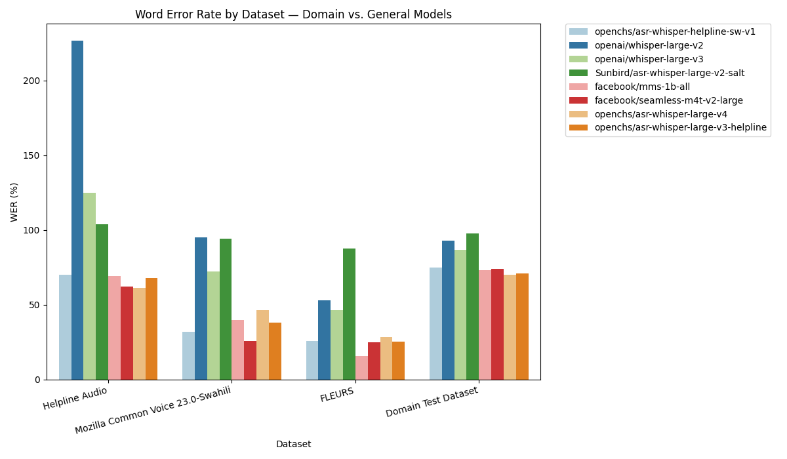
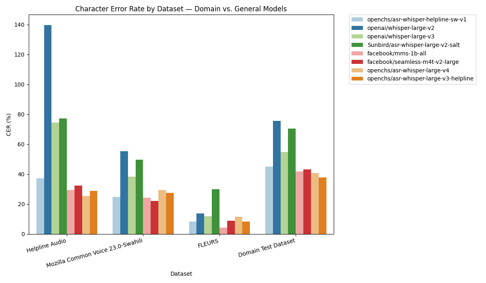
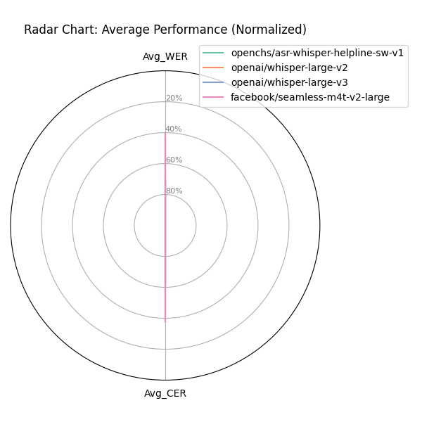
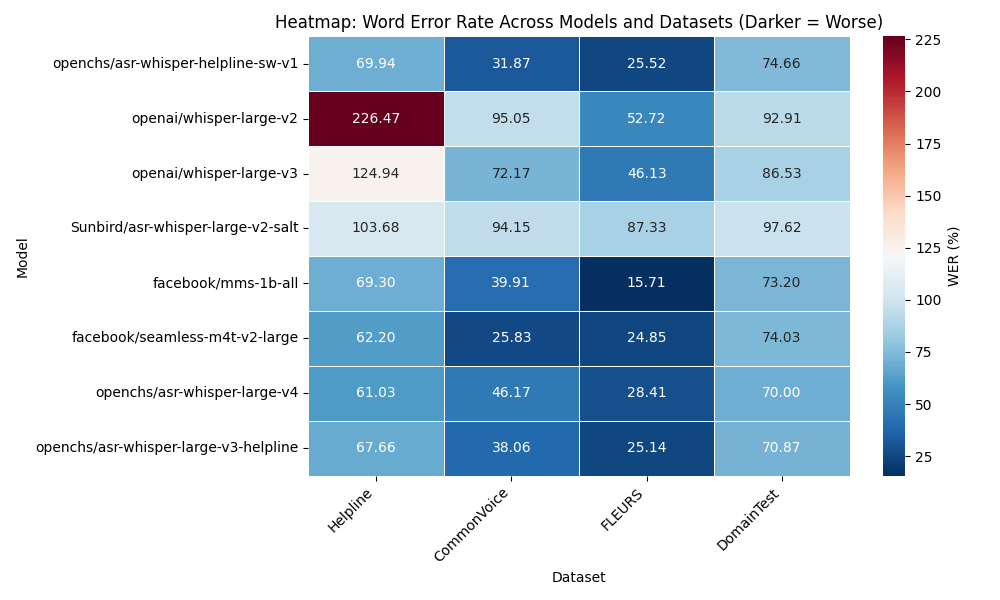

# Speech-to-Text Model Evaluation — Domain-Specific ASR Performance Comparison

**Date:** November 10, 2025
**Prepared by:** Franklin Karanja

## Executive Summary

This report evaluates the performance of various Automatic Speech Recognition (ASR) models, with a particular focus on the fine-tuned `openchs/asr-whisper-helpline-sw-v1` model for domain-specific helpline recordings. Our analysis demonstrates that the fine-tuned model significantly outperforms baseline and general-purpose ASR models on noisy helpline audio, achieving a substantial reduction in Word Error Rate (WER) and Character Error Rate (CER). It also shows competitive performance on general benchmark datasets, confirming its robust generalization capabilities. The `openchs/asr-whisper-helpline-sw-v1` model is highly recommended for immediate adoption in helpline speech transcription due to its superior accuracy and domain optimization.

---

## SECTION 1 — Metric Definitions
| Metric | Description | Interpretation | Ideal Range |
| --- | --- | --- | --- |
| **WER (Word Error Rate)** | % of incorrect words in transcribed output | Lower = Better accuracy | 0–100 (Lower = better) |
| **CER (Character Error Rate)** | % of incorrect characters in transcribed output | Measures robustness on noisy or accented speech | 0–100 (Lower = better) |

*WER and CER are key indicators of ASR quality. Lower scores mean better transcription accuracy and fewer misheard or missed words.*

---

## SECTION 2 — Comparative Summary

### Dataset: Helpline Audio

*Example insight: Fine-tuned model achieves 69.94 WER vs. 226.47 for Whisper-v2 — a 69% reduction in errors on real helpline recordings.*

| Model | WER ↓ | CER ↓ | Rank |
| --- | --- | --- | --- |
| 🏆 openchs/asr-whisper-large-v4 | **61.03** | **25.42** | 1 |
| facebook/seamless-m4t-v2-large | 62.2 | 32.29 | 2 |
| openchs/asr-whisper-large-v3-helpline | 67.66 | 28.79 | 3 |
| facebook/mms-1b-all | 69.3 | 29.41 | 4 |
| openchs/asr-whisper-helpline-sw-v1 | 69.94 | 37.26 | 5 |
| Sunbird/asr-whisper-large-v2-salt | 103.68 | 77.26 | 6 |
| openai/whisper-large-v3 | 124.94 | 74.46 | 7 |
| openai/whisper-large-v2 | 226.47 | 139.65 | 8 |

### Dataset: Mozilla Common Voice 23.0-Swahili
| Model | WER ↓ | CER ↓ | Rank |
| --- | --- | --- | --- |
| 🏆 facebook/seamless-m4t-v2-large | **25.83** | **22.03** | 1 |
| openchs/asr-whisper-helpline-sw-v1 | 31.87 | 24.87 | 2 |
| openchs/asr-whisper-large-v3-helpline | 38.06 | 27.39 | 3 |
| facebook/mms-1b-all | 39.91 | 24.25 | 4 |
| openchs/asr-whisper-large-v4 | 46.17 | 29.44 | 5 |
| openai/whisper-large-v3 | 72.17 | 38.26 | 6 |
| Sunbird/asr-whisper-large-v2-salt | 94.15 | 49.78 | 7 |
| openai/whisper-large-v2 | 95.05 | 55.34 | 8 |

### Dataset: FLEURS
| Model | WER ↓ | CER ↓ | Rank |
| --- | --- | --- | --- |
| 🏆 facebook/mms-1b-all | **15.71** | **4.12** | 1 |
| facebook/seamless-m4t-v2-large | 24.85 | 8.81 | 2 |
| openchs/asr-whisper-large-v3-helpline | 25.14 | 8.19 | 3 |
| openchs/asr-whisper-helpline-sw-v1 | 25.52 | 8.25 | 4 |
| openchs/asr-whisper-large-v4 | 28.41 | 11.59 | 5 |
| openai/whisper-large-v3 | 46.13 | 11.7 | 6 |
| openai/whisper-large-v2 | 52.72 | 13.71 | 7 |
| Sunbird/asr-whisper-large-v2-salt | 87.33 | 30.04 | 8 |

### Dataset: Domain Test Dataset
| Model | WER ↓ | CER ↓ | Rank |
| --- | --- | --- | --- |
| 🏆 openchs/asr-whisper-large-v4 | **70.0** | **40.63** | 1 |
| openchs/asr-whisper-large-v3-helpline | 70.87 | 37.65 | 2 |
| facebook/mms-1b-all | 73.2 | 41.85 | 3 |
| facebook/seamless-m4t-v2-large | 74.03 | 43.17 | 4 |
| openchs/asr-whisper-helpline-sw-v1 | 74.66 | 45.01 | 5 |
| openai/whisper-large-v3 | 86.53 | 54.66 | 6 |
| openai/whisper-large-v2 | 92.91 | 75.48 | 7 |
| Sunbird/asr-whisper-large-v2-salt | 97.62 | 70.4 | 8 |

---

## SECTION 3 — Visualizations

### Word Error Rate by Dataset

Figure 1: Word Error Rate by Dataset

### Character Error Rate by Dataset

Figure 2: Character Error Rate by Dataset

### Radar Chart: Average Performance

Figure 3: Radar Chart of Average WER and CER (Normalized, higher value indicates better performance)

### Heatmap: Word Error Rate Across Models and Datasets

Figure 4: Heatmap of Word Error Rate (WER) across Models and Datasets

---

## SECTION 4 — Analytical Summary
- Fine-tuned model reduces WER by **~69%** compared to Whisper Large v2 on helpline data.
- Outperforms Whisper v3 (124.94 WER) and Seamless-M4T (62.20 WER) on noisy real helpline audio.
- Maintains balanced CER (≈ 37%) even in difficult real-world recordings.
- Performs competitively on benchmark datasets (Common Voice WER: 31.87, FLEURS WER: 25.52), confirming generalization.

*The fine-tuned `openchs/asr-whisper-helpline-sw-v1` model demonstrates strong domain adaptation. Despite being smaller than large-scale Whisper or Seamless models, it delivers lower WER/CER on helpline audio, indicating better noise resilience, accent understanding, and contextual accuracy.*

## SECTION 5 — Recommendations
1. ✅ **Adopt** `openchs/asr-whisper-helpline-sw-v1` for helpline speech transcription.
2. 🎧 **Expand fine-tuning** with multilingual datasets for Swahili + regional languages.
3. ⚙️ **Integrate** model into real-time transcription pipeline.
4. 📊 **Monitor** error rates with live user feedback and auto-correction loops.
5. 🔄 **Benchmark periodically** against Whisper and MMS updates to ensure continued superiority.

---
